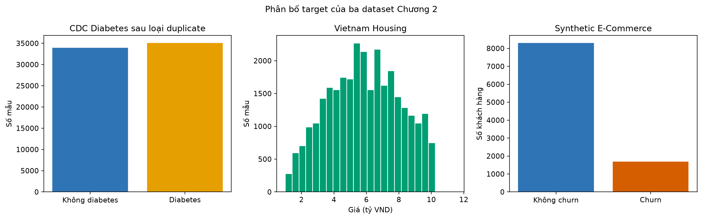
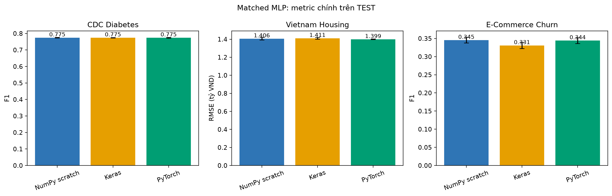
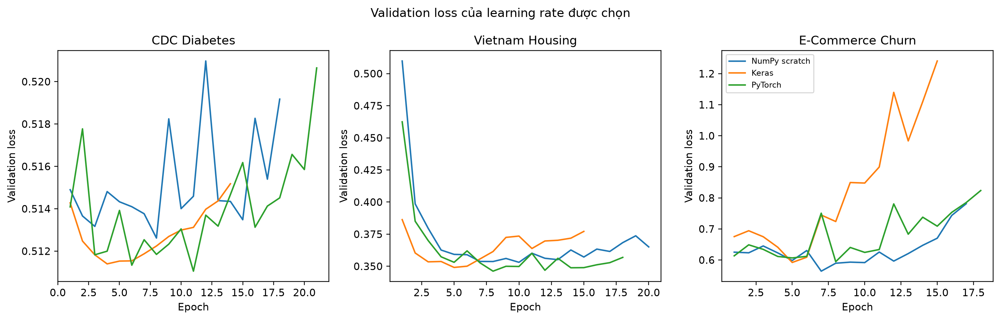
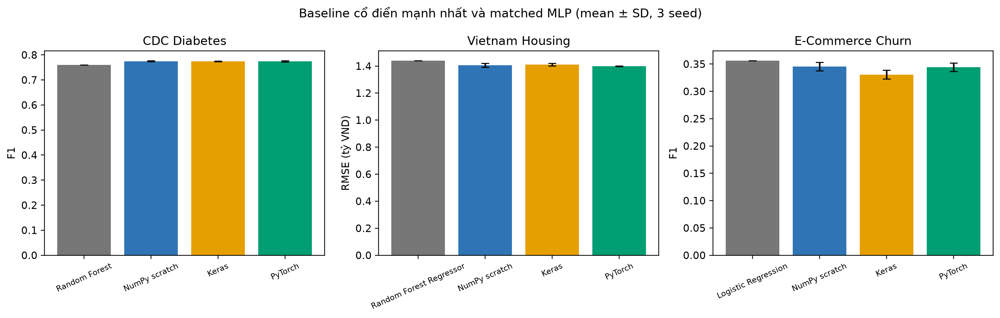
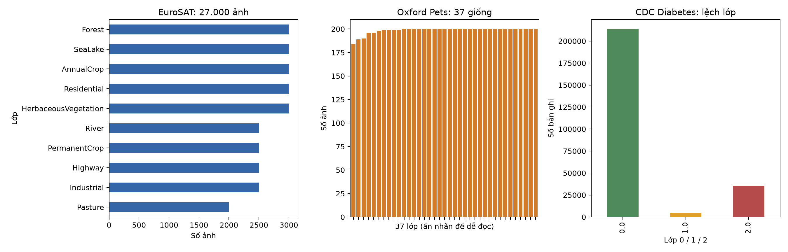
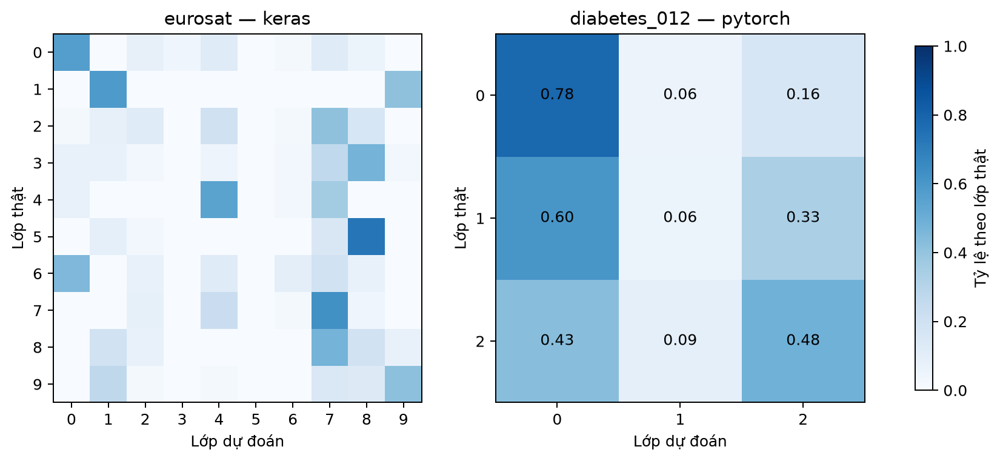
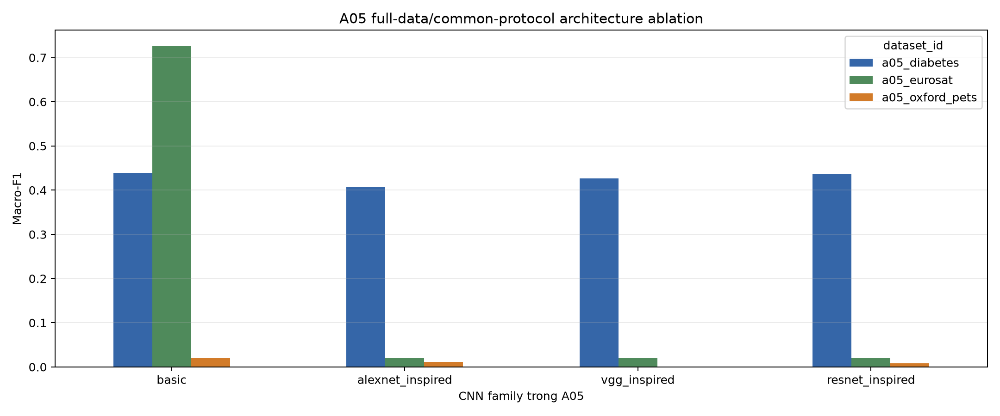
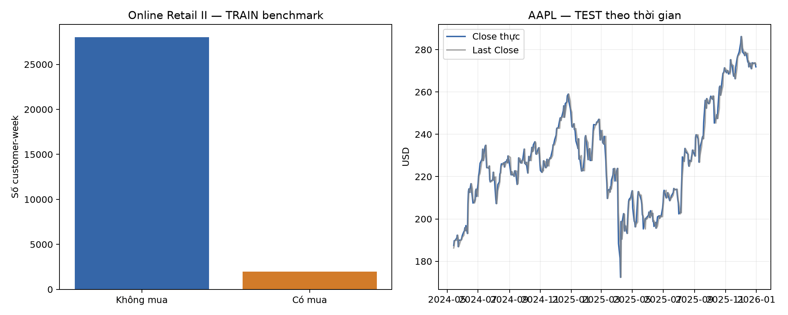
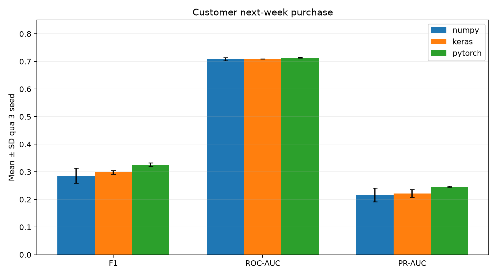
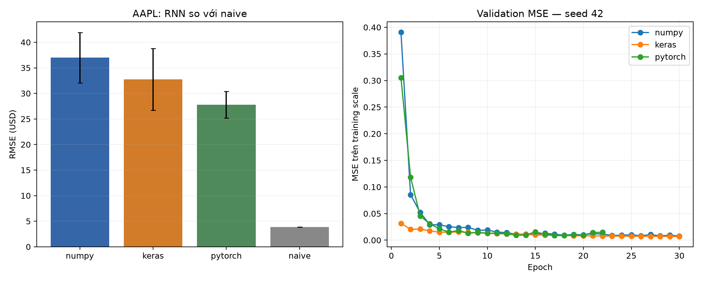

# TÓM TẮT

Tiểu luận hệ thống hóa quá trình phát triển của trí tuệ nhân tạo (Artificial Intelligence — AI), trình bày nền tảng của học máy (Machine Learning — ML), Convolutional Neural Network (CNN) và Recurrent Neural Network (RNN), sau đó kiểm chứng các khái niệm bằng một chuỗi thực nghiệm có thể tái lập. Trọng tâm không phải tìm mô hình đạt thành tích cao nhất bằng mọi giá, mà là so sánh ba cách cài đặt—NumPy scratch, Keras và PyTorch—trong điều kiện dữ liệu, split, topology logic, budget huấn luyện và metric được kiểm soát.

Phần thực nghiệm sử dụng tám dataset instance thuộc ba dạng dữ liệu. Chương 2 khảo sát dữ liệu bảng qua CDC Diabetes Binary, Vietnam Housing 2024 và Synthetic E-Commerce Customer Behavior. Chương 3 khảo sát ảnh và phép thích nghi convolution qua EuroSAT RGB, Oxford-IIIT Pet và CDC Diabetes 012. Chương 4 khảo sát chuỗi qua Online Retail II customer-week và AAPL next-Close. Tổng cộng 63 lượt huấn luyện thuộc matched track được thực hiện trên ba seed 42, 52 và 62; prediction từng mẫu, model, preprocessor, split manifest và SHA-256 được lưu để tái tính kết quả.

Kết quả cho thấy tên framework không quyết định một mô hình tốt hơn khi các biến còn lại được giữ gần tương đương. Trên diabetes binary, F1 trung bình của ba MLP gần như bằng nhau, khoảng 0,7745–0,7746. Trên housing, PyTorch MLP có RMSE thấp nhất trong nhóm được đánh giá, 1,3990 tỷ VND, nhưng khoảng cách với hai implementation còn lại nhỏ. Với churn, mọi MLP đều không vượt logistic regression nguồn. CNN matched trên EuroSAT đạt macro-F1 0,2026–0,2641 trong điều kiện chỉ có 500 ảnh TRAIN; A05 full-data BasicCNN2D đạt 0,7256, trong khi ba họ sâu hơn collapse ở 0,0200 dưới common protocol. Với customer-week, PyTorch RNN có F1 cao nhất trong ba implementation, 0,3265, nhưng precision và recall tuyệt đối vẫn hạn chế. Trên AAPL, cả chín RNN run thua xa naive last-Close: RNN tốt nhất có RMSE trung bình 27,7904 USD, còn naive đạt 3,8789 USD.

Một ứng dụng inference cục bộ khép kín chuỗi bằng chứng từ notebook đến triển khai. Ứng dụng phục vụ bốn model NumPy đã khóa qua ba nhóm use case, kiểm tra input theo schema, xác minh hash model/preprocessor, cung cấp health check và hiển thị cảnh báo y khoa hoặc tài chính. Docker image chạy bằng non-root user và smoke test xác nhận bốn bundle hợp lệ. Kết quả của tiểu luận nhấn mạnh ba nguyên tắc: so sánh framework chỉ có ý nghĩa khi protocol matched; kiến trúc phải phù hợp cấu trúc dữ liệu; và deployment phải giữ nguyên preprocessing, provenance, baseline cùng giới hạn diễn giải.

**Từ khóa:** trí tuệ nhân tạo; học máy; multilayer perceptron; convolutional neural network; recurrent neural network; NumPy; Keras; PyTorch; tái lập; triển khai mô hình.

<!-- SECTION_BREAK -->

<!-- page_target: 3-4; style: term_paper/config/style_spec.md -->

# MỞ ĐẦU

## 0.1. Bối cảnh và lý do chọn đề tài

Trí tuệ nhân tạo (Artificial Intelligence — AI) không hình thành từ một thuật toán đơn lẻ. Lĩnh vực này phát triển qua nhiều cách tiếp cận: suy luận dựa trên luật, tìm kiếm trong không gian trạng thái, học máy thống kê và mạng neuron. Trong đó, machine learning (ML) chuyển trọng tâm từ việc viết sẵn mọi quy tắc sang việc ước lượng quy luật từ dữ liệu; Convolutional Neural Network (CNN) khai thác cấu trúc cục bộ của ảnh; còn Recurrent Neural Network (RNN) mô hình hóa dữ liệu có thứ tự bằng trạng thái ẩn. Ba nhóm kỹ thuật này tạo thành một trục phát triển phù hợp để khảo sát cả lý thuyết, cài đặt và ứng dụng của AI hiện đại [1].

Việc chỉ trình bày công thức hoặc gọi một thư viện huấn luyện chưa đủ để cho thấy mô hình hoạt động như thế nào. Một kết quả thực nghiệm còn phụ thuộc vào cách chia dữ liệu, phạm vi fit bộ tiền xử lý, seed, hàm mất mát, tiêu chí chọn checkpoint và cách tính metric. Nếu các yếu tố đó thay đổi giữa các implementation, chênh lệch kết quả không còn phản ánh riêng framework hoặc thuật toán. Ngược lại, cài đặt hoàn toàn từ đầu giúp nhìn rõ phép toán nhưng có thể che khuất các vấn đề thực tế như lưu mô hình, suy luận theo batch và kiểm soát dữ liệu. Vì vậy, tiểu luận lựa chọn cách tiếp cận song song: triển khai từ nền tảng (scratch), Keras và PyTorch dưới một protocol chung.

Đề tài cũng xuất phát từ nhu cầu nối các bài thực hành riêng lẻ thành một chu trình có thể kiểm chứng. Các notebook hiện có đã xử lý dữ liệu bảng, ảnh và chuỗi thời gian, nhưng mỗi bài được xây dựng cho một mục tiêu học tập khác nhau. Nếu ghép trực tiếp các metric cuối cùng, sự khác biệt về split, preprocessing hoặc kiến trúc có thể tạo ra một so sánh thiếu công bằng. Tiểu luận vì vậy không coi notebook là văn bản báo cáo hoàn chỉnh. Chúng được dùng như nguồn bằng chứng ban đầu; dữ liệu, cấu hình, prediction và metric phải được truy vết trước khi đưa vào bảng tổng hợp.

Một lý do khác là khoảng cách giữa mô hình trong notebook và một chức năng inference có thể sử dụng. Mô hình đạt metric trên tập TEST chưa tự động trở thành một hệ thống triển khai được. Đầu vào mới cần được kiểm tra, biến đổi bằng đúng preprocessor đã fit trên TRAIN, chuyển qua đúng phiên bản mô hình và trả về output có diễn giải. Với bài toán sức khỏe hoặc tài chính, output còn phải đi kèm giới hạn sử dụng; dự đoán thực nghiệm không phải chẩn đoán y khoa hay khuyến nghị đầu tư. Phần triển khai trong tiểu luận được xem là phép kiểm tra cuối của tính nhất quán giữa dữ liệu, mô hình và mã suy luận, không phải tuyên bố về một sản phẩm sẵn sàng vận hành.

Từ các vấn đề trên, đề tài “Lịch sử phát triển AI và thực nghiệm các kỹ thuật ML, CNN, RNN” được lựa chọn nhằm trả lời hai nhu cầu. Về học thuật, báo cáo hệ thống hóa các mốc phát triển và giải thích cơ chế của những thuật toán tiêu biểu. Về thực nghiệm, báo cáo xây dựng một đường dẫn từ dữ liệu thô đến kết quả và triển khai, trong đó mỗi con số quan trọng phải gắn với artifact có thể tái tính. Cách tổ chức này giúp phân biệt điều mà thí nghiệm thực sự chứng minh với điều nằm ngoài phạm vi của nó.

## 0.2. Mục tiêu nghiên cứu

Mục tiêu tổng quát của tiểu luận là xây dựng một khảo sát có hệ thống về AI, ML, CNN và RNN, đồng thời kiểm chứng các khái niệm bằng thực nghiệm tái lập trên nhiều dạng dữ liệu. Báo cáo không hướng đến thiết lập kết quả state-of-the-art. Trọng tâm là hiểu cơ chế, kiểm soát protocol và so sánh ba cách cài đặt trong cùng điều kiện.

Các mục tiêu cụ thể gồm:

1. Hệ thống hóa lịch sử AI từ các tiền đề về logic và neuron nhân tạo, qua AI biểu tượng, học máy thống kê, deep learning, Transformer đến mô hình nền tảng và AI tạo sinh.
2. Trình bày nguyên lý của các kỹ thuật ML cơ bản cho classification và regression; giải thích vai trò của dữ liệu, hàm mất mát, tối ưu hóa và đánh giá khả năng khái quát.
3. Làm rõ cách CNN sử dụng convolution, activation và pooling để học đặc trưng không gian; khảo sát cả ảnh RGB và trường hợp chuyển dữ liệu bảng thành chuỗi một chiều có kiểm soát.
4. Làm rõ cơ chế trạng thái ẩn, Backpropagation Through Time và gradient clipping của Vanilla RNN; đặt kết quả trong quan hệ với LSTM, attention và giới hạn phụ thuộc dài hạn [2, 3].
5. Xây dựng các implementation tương ứng bằng NumPy scratch, Keras và PyTorch; dùng cùng sample keys, split, preprocessing output, topology logic và budget trong mỗi matched track.
6. Đánh giá mô hình bằng prediction artifact thay vì nhập metric thủ công; báo cáo accuracy, precision, recall, F1 hoặc MAE, RMSE, R² theo đúng loại bài toán, kèm baseline và failure case.
7. Triển khai một luồng inference có kiểm tra đầu vào, nạp đúng model/preprocessor và cung cấp thông tin provenance, từ đó chứng minh rằng artifact huấn luyện có thể được tái sử dụng ngoài notebook.

Các mục tiêu trên được sắp xếp theo chuỗi “lịch sử — cơ chế — thực nghiệm — triển khai”. Chuỗi này tránh hai cực: một báo cáo chỉ tóm lược lịch sử nhưng thiếu kiểm chứng, hoặc một tập notebook có nhiều output nhưng thiếu lập luận xuyên suốt.

## 0.3. Đối tượng, phạm vi và câu hỏi nghiên cứu

Đối tượng nghiên cứu gồm ba họ mô hình. Chương 2 khảo sát các thuật toán ML cơ bản và Multilayer Perceptron (MLP) trên dữ liệu bảng. Chương 3 tập trung vào CNN trên dữ liệu ảnh và một thí nghiệm Conv1D. Chương 4 tập trung vào Vanilla RNN cho classification chuỗi hành vi và regression chuỗi thời gian. LSTM, attention, Transformer và mô hình nền tảng được trình bày trong phần lịch sử và nền tảng để xác định vị trí của các mô hình thực nghiệm; chúng không thay thế phạm vi matched comparison đã khóa.

Phạm vi dữ liệu gồm tám dataset instance. Chương 2 dùng CDC Diabetes binary classification, Vietnam Housing 2024 regression và Synthetic E-Commerce Customer Behavior churn classification. Chương 3 dùng EuroSAT RGB, Oxford-IIIT Pet và CDC Diabetes 012 được biểu diễn cho Conv1D. Chương 4 dùng UCI Online Retail II ở dạng chuỗi khách hàng–tuần và AAPL giai đoạn 2015–2025 ở dạng chuỗi 30 phiên. EuroSAT được gắn với công trình và bản phát hành dataset tương ứng [4, 5]; Oxford-IIIT Pet được dùng theo annotation chính thức [6]; Online Retail II được truy vết về UCI Machine Learning Repository [7].

Các dataset không được dùng để đưa ra kết luận phổ quát về mọi dữ liệu cùng loại. CDC là bài toán học thuật, không tạo ra chẩn đoán y khoa. Dữ liệu nhà ở và thương mại điện tử phản ánh schema, thời điểm và quy trình thu thập cụ thể. Chuỗi AAPL là một ảnh chụp lịch sử và luôn được so với baseline dự đoán giá đóng cửa phiên kế tiếp bằng giá cuối chuỗi; kết quả không được diễn giải thành chiến lược đầu tư. Với Oxford-IIIT Pet, kết quả Keras có sẵn chỉ đi vào bảng matched chính nếu scratch, Keras và PyTorch dùng cùng tập khóa mẫu.

Ba câu hỏi nghiên cứu định hướng toàn bộ thực nghiệm:

- **RQ1:** Khi giữ cùng dữ liệu đã xử lý, split, topology logic, budget huấn luyện và metric, kết quả của implementation scratch, Keras và PyTorch khác nhau ở mức nào?
- **RQ2:** ML cơ bản, CNN và RNN phù hợp với những giả định cấu trúc dữ liệu nào, và điều gì xảy ra khi kiến trúc được áp dụng ngoài dạng dữ liệu tự nhiên của nó?
- **RQ3:** Làm thế nào chuyển một artifact thực nghiệm thành luồng inference có thể kiểm thử, đồng thời giữ nhất quán preprocessing, model version và giới hạn diễn giải?

RQ1 không giả định ba framework phải tạo ra trọng số hoặc metric giống hệt nhau. Sai khác số học, quy ước logits/probability, thứ tự mini-batch và kernel backend có thể làm quỹ đạo tối ưu khác nhau. So sánh chỉ có ý nghĩa khi các biến kiểm soát được công bố. RQ2 cũng không tìm một kiến trúc “tốt nhất” chung cho mọi bài toán; nó xem xét mức độ phù hợp giữa inductive bias và cấu trúc dữ liệu. RQ3 giới hạn ở triển khai inference phục vụ minh họa và smoke test, không bao gồm cam kết SLA, bảo mật sản xuất, giám sát drift dài hạn hoặc đánh giá tác động thực địa.

Các thí nghiệm được thiết kế theo giới hạn phần cứng của môi trường học tập. Seed mặc định là 42; ưu tiên chạy CPU và chỉ dùng GPU khi môi trường sẵn có được ghi nhận. Một clean run là bắt buộc. Chỉ chạy thêm seed 52 và 62 khi full matched run không vượt ngưỡng thời gian đã khóa. Nếu scratch CNN trên toàn bộ dữ liệu vượt giới hạn vận hành, một benchmark subset phân tầng cố định được phép sử dụng, nhưng cả ba framework phải chuyển sang đúng cùng subset. Quyết định này làm giảm phạm vi suy diễn nhưng giữ tính công bằng của so sánh.

## 0.4. Phương pháp và cấu trúc tiểu luận

Tiểu luận kết hợp bốn phương pháp. Thứ nhất, nghiên cứu tài liệu được dùng để xây dựng lịch sử và nền tảng thuật toán; nguồn gốc như bài báo, sách và kho lưu trữ học thuật được ưu tiên hơn nội dung tổng hợp. Thứ hai, audit notebook và artifact xác định dữ liệu nào đã tồn tại, cell nào đã chạy, metric nào có prediction nguồn và khoảng trống nào cần bổ sung. Thứ ba, controlled experiment giữ một hợp đồng chung về split, preprocessing, kiến trúc và đánh giá. Thứ tư, artifact-first reporting yêu cầu bảng và hình được sinh từ CSV/JSON/prediction có thể truy vết, thay vì sao chép số từ output màn hình.

Trong mỗi matched track, bộ tiền xử lý chỉ được fit trên TRAIN. VALIDATION dùng để chọn hyperparameter, threshold, checkpoint và early stopping; TEST chỉ được mở cho đánh giá sau khi cấu hình đã khóa. Classification báo metric theo lớp và metric phù hợp với mất cân bằng; regression báo sai số trên đơn vị thật. Parameter count được đối chiếu bằng shape hoặc API. Thời gian chạy chỉ mô tả môi trường và lần chạy cụ thể, không được dùng để kết luận một framework nhanh hơn một cách phổ quát.

Nội dung còn lại được tổ chức như sau. Chương 1 trình bày lịch sử phát triển AI và rút ra các điều kiện làm nên tiến bộ: biểu diễn, dữ liệu, năng lực tính toán, thuật toán tối ưu và protocol đánh giá. Chương 2 trình bày ML có giám sát, các baseline cổ điển và matched MLP trên ba dataset bảng. Chương 3 giải thích CNN, mô tả ba dataset và so sánh scratch/Keras/PyTorch trên các track đủ điều kiện. Chương 4 trình bày Vanilla RNN, BPTT và hai bài toán chuỗi. Phần triển khai mô tả luồng input–validate–preprocess–model–response, provenance và kiểm thử. Kết luận trả lời ba câu hỏi nghiên cứu, tổng hợp giới hạn và xác định hướng mở rộng.

Với cấu trúc này, phần lịch sử không đứng tách khỏi thực nghiệm. Những giới hạn từng xuất hiện trong lịch sử AI—kỳ vọng vượt quá dữ liệu, compute hoặc khả năng đánh giá—được chuyển thành nguyên tắc kiểm soát ở các chương sau. Mọi kết quả vì vậy được đọc trong phạm vi protocol của tiểu luận: nó cho thấy điều gì trên tập dữ liệu và cấu hình đã công bố, đồng thời nêu rõ điều chưa thể suy ra.

<!-- SECTION_BREAK -->

<!-- page_target: approximately 8; style: term_paper/config/style_spec.md -->

# CHƯƠNG 1. LỊCH SỬ PHÁT TRIỂN TRÍ TUỆ NHÂN TẠO

Lịch sử AI thường được kể bằng một chuỗi mốc công nghệ. Cách kể đó hữu ích nhưng chưa đủ: cùng một ý tưởng có thể xuất hiện sớm hơn nhiều so với thời điểm nó trở nên khả thi. Tiến bộ chỉ bền vững khi bốn thành phần gặp nhau: biểu diễn phù hợp, thuật toán học hoặc suy luận, dữ liệu đủ chất lượng và năng lực tính toán đáp ứng quy mô bài toán. Chương này vì vậy không xem lịch sử như cuộc thay thế tuyến tính giữa “AI cũ” và “AI mới”. Nó theo dõi sự thay đổi trọng tâm từ quy tắc được mã hóa bằng tay sang mô hình học từ dữ liệu, đồng thời giữ lại những đóng góp còn giá trị của tìm kiếm, biểu diễn tri thức và đánh giá thực nghiệm.

## 1.1. Tiền đề lý thuyết trước khi AI thành ngành

### 1.1.1. Logic hình thức, tính toán và neuron nhân tạo

Trước khi thuật ngữ “artificial intelligence” xuất hiện, hai câu hỏi nền tảng đã được đặt ra. Thứ nhất, suy luận có thể được biểu diễn bằng ký hiệu và quy tắc hình thức hay không. Thứ hai, một quá trình cơ học có thể thực hiện các quy tắc ấy đến mức nào. Logic toán học cung cấp ngôn ngữ để mô tả mệnh đề và suy diễn; lý thuyết tính toán làm rõ khái niệm thuật toán, trạng thái và giới hạn của phép tính. Các hướng này biến “trí tuệ” từ một khái niệm chỉ thuộc triết học thành đối tượng có thể mô hình hóa từng phần.

Sự chuyển đổi quan trọng nằm ở việc tách chức năng khỏi vật liệu sinh học. Một hệ thống không cần tái tạo toàn bộ bộ não để thực hiện một thao tác được xem là thông minh; nó có thể biểu diễn đầu vào, áp dụng quy tắc và sinh đầu ra. Quan điểm chức năng này mở đường cho hai truyền thống. Truyền thống biểu tượng mô tả tri thức bằng cấu trúc rời rạc và thao tác logic. Truyền thống kết nối mô tả hành vi bằng mạng gồm nhiều đơn vị đơn giản. Hai truyền thống nhiều lần cạnh tranh về nguồn lực và kỳ vọng, nhưng AI hiện đại sử dụng thành phần của cả hai: mạng neuron học biểu diễn, còn hệ thống triển khai vẫn cần quy tắc, tìm kiếm, bộ nhớ và kiểm tra ràng buộc.

### 1.1.2. McCulloch–Pitts và mô hình hóa hoạt động thần kinh

Năm 1943, Warren McCulloch và Walter Pitts công bố một mô hình neuron trừu tượng. Mỗi đơn vị nhận các tín hiệu nhị phân, kết hợp chúng theo một ngưỡng và phát tín hiệu đầu ra. Công trình cho thấy mạng các đơn vị đơn giản có thể biểu diễn những quan hệ logic nhất định [8]. Đóng góp chính không nằm ở độ trung thực sinh học. Mô hình đã tạo một cầu nối giữa hoạt động thần kinh, logic mệnh đề và tính toán.

Neuron McCulloch–Pitts chưa phải mô hình học theo nghĩa hiện nay. Trọng số và cấu trúc không tự điều chỉnh từ dữ liệu; chúng phải được thiết kế để thực hiện hàm mong muốn. Tuy nhiên, ba thành phần của nó—tổng hợp tín hiệu, ngưỡng kích hoạt và kết nối giữa các đơn vị—trở thành ngôn ngữ nền tảng cho perceptron và mạng neuron nhiều lớp. Đây cũng là ví dụ sớm về sự đánh đổi giữa mô hình hóa và hiện thực: lược bỏ nhiều chi tiết sinh học giúp phân tích toán học rõ hơn, nhưng kết quả không cho phép suy ra rằng hệ thống đã tái tạo hoạt động của não người.

## 1.2. Turing và câu hỏi về trí tuệ máy

### 1.2.1. Imitation Game năm 1950

Năm 1950, Alan Turing mở đầu bài báo “Computing Machinery and Intelligence” bằng cách thay câu hỏi “máy có thể suy nghĩ không?” bằng một phép thử hành vi cụ thể hơn. Trong Imitation Game, người đánh giá trao đổi qua kênh văn bản và cố phân biệt người với máy. Turing không đưa ra một danh sách thuộc tính nội tâm cần chứng minh; ông chuyển vấn đề sang khả năng tạo hành vi ngôn ngữ khó phân biệt trong một điều kiện tương tác xác định [9].

Cách đặt vấn đề này có hai giá trị. Thứ nhất, nó tạo một tiêu chí có thể quan sát thay cho tranh luận thuần định nghĩa. Thứ hai, nó thừa nhận rằng nhiều năng lực phải phối hợp trong hội thoại: ngôn ngữ, kiến thức, suy luận, duy trì ngữ cảnh và xử lý câu hỏi bất ngờ. Bài báo cũng xem xét một số phản biện đối với trí tuệ máy và nêu ý tưởng về máy học, thay vì giả định mọi hành vi phải được lập trình trực tiếp.

### 1.2.2. Ý nghĩa và giới hạn của phép thử hành vi

Imitation Game có ảnh hưởng lớn nhưng không phải thước đo đầy đủ cho mọi dạng trí tuệ. Một hệ thống có thể hoàn thành tốt một nhiệm vụ đối thoại mà vẫn không có khả năng tri giác, thao tác vật lý hoặc khái quát ngoài phân phối dữ liệu đã gặp. Ngược lại, một hệ thống dự báo ảnh hoặc điều khiển robot có thể hữu ích dù không hướng đến việc bắt chước hội thoại của con người. Kết quả của phép thử còn phụ thuộc người đánh giá, thời lượng tương tác, chủ đề và tiêu chí chấp nhận.

Giới hạn này dẫn đến một bài học về đánh giá: tiêu chí phải phù hợp với năng lực đang được tuyên bố. Accuracy trên một dataset không đo trực tiếp “trí tuệ”; nó chỉ đo tỷ lệ dự đoán đúng theo nhãn và mẫu của protocol. Tương tự, hội thoại thuyết phục không tự động chứng minh tính đúng đắn. Trong tiểu luận này, mỗi mô hình vì vậy được đánh giá bằng metric gắn với bài toán cụ thể, kèm baseline, phân bố lớp và trường hợp thất bại.

## 1.3. Dartmouth 1955–1956 và sự hình thành tên gọi AI

### 1.3.1. Mục tiêu trong đề xuất Dartmouth

Ngày 31 tháng 8 năm 1955, John McCarthy, Marvin Minsky, Nathaniel Rochester và Claude Shannon đề xuất một dự án nghiên cứu mùa hè tại Dartmouth College. Tài liệu sử dụng cụm từ “artificial intelligence” và dự kiến một nhóm nhỏ làm việc trong mùa hè năm 1956. Giả thuyết trung tâm là các khía cạnh của học tập hoặc trí tuệ có thể được mô tả đủ chính xác để máy mô phỏng [10]. Mốc 1956 thường được xem là thời điểm AI hình thành như một lĩnh vực nghiên cứu có tên gọi và cộng đồng rõ hơn.

Đề xuất nêu nhiều chủ đề vẫn còn hiện diện: sử dụng ngôn ngữ, hình thành trừu tượng, giải quyết vấn đề, tự cải thiện và mô phỏng neuron. Điều này cho thấy AI ngay từ đầu không đồng nhất với mạng neuron hoặc logic biểu tượng. Lĩnh vực được xác lập bởi mục tiêu xây dựng năng lực trí tuệ bằng máy, còn phương pháp có thể thay đổi theo từng giai đoạn.

### 1.3.2. Kỳ vọng ban đầu và những hướng nghiên cứu chính

Kỳ vọng của giai đoạn đầu được thúc đẩy bởi thành công trên các miền có luật rõ. Logic Theory Machine của Newell, Shaw và Simon dùng heuristic để chứng minh một số định lý trong logic mệnh đề, cho thấy tìm kiếm có hướng có thể giảm không gian phương án so với liệt kê mù [11]. Các chương trình chơi trò chơi cũng cung cấp môi trường thuận lợi: trạng thái, hành động hợp lệ và điều kiện thắng có thể định nghĩa chính xác.

Từ đây hình thành ba hướng chính. Hướng thứ nhất là tìm kiếm và giải quyết vấn đề: biểu diễn trạng thái rồi tìm chuỗi hành động dẫn đến mục tiêu. Hướng thứ hai là biểu diễn tri thức và suy luận: mã hóa sự kiện, quan hệ và luật để hệ thống rút ra kết luận. Hướng thứ ba là học từ dữ liệu hoặc kinh nghiệm. Trong nhiều thập niên, hai hướng đầu chiếm ưu thế vì máy tính và dữ liệu còn hạn chế, còn tri thức chuyên gia có thể được chuyển thành luật trong các miền hẹp. Tuy nhiên, thành công trong môi trường đóng cũng tạo kỳ vọng rằng phương pháp sẽ nhanh chóng mở rộng sang thế giới thực. Đây là điểm mà lịch sử sau đó nhiều lần điều chỉnh.

## 1.4. Từ AI biểu tượng đến các chu kỳ hưng thịnh–suy giảm

### 1.4.1. Tìm kiếm, biểu diễn tri thức và hệ chuyên gia

AI biểu tượng xem giải quyết vấn đề như thao tác trên các biểu diễn có ý nghĩa rõ. Trong tìm kiếm, node mô tả trạng thái, cạnh mô tả hành động và heuristic ước lượng hướng đi triển vọng. Trong hệ dựa trên luật, tri thức thường được biểu diễn dưới dạng điều kiện–kết luận. Ưu điểm của cách tiếp cận này là đường suy luận có thể kiểm tra: người phát triển biết quy tắc nào được kích hoạt và vì sao hệ thống đưa ra kết luận.

Hệ chuyên gia mở rộng ý tưởng đó bằng cách thu thập tri thức của chuyên gia cho một miền hẹp. DENDRAL hỗ trợ suy luận cấu trúc phân tử từ dữ liệu hóa học và được mô tả như một trong các hệ tri thức chuyên biệt quy mô lớn đầu tiên [12]. Những hệ như DENDRAL cho thấy hiệu quả không nhất thiết đến từ một cơ chế suy luận hoàn toàn tổng quát; tri thức miền và cách biểu diễn có thể quyết định chất lượng.

Tuy nhiên, tri thức mã hóa thủ công tạo ra nút thắt. Luật khó bao phủ mọi ngoại lệ, tốn công duy trì và có thể xung đột khi hệ thống lớn lên. Các khái niệm hiển nhiên với con người—bối cảnh, quan hệ nhân quả thông thường hoặc nghĩa linh hoạt của ngôn ngữ—khó chuyển thành tập luật đầy đủ. Hệ thống cũng dễ suy giảm khi đầu vào lệch khỏi miền đã thiết kế. Thành công trong miền hẹp vì vậy không đồng nghĩa trí tuệ tổng quát.

### 1.4.2. AI winter: giới hạn dữ liệu, tính toán và kỳ vọng

Thuật ngữ “AI winter” mô tả các giai đoạn đầu tư và quan tâm suy giảm sau khi kỳ vọng không được đáp ứng. Không nên quy lịch sử này cho một sự kiện duy nhất. Trong dịch máy, báo cáo ALPAC năm 1966 đánh giá tiến độ, chi phí và triển vọng của dịch tự động trong bối cảnh cụ thể của Hoa Kỳ; ảnh hưởng của nó gắn trực tiếp với tài trợ cho xử lý ngôn ngữ và dịch máy [13]. Tại Anh, báo cáo Lighthill đầu thập niên 1970 phê phán khả năng mở rộng của nhiều hướng AI đương thời và trở thành một tài liệu quan trọng trong tranh luận về tài trợ [14].

Các khó khăn kỹ thuật có tính lặp lại. Không gian tìm kiếm tăng theo cấp số khi số biến hoặc độ sâu kế hoạch tăng. Bộ nhớ và tốc độ máy tính giới hạn độ lớn bài toán. Dữ liệu số hóa còn ít và thiếu chuẩn đánh giá chung. Hệ chuyên gia cần tri thức được thu thập, chuẩn hóa và cập nhật bằng tay. Đối với mạng neuron, việc huấn luyện nhiều lớp chưa có quy trình ổn định ở quy mô lớn. Khi các demo trong miền hẹp được diễn giải thành lời hứa về năng lực tổng quát, khoảng cách giữa kỳ vọng và kết quả càng lớn.

Làn sóng hệ chuyên gia trong thập niên 1980 tạo một chu kỳ thương mại hóa mới, nhưng chi phí xây dựng và bảo trì cơ sở tri thức tiếp tục là vấn đề. AI winter thứ hai thường được gắn với cuối thập niên 1980 và đầu thập niên 1990, khi thị trường và tài trợ điều chỉnh. Cách đọc thận trọng là: hoạt động nghiên cứu không dừng hoàn toàn trong “mùa đông”; nhiều công trình nền tảng về học máy, thị giác và mạng neuron vẫn tiếp tục. Sự suy giảm chủ yếu cho thấy tên gọi và nguồn lực của lĩnh vực nhạy với kỳ vọng hơn là ý tưởng kỹ thuật biến mất.

## 1.5. Sự trỗi dậy của machine learning và deep learning

### 1.5.1. Perceptron, backpropagation và học biểu diễn

Perceptron của Frank Rosenblatt đưa cơ chế học vào mô hình neuron. Với đầu vào \(x\), trọng số \(w\), bias \(b\) và hàm ngưỡng, mô hình tạo dự đoán từ dấu của \(w^Tx+b\); quy tắc cập nhật điều chỉnh trọng số khi phân loại sai. Bài báo năm 1958 mô tả perceptron như một mô hình xác suất cho lưu trữ và tổ chức thông tin [15]. Giá trị thực nghiệm của perceptron nằm ở việc tham số có thể được suy ra từ ví dụ thay vì thiết lập hoàn toàn bằng tay.

Perceptron một lớp chỉ tạo biên quyết định tuyến tính. Các phân tích về perceptron làm rõ những hàm mà cấu trúc này không biểu diễn được [16]. Giới hạn đó là giới hạn của kiến trúc và thuật toán đang xét, không phải chứng minh rằng mọi mạng neuron đều bất khả thi. Mạng nhiều lớp có thể tạo biên phi tuyến, nhưng cần cách phân bổ sai số từ output về các lớp trước.

Backpropagation giải quyết bài toán này bằng quy tắc dây chuyền. Sai số được truyền ngược qua đồ thị tính toán để thu gradient của loss theo từng tham số, sau đó optimizer cập nhật trọng số. Công trình của Rumelhart, Hinton và Williams năm 1986 cho thấy mạng có thể học các biểu diễn nội bộ hữu ích khi tối ưu bằng lan truyền ngược [17]. Cơ chế này hiện vẫn là nền tảng của MLP, CNN, RNN và Transformer.

Song song với mạng neuron, statistical machine learning phát triển các mô hình có giả định và biên quyết định khác nhau. k-nearest neighbors dự đoán dựa trên các mẫu gần trong không gian đặc trưng [18]. Support Vector Machine tối đa hóa biên và có thể dùng kernel để tạo biên phi tuyến [19]. Random Forest kết hợp nhiều cây để giảm phương sai và tăng độ ổn định [20]. Sự phát triển này chuyển trọng tâm đánh giá sang khả năng khái quát trên dữ liệu chưa thấy, từ đó hình thành quy trình train/validation/test và so sánh bằng benchmark.

### 1.5.2. CNN, ImageNet và bước ngoặt AlexNet

CNN đưa một inductive bias phù hợp với ảnh vào kiến trúc. Thay vì mỗi neuron nối với toàn bộ pixel, convolution dùng kernel cục bộ và chia sẻ trọng số qua các vị trí. Cách tổ chức này giảm số tham số và cho phép phát hiện cùng một mẫu ở nhiều vùng ảnh. Pooling hoặc bước nhảy làm giảm kích thước không gian, còn các lớp sâu dần kết hợp cạnh, texture và cấu trúc thành đặc trưng cấp cao hơn. LeNet và các hệ nhận dạng tài liệu cho thấy học dựa trên gradient có thể hoạt động end-to-end trên ảnh chữ số và ký tự [21].

Deep learning chưa bùng nổ ngay sau các kết quả đó. Mạng sâu khó tối ưu, dữ liệu gán nhãn còn nhỏ và huấn luyện tốn thời gian. Nghiên cứu về tiền huấn luyện các mạng niềm tin sâu năm 2006 là một trong các tín hiệu phục hồi quan tâm đối với kiến trúc nhiều lớp [22]. Đồng thời, dữ liệu quy mô lớn và phần cứng song song thay đổi điều kiện thực nghiệm. ImageNet cung cấp cơ sở dữ liệu ảnh phân cấp quy mô lớn và một benchmark có tính cạnh tranh, giúp đo tiến bộ trên cùng bài toán [23].

Năm 2012, AlexNet đạt kết quả nổi bật trong ImageNet Large Scale Visual Recognition Challenge. Mạng gồm năm lớp convolution cùng các lớp fully connected, được huấn luyện trên khoảng 1,3 triệu ảnh thuộc 1.000 lớp và khai thác GPU để thực hiện tính toán lớn [24]. Bước ngoặt không đến từ một thành phần duy nhất: dữ liệu, GPU, activation, regularization và quy trình huấn luyện cùng tạo hiệu quả. Sau AlexNet, CNN sâu trở thành hướng chủ đạo trong nhiều bài toán thị giác.

Lịch sử CNN cũng cảnh báo về cách hiểu benchmark. Một kiến trúc đạt kết quả cao trên ImageNet không mặc nhiên tối ưu cho ảnh 64×64, dữ liệu y tế dạng bảng hay thiết bị giới hạn. Trong Chương 3, CNN nhỏ được so sánh dưới topology và split đã khóa. Mục tiêu là quan sát phép convolution và sai khác implementation, không tái hiện quy mô AlexNet hoặc tuyên bố state-of-the-art.

### 1.5.3. RNN, LSTM, attention và Transformer

Dữ liệu chuỗi đặt ra yêu cầu khác ảnh. Thứ tự có ý nghĩa và dự đoán tại thời điểm hiện tại có thể phụ thuộc các bước trước. RNN xử lý lần lượt từng phần tử, cập nhật trạng thái ẩn \(h_t=f(x_t,h_{t-1})\), rồi dùng trạng thái này cho output. Elman chỉ ra rằng biểu diễn phân tán trong mạng hồi quy có thể học cấu trúc theo thời gian [2]. Khi unroll mạng qua các bước, Backpropagation Through Time (BPTT) tính gradient trên chuỗi đồ thị lặp.

Vanilla RNN gặp khó khi học phụ thuộc dài. Gradient được nhân lặp qua nhiều Jacobian nên có thể giảm về gần 0 hoặc tăng mất kiểm soát; nghiên cứu thực nghiệm và lý thuyết đã chỉ rõ khó khăn của gradient descent trong bối cảnh này [25]. Gradient clipping xử lý trường hợp bùng nổ bằng cách chặn norm, nhưng không tự giải quyết việc thông tin dài hạn bị mất.

Long Short-Term Memory (LSTM) đưa vào đường truyền trạng thái và các cổng điều khiển việc ghi, giữ và đọc thông tin. Kiến trúc được thiết kế để duy trì dòng gradient tốt hơn qua nhiều bước [3]. LSTM và các biến thể sau đó trở thành lựa chọn phổ biến cho tiếng nói, ngôn ngữ và chuỗi thời gian. Tuy vậy, xử lý tuần tự làm hạn chế mức song song và trạng thái cố định vẫn tạo nút thắt khi chuỗi dài.

Attention cho phép mô hình gán trọng số trực tiếp lên những vị trí liên quan thay vì buộc toàn bộ thông tin đi qua một trạng thái duy nhất. Transformer năm 2017 xây dựng kiến trúc dựa chủ yếu trên self-attention, bỏ recurrence trong khối chính và nhờ đó tăng khả năng song song khi huấn luyện [26]. Mỗi token có thể tổng hợp thông tin từ các vị trí khác theo trọng số attention; positional encoding bổ sung thông tin thứ tự mà phép attention tự thân không mang.

Transformer không làm RNN trở nên vô nghĩa. RNN vẫn phù hợp để giảng giải trạng thái, BPTT và suy luận streaming với mô hình nhỏ. Trong Chương 4, Vanilla RNN được chọn để ba implementation có thể đối chiếu đến phương trình và gradient. LSTM, attention và Transformer đóng vai trò mốc mở rộng: chúng cho biết vì sao kiến trúc cơ bản có giới hạn và những cơ chế nào đã được phát triển để xử lý giới hạn đó.

Từ Transformer, tiền huấn luyện trên tập dữ liệu rộng rồi thích nghi cho nhiều nhiệm vụ trở thành một mô hình phát triển quan trọng. GPT-3 cho thấy một mô hình ngôn ngữ tự hồi quy quy mô 175 tỷ tham số có thể thực hiện nhiều nhiệm vụ zero-shot hoặc few-shot thông qua ngữ cảnh mà không cập nhật gradient cho từng nhiệm vụ [27]. Khái niệm “foundation model” nhấn mạnh các mô hình được huấn luyện trên dữ liệu rộng, có thể thích nghi cho nhiều tác vụ hạ nguồn, đồng thời lưu ý rằng lỗi và thiên lệch của mô hình nền tảng có thể truyền sang nhiều ứng dụng [28].

AI tạo sinh mở rộng từ sinh văn bản sang ảnh, âm thanh và dữ liệu đa phương thức. Diffusion model học quá trình đảo nhiễu và đạt kết quả sinh ảnh chất lượng cao, tạo một hướng khác với mô hình tự hồi quy và GAN [29]. Việc ChatGPT được giới thiệu công khai dưới dạng research preview vào ngày 30 tháng 11 năm 2022 làm giao diện hội thoại của mô hình ngôn ngữ trở nên phổ biến hơn; thông báo ban đầu đồng thời ghi nhận các hạn chế như câu trả lời nghe hợp lý nhưng sai và độ nhạy với cách diễn đạt prompt [30]. Vì vậy, sự phát triển của generative AI tăng cả năng lực lẫn yêu cầu đánh giá: fluency không thay thế kiểm tra factuality, và khả năng đa nhiệm không loại bỏ rủi ro dữ liệu, bias hoặc misuse.

## 1.6. Bài học lịch sử cho thực nghiệm hiện đại


*Nguồn: tác giả tổng hợp từ các tài liệu gốc; ánh xạ từng mốc nằm trong `timeline_sources.csv`.*

### 1.6.1. Dữ liệu, compute, kiến trúc và protocol đánh giá

Timeline ở Hình 1.1 cho thấy các bước tiến không phân bố đều. Mô hình neuron xuất hiện từ năm 1943, nhưng cần thuật toán học, dữ liệu và compute mới phát triển thành deep learning quy mô lớn. CNN đã có ứng dụng thực tế trước AlexNet, nhưng ImageNet và GPU tạo điều kiện so sánh và mở rộng. RNN đặt nền tảng cho mô hình chuỗi, LSTM xử lý một phần phụ thuộc dài, còn attention và Transformer thay đổi đường truyền thông tin và mức song song. Foundation model tiếp tục mở rộng quy mô tiền huấn luyện, nhưng vẫn dựa trên backpropagation và học biểu diễn đã hình thành từ các giai đoạn trước.

Từ đó có thể rút ra bốn điều kiện cho một kết quả thực nghiệm có ý nghĩa. Một là **dữ liệu**: nhãn, phân bố, kích thước và split quyết định câu hỏi mà mô hình thực sự trả lời. Hai là **kiến trúc**: inductive bias phải tương ứng cấu trúc dữ liệu; CNN giả định locality, RNN giả định thứ tự, còn mô hình bảng có thể không hưởng lợi từ các giả định này. Ba là **compute**: giới hạn thiết bị ảnh hưởng batch size, số epoch và khả năng chạy nhiều seed, nên phải được ghi thay vì che giấu. Bốn là **protocol**: nếu preprocessing hoặc tập TEST được dùng để chọn mô hình, metric có thể lạc quan dù code không lỗi.

Các mốc thi đấu giữa máy và người cũng cần được đặt đúng ngữ cảnh. Deep Blue đánh bại Garry Kasparov trong trận tái đấu sáu ván năm 1997 nhờ tìm kiếm, phần cứng song song, hàm đánh giá và cơ sở dữ liệu cờ; đó là thành công lớn trong cờ vua, không phải phép đo mọi dạng trí tuệ [31]. AlphaGo năm 2016 kết hợp policy network, value network và Monte Carlo tree search để xử lý không gian cờ vây [32]. Hai hệ thống cho thấy học và tìm kiếm có thể bổ sung nhau, đồng thời nhắc rằng kết quả phải gắn với miền nhiệm vụ.

Tiểu luận chuyển các bài học này thành matched protocol. Ba framework trong cùng track dùng đúng sample keys, split, dữ liệu sau preprocessing và topology logic. Validation quyết định checkpoint; TEST không tham gia chọn cấu hình. Metric được tái tính từ prediction artifact. Nếu giới hạn phần cứng buộc dùng subset, cả ba framework dùng cùng subset. Như vậy, so sánh không loại bỏ mọi nguồn biến thiên, nhưng các nguồn chính được kiểm soát và công bố.

### 1.6.2. Tính tái lập, đạo đức và giới hạn suy diễn

Tái lập không chỉ là chạy lại một notebook mà không báo lỗi. Một kết quả có thể chạy lại nhưng vẫn không kiểm chứng được nếu thiếu phiên bản dữ liệu, split indices, model weights hoặc quy tắc tính metric. Báo cáo này dùng provenance theo chuỗi: raw source → preprocessing → split → model → prediction → metric → figure/table. Mỗi mắt xích quan trọng cần có đường dẫn tương đối, cấu hình hoặc hash phù hợp. Duration chỉ mô tả lần chạy trên môi trường ghi nhận, không phải benchmark phổ quát cho Keras, PyTorch hay NumPy.

Đạo đức và giới hạn suy diễn cũng là một phần của chất lượng kỹ thuật. Dataset sức khỏe có thể chứa mất cân bằng và sai lệch đại diện; recall của lớp thiểu số cần được xem cùng precision và false positive. Dữ liệu giá cổ phiếu có autocorrelation và distribution shift; split ngẫu nhiên có thể gây leakage theo thời gian. Foundation model có thể truyền lỗi và bias đến nhiều ứng dụng hạ nguồn [28]. Việc mô hình tạo output thuyết phục không làm mất nhu cầu kiểm tra nguồn, bảo vệ dữ liệu và xác định trách nhiệm của người sử dụng.

Chương 1 cho thấy lịch sử AI là lịch sử của cả ý tưởng lẫn điều kiện kiểm chứng. Chương 2 bắt đầu từ machine learning có giám sát và các thuật toán cơ bản, nơi split, preprocessing và baseline được định nghĩa rõ. Chương 3 đi sâu vào CNN để xem inductive bias không gian hoạt động trên ảnh và trên một phép chuyển đổi Conv1D có giới hạn. Chương 4 khảo sát RNN, BPTT và dữ liệu tuần tự, nơi thứ tự thời gian trở thành ràng buộc của thiết kế thực nghiệm. Ba chương không cố tái hiện toàn bộ lịch sử; chúng chọn các mô hình đủ nền tảng để cài đặt từ scratch, đủ phổ biến để đối chiếu framework và đủ khác nhau để làm rõ quan hệ giữa dữ liệu, kiến trúc và đánh giá.

<!-- SECTION_BREAK -->

<!-- page_target: 12-14; style: term_paper/config/style_spec.md -->

# CHƯƠNG 2. CÁC KỸ THUẬT MACHINE LEARNING CƠ BẢN

Chương này khảo sát machine learning có giám sát trên ba dạng bài toán dữ liệu bảng: phân loại nguy cơ diabetes, hồi quy giá nhà và phân loại churn. Phần thực nghiệm gồm hai track. Track A giữ nguyên kết quả của các thuật toán cổ điển trong ba pipeline nguồn. Track B cài đặt cùng một Multilayer Perceptron (MLP) bằng NumPy scratch, Keras và PyTorch. Ba implementation không dùng chung trọng số, nhưng dùng đúng cùng processed arrays, sample keys, topology, optimizer family, batch size, tập learning rate và tiêu chí early stopping.

Kết quả được báo trên ba seed mô hình 42, 52 và 62. Quyết định chạy ba seed không được đặt ra sau khi nhìn metric TEST: full matched run seed 42 mất 67,38 giây, thấp hơn ngưỡng 20 phút đã khóa trong hợp đồng thực nghiệm, nên hai repeat còn lại trở thành bắt buộc. Tổng cộng có 27 run chính, tương ứng 3 dataset × 3 framework × 3 seed. Mỗi run lưu model, prediction theo sample, metric tái tính từ prediction, learning-rate search, threshold search nếu có và hash provenance.

## 2.1. Bài toán học máy có giám sát

### 2.1.1. Classification và regression

Học có giám sát bắt đầu từ tập ví dụ \(D=\{(x_i,y_i)\}_{i=1}^{n}\), trong đó \(x_i\) là vector đặc trưng và \(y_i\) là nhãn hoặc giá trị cần dự đoán. Mô hình \(f_\theta\) được điều chỉnh để giảm một hàm mất mát trên TRAIN, nhưng mục tiêu thực tế là giảm sai số kỳ vọng trên các mẫu chưa thấy. Sự khác biệt giữa hai mục tiêu giải thích vì sao loss TRAIN thấp không đủ để kết luận mô hình tốt.

Trong classification, output thuộc một tập lớp rời rạc. Với binary classification, mô hình thường sinh một score hoặc probability \(p(y=1\mid x)\), sau đó áp dụng threshold \(t\):

\[
\hat{y}=\mathbb{1}[p\geq t].
\]

Accuracy đo tỷ lệ dự đoán đúng, nhưng có thể gây hiểu nhầm khi lớp dương hiếm. Precision trả lời “trong các mẫu được dự đoán dương, bao nhiêu mẫu thật sự dương”; recall trả lời “trong các mẫu dương thật, mô hình tìm được bao nhiêu”. F1 là trung bình điều hòa của precision và recall. ROC-AUC đánh giá thứ hạng score qua nhiều threshold, nhưng không thay thế việc chọn operating threshold cho use case cụ thể.

Trong regression, output là đại lượng liên tục. Mean Absolute Error (MAE) giữ cùng đơn vị với target và ít nhạy hơn với sai số lớn so với Root Mean Squared Error (RMSE). Hệ số \(R^2\) so sánh sai số mô hình với dự báo bằng mean target; \(R^2<0\) có nghĩa mô hình kém hơn baseline mean trên tập đang đánh giá. MAPE dễ diễn giải theo phần trăm nhưng không ổn định khi target gần 0. Trong bài toán housing của chương này, target dương từ 1,0 đến 11,5 tỷ VND nên MAPE được báo như metric phụ, còn RMSE là metric chọn chính.

Classification và regression dùng chung workflow nhưng khác output activation, loss và metric. Binary MLP dùng một logit ở lớp cuối, sigmoid khi suy luận và binary cross-entropy (BCE) khi huấn luyện. Regression MLP dùng output tuyến tính và mean squared error (MSE). Housing được huấn luyện trên standardized \(\log(1+y)\) để làm ổn định scale; mọi metric cuối được inverse-transform về tỷ VND.

### 2.1.2. Train/validation/test và khái quát hóa

Ba tập dữ liệu có vai trò tách biệt. TRAIN được dùng để fit imputer, scaler, vocabulary, one-hot categories và trọng số mô hình. VALIDATION được dùng để chọn learning rate, best checkpoint và threshold. TEST chỉ được đánh giá sau khi các lựa chọn đó đã khóa. Nếu scaler được fit trên toàn bộ dữ liệu hoặc threshold được tối ưu trực tiếp trên TEST, metric không còn mô tả đúng khả năng khái quát.

Protocol của chương giữ outer split 80/20 từ các notebook nguồn, sau đó tách 20% development làm VALIDATION. Tỷ lệ hiệu dụng là 64/16/20. Diabetes và churn dùng stratification; housing regression không stratify. Seed của split luôn là 42, kể cả khi seed khởi tạo mô hình chuyển sang 52 hoặc 62. Nhờ đó, độ lệch giữa các seed phản ánh tối ưu hóa và khởi tạo, không phản ánh việc đổi mẫu TEST.

Khái quát hóa còn phụ thuộc mức tương đồng giữa dữ liệu triển khai và dữ liệu huấn luyện. Một split ngẫu nhiên chỉ kiểm tra khả năng dự đoán các mẫu cùng snapshot phân phối. Nó không đo trực tiếp robustness trước thay đổi bệnh học, thị trường nhà ở hoặc hành vi khách hàng theo thời gian. Vì vậy, kết quả Chương 2 được giới hạn ở ba dataset và protocol đã công bố; không được chuyển thành tuyên bố về hiệu quả y khoa, định giá thị trường hoặc vận hành thương mại.

## 2.2. Các thuật toán nền tảng

### 2.2.1. Linear/logistic regression và hàm mất mát

Linear regression mô hình hóa target bằng tổ hợp tuyến tính:

\[
\hat{y}=w^Tx+b.
\]

Với MSE, nghiệm tối ưu tìm tham số làm nhỏ trung bình bình phương residual. Mô hình dễ kiểm tra và tạo baseline quan trọng, nhưng giả định quan hệ tuyến tính trong không gian đặc trưng. Pipeline housing áp dụng linear regression sau one-hot và log target. Kết quả nguồn cho thấy mô hình tuyến tính nhạy với representation và bất ổn trong một cấu hình; vì vậy báo cáo không dùng nó làm bằng chứng rằng mọi mô hình tuyến tính đều không phù hợp, mà giữ Random Forest làm baseline cổ điển mạnh hơn.

Logistic regression thay output tuyến tính bằng xác suất sigmoid:

\[
p=\sigma(w^Tx+b)=\frac{1}{1+e^{-(w^Tx+b)}}.
\]

Với nhãn \(y\in\{0,1\}\), BCE cho một mẫu là

\[
\mathcal{L}_{BCE}=-y\log p-(1-y)\log(1-p).
\]

Logistic regression vẫn tạo biên tuyến tính trong không gian đã biến đổi, nhưng probability output cho phép điều chỉnh threshold. Trong customer churn, logistic regression nguồn đạt F1 0,3562 và là baseline cổ điển cao nhất theo F1. Kết quả này có ý nghĩa vì matched MLP không vượt baseline đó một cách ổn định.

### 2.2.2. k-nearest neighbors và support vector machine

k-nearest neighbors (KNN) không học một hàm tham số cố định. Khi suy luận, thuật toán tìm \(k\) mẫu TRAIN gần nhất và tổng hợp nhãn hoặc target của chúng. Phương pháp đơn giản nhưng phụ thuộc mạnh vào scale, metric khoảng cách, giá trị \(k\) và số chiều. Khi số chiều tăng, khoảng cách giữa các điểm dễ trở nên kém phân biệt; preprocessing vì vậy là một phần của mô hình chứ không phải bước trang trí. Nền tảng phân loại nearest-neighbor và tính chất lỗi tiệm cận được trình bày trong công trình của Cover và Hart [18].

Support Vector Machine (SVM) tìm siêu phẳng có margin lớn giữa các lớp. Với soft margin, các mẫu vi phạm được cho phép thông qua biến slack và hệ số điều chuẩn. Kernel có thể ánh xạ quan hệ phi tuyến sang không gian đặc trưng khác; pipeline nguồn dùng cấu hình phù hợp với quy mô dữ liệu thay vì search không giới hạn. Trên diabetes, SVM đạt F1 0,7552, thấp hơn Random Forest và matched MLP nhưng vẫn là baseline cạnh tranh. Công thức và cơ chế support-vector network được giới thiệu trong công trình của Cortes và Vapnik [19].

KNN và SVM minh họa hai cách kiểm soát độ phức tạp khác nhau. KNN trì hoãn phần lớn tính toán đến inference và dựa vào locality của dữ liệu. SVM nén quyết định vào support vectors và margin. Không có thuật toán nào mặc nhiên tốt hơn; cách biểu diễn feature và phân bố dữ liệu quyết định phần lớn kết quả.

### 2.2.3. Decision tree, random forest và boosting

Decision tree chia không gian đặc trưng bằng các điều kiện tuần tự. Với classification, split có thể giảm impurity; với regression, split có thể giảm phương sai hoặc squared error trong node. Cây dễ diễn giải theo đường quyết định nhưng có phương sai cao: thay đổi nhỏ trong TRAIN có thể tạo cấu trúc khác. Pruning, giới hạn depth và minimum samples per leaf là các cơ chế kiểm soát. Nền tảng của cây classification/regression được hệ thống hóa trong CART [33].

Random Forest huấn luyện nhiều cây trên các bootstrap sample và subset feature ngẫu nhiên, sau đó tổng hợp dự đoán. Việc trung bình hóa giảm phương sai so với một cây riêng lẻ [20]. Trong các artifact nguồn, Random Forest là baseline mạnh nhất cho diabetes theo F1 0,7602 và housing theo RMSE 1,4399 tỷ VND. Với churn, Random Forest có ROC-AUC 0,6792 cao nhất trong các baseline cổ điển, dù F1 0,3561 gần logistic regression.

Gradient Boosting xây mô hình cộng dồn theo từng stage; mỗi weak learner mới đi theo hướng làm giảm loss của ensemble hiện tại. Cách nhìn tối ưu hóa trong không gian hàm được Friedman trình bày cho regression và classification [34]. Boosting có thể học quan hệ phi tuyến mạnh nhưng nhạy với learning rate, số estimator và độ sâu của cây con. Trong housing nguồn, Gradient Boosting không vượt Random Forest; đây là kết quả của cấu hình và dữ liệu cụ thể, không phải thứ hạng phổ quát giữa hai họ thuật toán.

### 2.2.4. Multilayer perceptron và backpropagation

MLP nối nhiều phép biến đổi affine và activation. Với hai hidden layer:

\[
h_1=\mathrm{ReLU}(XW_1+b_1),\quad
h_2=\mathrm{ReLU}(h_1W_2+b_2),\quad
z=h_2W_3+b_3.
\]

Binary model dùng \(p=\sigma(z)\), còn regression dùng trực tiếp \(z\). ReLU tạo phi tuyến và có đạo hàm bằng 1 khi pre-activation dương, bằng 0 khi âm. Backpropagation áp dụng quy tắc dây chuyền từ loss về \(W_3,W_2,W_1\), cho phép tối ưu toàn bộ mạng bằng gradient [17].

Ba implementation dùng Adam, một optimizer duy trì exponential moving average của gradient và bình phương gradient [35]. Với bước \(t\), Adam hiệu chỉnh bias của hai moment rồi cập nhật từng tham số theo tỷ lệ giữa moment bậc nhất và căn moment bậc hai. Chương này không xem Adam là lời giải tối ưu cho mọi bài toán; nó được chọn để ba framework có cùng optimizer family và để scratch thể hiện một update thực sự, không chỉ forward demo.

Topology 64–32 có số tham số phụ thuộc input dimension \(d\):

\[
P=(d\times64+64)+(64\times32+32)+(32\times1+1).
\]

Do đó diabetes có 3.521 tham số, housing có 11.329 và churn có 25.729. Parameter count bằng nhau giữa NumPy, Keras và PyTorch trên từng dataset; điều này xác nhận topology logic được giữ, dù kernel số học và dtype có thể khác.

## 2.3. Quy trình dữ liệu và kiểm soát leakage

### 2.3.1. Làm sạch, mã hóa, chuẩn hóa và fit scope

Pipeline dữ liệu được thực hiện trước huấn luyện nhưng sau khi xác định ranh giới thông tin. Diabetes chuyển toàn bộ 22 cột sang numeric, loại 1.635 exact duplicate rồi giữ 21 predictor. Housing parse đơn vị diện tích, frontage, access road và price; tách address thành thành phần location; loại 6 hàng có target/area không hợp lệ. Customer churn tổng hợp transaction, session và review chỉ đến cutoff `2024-10-01 23:59:05`; `lifetime_value` và ID không được đưa vào X.

Numeric feature dùng median imputation và StandardScaler. Categorical feature dùng giá trị `Unknown` và one-hot encoding với xử lý an toàn cho category chưa thấy. Text review của customer dùng TF-IDF tối đa 300 feature, unigram và bigram. Mọi estimator trong các bộ biến đổi chỉ fit trên TRAIN. VALIDATION và TEST chỉ gọi `transform`.

Fit scope ảnh hưởng trực tiếp số chiều. Pipeline housing cũ fit preprocessor trên development 80% và tạo 154 cột. Matched protocol mới fit trên TRAIN 64%, nên các category hiếm chịu `min_frequency=20` tạo 143 cột. Đây không phải lỗi mất feature; đó là hệ quả của việc loại VALIDATION khỏi fit scope. Cả ba framework nhận đúng matrix 143 cột và cùng SHA-256 processed artifact. Phân bố target sau cleaning được tổng hợp ở Hình 2.1.



*Nguồn: sinh từ split manifest của Phase 3; mọi split được ghép lại đúng một lần.*

### 2.3.2. Split, seed, threshold và baseline

Bảng 2.1 tóm tắt dataset sau làm sạch và split. `split_sha256` đầy đủ nằm trong metadata; tiền tố trong bảng giúp đối chiếu mà không làm bảng quá rộng.

**Bảng 2.1. Quy mô dữ liệu và split khóa của Chương 2**

| Dataset | Bài toán | Raw → model rows | Raw → transformed features | TRAIN / VAL / TEST | Split hash (12 ký tự đầu) |
|---|---|---:|---:|---:|---|
| CDC Diabetes | Binary classification | 70.692 → 69.057 | 21 → 21 | 44.196 / 11.049 / 13.812 | `138c04fa519a` |
| Vietnam Housing | Regression | 30.229 → 30.223 | 12 → 143 | 19.342 / 4.836 / 6.045 | `8d8d69071704` |
| E-Commerce Behavior | Binary churn | 10.000 → 10.000 | 51 → 368 | 6.400 / 1.600 / 2.000 | `b9bf6fd92b31` |

*Nguồn bảng: `term_paper/artifacts/metrics/ch2_dataset_summary.csv` và metadata/split manifests Chương 2.*

Learning rate được chọn riêng cho từng framework/seed từ hai candidate 0,01 và 0,003 theo validation loss. Max epoch là 80, batch size 512, patience 10 và `min_delta=10^{-5}`. Early stopping phục hồi checkpoint có validation loss thấp nhất. Cách này cho phép optimizer trajectory khác nhau nhưng giữ search space và budget bằng nhau.

Threshold binary được chọn sau khi learning rate và checkpoint đã khóa. Grid gồm 61 giá trị từ 0,20 đến 0,80; tiêu chí là validation F1. TEST không tham gia lựa chọn. Threshold diabetes nằm trong khoảng 0,31–0,40. Churn biến động mạnh hơn, từ 0,20 đến 0,50, cho thấy score chưa ổn định theo seed và không nên mặc định threshold 0,5.

Baseline có hai nghĩa được tách rõ. Baseline tham chiếu đơn giản là majority class cho classification hoặc median target cho regression. Baseline cổ điển là các thuật toán đã có trong pipeline: logistic/linear regression, KNN, decision tree, Random Forest, Gradient Boosting và SVM khi phù hợp. Kết quả cổ điển không nằm trong matched topology table vì chúng không có cùng số tham số hay cơ chế huấn luyện. Chúng được dùng để kiểm tra liệu MLP có mang lại lợi ích thực tế trên dataset hay không.

## 2.4. Datasets của Chương 2

### 2.4.1. CDC Diabetes Health Indicators — binary

CDC Diabetes Health Indicators bản balanced có 70.692 hàng raw và 22 cột, gồm target `Diabetes_binary` cùng 21 chỉ báo sức khỏe/lối sống. Nguồn/link là [trang dataset Kaggle](https://www.kaggle.com/datasets/alexteboul/diabetes-health-indicators-dataset) [36]; license chưa xác minh được từ metadata chính thức có thể truy cập nên báo cáo không suy đoán từ bản mirror. Nguồn local có kích thước 6.347.570 bytes. Sau khi loại exact duplicate, còn 69.057 hàng: class 0 có 33.960 mẫu và class 1 có 35.097 mẫu, tương ứng positive rate 50,82%.

Các predictor gồm binary indicator như `HighBP`, `HighChol`, `Smoker`, `PhysActivity`; ordinal survey code như `GenHlth`, `Age`, `Education`, `Income`; số ngày sức khỏe tinh thần/thể chất kém và BMI. Không có missing value biểu diễn trực tiếp trong snapshot, nhưng median imputer vẫn nằm trong pipeline để schema inference ổn định.

Bản balanced thuận lợi cho so sánh thuật toán nhưng không mô tả prevalence diabetes trong dân số. Một metric accuracy hoặc recall cao ở đây không phải độ chính xác chẩn đoán lâm sàng. Dữ liệu là health indicators tự báo cáo và nhãn dataset, không phải hồ sơ chẩn đoán được thẩm định cho từng use case triển khai.

### 2.4.2. Vietnam Housing Dataset 2024

Vietnam Housing Dataset 2024 có 30.229 hàng raw, 12 cột và file 3.532.685 bytes. Nguồn/link là [trang dataset Kaggle](https://www.kaggle.com/datasets/nguyentiennhan/vietnam-housing-dataset-2024) [37]; license chưa xác minh được từ metadata chính thức có thể truy cập và được ghi `UNVERIFIED` trong registry. Sáu hàng bị loại do price/area không hợp lệ; tập model còn 30.223 hàng. Target `Price_BillionVND` nằm trong khoảng 1,0–11,5 tỷ VND, mean 5,873 và median 5,9. Diện tích sau làm sạch có median 56 m² và mean 68,51 m².

Sáu feature numeric là area, frontage, access road, floors, bedrooms và bathrooms. Sáu feature categorical gồm city, district, legal status, furniture state, house direction và balcony direction. `price_per_m2_million` chỉ được dùng cho EDA; đưa biến này vào X sẽ tiết lộ trực tiếp target. Raw address cũng không được one-hot toàn chuỗi vì cardinality cao và nguy cơ ghi nhớ listing; pipeline chỉ dùng các thành phần location đã tách.

Target được biến đổi theo \(z=(\log(1+y)-\mu_{TRAIN})/\sigma_{TRAIN}\). Giá trị \(\mu\) và \(\sigma\) chỉ tính trên TRAIN, được lưu trong metadata và dùng chung cho ba framework. Prediction TEST được inverse bằng \(\exp(z\sigma+\mu)-1\) trước khi tính MAE/RMSE/R²/MAPE. Nhờ vậy, bảng kết quả giữ đơn vị tỷ VND thay vì scale nội bộ khó diễn giải.

Dataset là snapshot rao bán, không nhất thiết là giá giao dịch. Missingness cao ở hướng nhà, hướng ban công, access road và furniture có thể mang thông tin về hành vi đăng tin, không chỉ về tài sản. Kết quả không được suy rộng thành chỉ số giá nhà toàn Việt Nam.

### 2.4.3. Synthetic E-Commerce Customer Behavior

Synthetic E-Commerce Customer Behavior có nguồn/link tại [trang dataset Kaggle](https://www.kaggle.com/datasets/lorenzoscaturchio/ecommerce-behavior) [38]. README đi kèm snapshot local ghi GPL-3.0; registry đánh dấu `PARTIALLY_VERIFIED` vì license chưa được đối chiếu độc lập từ metadata trang nguồn. Dataset gồm năm bảng: 10.000 customers, 1.000 products, 120.000 transactions, 80.000 sessions và 25.000 reviews; tổng dung lượng năm CSV chính và README là 17.139.547 bytes. Target churn có 8.306 class 0 và 1.694 class 1, tức positive rate 16,94%.

Feature engineering chỉ dùng sự kiện trước cutoff. Transaction tạo RFM-like aggregate, trạng thái order, category/brand diversity và spend theo tám category phổ biến. Session tạo count, duration, page views, conversion, bounce, cart addition, device/channel. Review tạo count, rating, low-rating share, verified share, helpful votes và text gộp. Sau preprocessing, 51 raw feature thành 368 transformed feature.

Bảng 2.2 đưa ba mẫu rút gọn để minh họa input/output. Đây là hàng dữ liệu thật đã giảm cột hoặc ẩn định danh; không phải request schema đầy đủ.

**Bảng 2.2. Mẫu input/output rút gọn và phân bố target**

| Dataset | Một số input của mẫu | Output mẫu | Phân bố/summary chính |
|---|---|---|---|
| Diabetes | `HighBP=1`, `HighChol=0`, `BMI=26`, `Smoker=0`, `PhysActivity=1`, `Age=4`, `Income=8` | `Diabetes_binary=0` | Class 0/1 = 33.960/35.097 sau cleaning |
| Housing | `Area=84 m²`, `Floors=4`, `Legal status=Have certificate`; một số trường hướng/road thiếu | `Price=8,6` tỷ VND | Median 5,9; khoảng 1,0–11,5 tỷ VND |
| E-Commerce | Khách đã ẩn ID, tuổi 28, giới tính M, country BR, segment Premium, email/app opt-in = 0 | `is_churned=0` | Không churn/churn = 8.306/1.694 |

*Nguồn bảng: raw rows và dataset summaries được khóa trong manifests Chương 2; các định danh đã được lược bỏ khi trình bày.*

Dữ liệu churn là synthetic, giúp tái lập và không chứa PII thật, nhưng quan hệ feature–target có thể phản ánh rule của generator. Dataset cung cấp nhãn `is_churned` mà không có churn date chính xác; cutoff giảm future leakage ở feature nhưng không giải quyết hoàn toàn ambiguity của outcome window.

## 2.5. Ba cách cài đặt MLP

### 2.5.1. NumPy scratch: forward, loss, backpropagation và update

Implementation scratch không gọi autograd hay layer API. Constructor khởi tạo ba ma trận trọng số theo He initialization và bias bằng 0. Forward lưu \(X,z_1,h_1,z_2,h_2\) để backprop. Binary gradient tại output là \((p-y)/n\); regression là \(2(\hat{y}-y)/n\). Với churn, sample weight theo class được nhân vào output gradient và chuẩn hóa bằng tổng weight.

Đoạn mã rút gọn sau cho thấy đường gradient; code đầy đủ nằm trong `term_paper/src/scratch/mlp.py`.

```python
score, cache = self._forward(x)
delta = (score - y) / n if self.task == "binary" else 2 * (score - y) / n
gradients["W3"] = cache["h2"].T @ delta
gradients["b3"] = np.sum(delta, axis=0, keepdims=True)
delta2 = (delta @ self.params["W3"].T) * (cache["z2"] > 0)
gradients["W2"] = cache["h1"].T @ delta2
gradients["b2"] = np.sum(delta2, axis=0, keepdims=True)
delta1 = (delta2 @ self.params["W2"].T) * (cache["z1"] > 0)
gradients["W1"] = cache["x"].T @ delta1
gradients["b1"] = np.sum(delta1, axis=0, keepdims=True)
```

Adam scratch duy trì hai state cho từng parameter, hiệu chỉnh bias và update theo mini-batch. Unit test kiểm tra output shape/range, loss giảm trên toy binary/regression, numerical gradient tại một phần tử `W3` và prediction parity sau save/load. Scratch tính bằng NumPy float64 trong phần lõi; Keras/PyTorch dùng float32. Đây là implementation deviation có chủ ý để numerical-gradient test ổn định, và được giữ trong diễn giải sai khác số học.

### 2.5.2. Keras Dense MLP

Keras model dùng `Sequential`: `Input(d) → Dense(64, relu) → Dense(32, relu) → Dense(1)`. Lớp cuối không gắn sigmoid; `BinaryCrossentropy(from_logits=True)` dùng logit ổn định khi train, còn sigmoid chỉ áp dụng trong `predict_score`. Regression dùng `MeanSquaredError`. `EarlyStopping` theo `val_loss` và `restore_best_weights=True`.

```python
self.model = keras.Sequential([
    keras.layers.Input(shape=(input_dim,)),
    keras.layers.Dense(64, activation="relu"),
    keras.layers.Dense(32, activation="relu"),
    keras.layers.Dense(1),
])
loss = (keras.losses.BinaryCrossentropy(from_logits=True)
        if task == "binary" else keras.losses.MeanSquaredError())
self.model.compile(
    optimizer=keras.optimizers.Adam(learning_rate),
    loss=loss,
)
```

Model lưu ở định dạng `.keras` cùng metadata JSON mô tả input dimension, task, hidden units, seed và learning rate. Test tải lại model và yêu cầu prediction parity với tolerance \(10^{-6}\). Keras cung cấp graph/layer abstraction thuận tiện, nhưng abstraction đó không thay thế việc khóa preprocessing và threshold bên ngoài model.

### 2.5.3. PyTorch MLP

PyTorch dùng `nn.Sequential` với ba `nn.Linear` và hai `nn.ReLU`. Training loop được viết rõ: tạo permutation theo seed, lấy mini-batch, `zero_grad`, forward, loss, `backward`, `optimizer.step`, sau đó đo train/validation loss. Best `state_dict` được sao chép và phục hồi khi kết thúc.

```python
self.model = nn.Sequential(
    nn.Linear(input_dim, 64), nn.ReLU(),
    nn.Linear(64, 32), nn.ReLU(),
    nn.Linear(32, 1),
)
optimizer = torch.optim.Adam(self.model.parameters(), lr=learning_rate)
optimizer.zero_grad(set_to_none=True)
loss = self._loss(self.model(x_batch), y_batch, sample_weight)
loss.backward()
optimizer.step()
```

PyTorch model lưu config và `state_dict` trong `.pt`. Inference chạy trong `torch.no_grad()`. Test xác nhận train/infer/save/load và parameter count. Sự khác nhau chính so với Keras nằm ở mức điều khiển training loop; phép toán logic của topology không đổi. Bảng 2.3 đối chiếu các điểm tương đương và khác biệt được quản lý của ba implementation.

**Bảng 2.3. Đối chiếu ba implementation MLP**

| Thành phần | NumPy scratch | Keras | PyTorch |
|---|---|---|---|
| Dense/ReLU | Matrix operation tự cài đặt | `Dense` | `Linear` + `ReLU` |
| Gradient | Backprop viết tay, có numerical-gradient test | Autodiff | Autograd |
| Optimizer | Adam viết tay | `keras.optimizers.Adam` | `torch.optim.Adam` |
| Early stopping | Loop viết tay, copy best parameters | Callback | Loop viết tay, copy `state_dict` |
| Dtype chính | float64 trong model core | float32 | float32 |
| Save/load | `.npz` | `.keras` + metadata | `.pt` config + state |
| Tham số Diabetes/Housing/Churn | 3.521 / 11.329 / 25.729 | Giống scratch | Giống scratch |

*Nguồn bảng: `term_paper/src/scratch/mlp.py`, `keras_impl/mlp.py`, `pytorch_impl/mlp.py` và load/parameter-parity tests.*

## 2.6. Kết quả thực nghiệm và so sánh

Hình 2.2 đặt metric chính của ba framework trên cùng TEST cạnh nhau; Hình 2.3 dùng validation loss của seed 42 để kiểm tra diễn biến hội tụ, không dùng để chọn kết quả thuận lợi.



*Nguồn: `ch2_framework_comparison.csv`; cột là mean và error bar là sample standard deviation của ba seed.*



*Nguồn: history artifact của run seed 42. Hình dùng để kiểm tra hội tụ, không dùng để xếp hạng framework.*

Bảng 2.4 trình bày metric TEST dạng mean ± SD. Với classification, F1 là cột chính; với regression, RMSE là cột chính. Dấu “—” thể hiện metric không áp dụng, không phải dữ liệu thiếu.

**Bảng 2.4. Matched MLP trên TEST, mean ± SD của ba seed**

| Dataset | Framework | Accuracy | Precision | Recall | F1 | ROC-AUC | MAE | RMSE | R² |
|---|---|---:|---:|---:|---:|---:|---:|---:|---:|
| Diabetes | NumPy | 0,7326 ± 0,0069 | 0,6780 ± 0,0110 | 0,9035 ± 0,0165 | 0,7746 ± 0,0020 | 0,8199 ± 0,0007 | — | — | — |
| Diabetes | Keras | 0,7338 ± 0,0045 | 0,6801 ± 0,0074 | 0,8997 ± 0,0108 | 0,7746 ± 0,0014 | 0,8213 ± 0,0012 | — | — | — |
| Diabetes | PyTorch | 0,7372 ± 0,0041 | 0,6867 ± 0,0052 | 0,8882 ± 0,0051 | 0,7745 ± 0,0023 | 0,8220 ± 0,0013 | — | — | — |
| Housing | NumPy | — | — | — | — | — | 1,0530 ± 0,0084 | 1,4061 ± 0,0147 | 0,5862 ± 0,0086 |
| Housing | Keras | — | — | — | — | — | 1,0637 ± 0,0112 | 1,4111 ± 0,0104 | 0,5833 ± 0,0061 |
| Housing | PyTorch | — | — | — | — | — | 1,0488 ± 0,0040 | 1,3990 ± 0,0033 | 0,5905 ± 0,0019 |
| Churn | NumPy | 0,5718 ± 0,0578 | 0,2345 ± 0,0078 | 0,6686 ± 0,1127 | 0,3454 ± 0,0078 | 0,6379 ± 0,0085 | — | — | — |
| Churn | Keras | 0,5125 ± 0,0627 | 0,2166 ± 0,0101 | 0,7109 ± 0,0922 | 0,3308 ± 0,0083 | 0,6260 ± 0,0172 | — | — | — |
| Churn | PyTorch | 0,6012 ± 0,0618 | 0,2410 ± 0,0141 | 0,6195 ± 0,1110 | 0,3443 ± 0,0080 | 0,6476 ± 0,0215 | — | — | — |

*Nguồn bảng: `term_paper/artifacts/metrics/ch2_framework_summary.csv`, TEST predictions của seed 42/52/62 và verifier Phase 3.*

### 2.6.1. So sánh trên diabetes classification

Ba framework gần như bằng nhau theo F1: 0,7746 với NumPy, 0,7746 với Keras và 0,7745 với PyTorch sau khi làm tròn bốn chữ số. Chênh lệch giữa mean nhỏ hơn SD của từng implementation, nên không có bằng chứng thực nghiệm để tuyên bố một framework tốt hơn theo F1. Điều đáng chú ý hơn là trade-off precision–recall: NumPy có recall mean 0,9035, Keras 0,8997 và PyTorch 0,8882; PyTorch đổi một phần recall lấy precision/accuracy cao hơn.

Threshold validation giải thích trade-off này. Qua chín run diabetes, threshold nằm 0,31–0,40, đều thấp hơn 0,5. Việc hạ threshold tăng số mẫu được dự đoán class 1, từ đó tăng recall và giảm precision. Nếu dùng 0,5 cố định, so sánh sẽ đánh đồng calibration khác nhau với năng lực xếp hạng. ROC-AUC 0,8199–0,8220 gần nhau hơn F1 thresholded và cũng gần Random Forest nguồn 0,8208.

Matched MLP vượt Random Forest nguồn theo F1: best mean 0,7746 so với 0,7602. Tuy nhiên, so sánh này không phải controlled topology comparison vì baseline nguồn dùng outer TRAIN 80% cho fit, còn MLP dùng TRAIN 64% và VALIDATION 16% riêng. Kết quả cho thấy MLP cạnh tranh trong protocol hiện tại; nó không chứng minh MLP phổ quát hơn Random Forest hay phù hợp để chẩn đoán.

### 2.6.2. So sánh trên house-price regression

PyTorch có RMSE mean thấp nhất trong ba matched implementation: 1,3990 ± 0,0033 tỷ VND. NumPy đạt 1,4061 ± 0,0147 và Keras 1,4111 ± 0,0104. Khoảng cách PyTorch–NumPy khoảng 0,0072 tỷ VND, nhỏ so với sai số tuyệt đối hơn một tỷ VND và không đủ để tạo kết luận kiến trúc, vì topology giống nhau. PyTorch cũng có MAE 1,0488 và \(R^2=0,5905\), cao nhất trong nhóm.

Cả ba matched MLP vượt Random Forest nguồn RMSE 1,4399 trong lần so sánh này. Best PyTorch cải thiện khoảng 0,0409 tỷ VND, tương đương 2,84% RMSE của baseline. Mức cải thiện có thật trong artifact nhưng nhỏ so với độ phân tán giá và giới hạn dữ liệu. Không nên chuyển chênh lệch này thành lời khẳng định MLP định giá tốt hơn trong vận hành.

Input dimension của housing là 143, không phải 154 như notebook nguồn. Việc fit category vocabulary chỉ trên TRAIN làm representation chặt hơn và tránh để VALIDATION ảnh hưởng feature space. Kết quả vì vậy không so trực tiếp từng chữ số với Improved DNN cũ; nó là một matched experiment mới với protocol nghiêm ngặt hơn.

### 2.6.3. So sánh trên customer churn classification

Churn là kết quả âm quan trọng nhất. NumPy có F1 mean 0,3454 ± 0,0078; PyTorch 0,3443 ± 0,0080; Keras 0,3308 ± 0,0083. Không implementation nào vượt logistic regression nguồn 0,3562 hoặc Random Forest 0,3561. Theo ROC-AUC, PyTorch đạt 0,6476, NumPy 0,6379 và Keras 0,6260, đều dưới Random Forest nguồn 0,6792.

Accuracy không được dùng để che kết quả này. Majority class đã chiếm 83,06%, nên một mô hình dự đoán tất cả khách không churn có accuracy cao nhưng F1 lớp churn bằng 0. Matched MLP chủ động hạ threshold để tăng recall; Keras mean recall 0,7109 nhưng precision chỉ 0,2166. Đây là operating point phát hiện nhiều churner hơn với chi phí false positive lớn.

Độ lệch giữa seed rõ hơn diabetes và housing. Accuracy SD của ba framework khoảng 0,058–0,063; recall SD khoảng 0,092–0,113. Threshold Keras ở hai seed chạm cận dưới 0,20, còn seed thứ ba là 0,36. Dấu hiệu này cho thấy score calibration và decision boundary chưa ổn định. Thay vì chọn một seed đẹp, báo cáo giữ mean ± SD và kết luận rằng MLP 64–32 không tạo cải thiện đáng tin cậy trên representation churn hiện tại. Hình 2.4 và Bảng 2.5 đặt kết quả này cạnh baseline cổ điển để phân biệt cải thiện thật với trường hợp mô hình sâu không tạo lợi ích.



*Nguồn: baseline từ CSV của pipeline gốc; MLP là mean ± SD của ba seed. Với housing, thấp hơn là tốt hơn; với hai bài classification, cao hơn là tốt hơn.*

**Bảng 2.5. Baseline cổ điển mạnh nhất so với matched MLP tốt nhất**

| Dataset | Metric | Baseline cổ điển | Giá trị baseline | Matched framework cao nhất/thấp nhất phù hợp | Mean ± SD |
|---|---|---|---:|---|---:|
| Diabetes | F1 ↑ | Random Forest | 0,7602 | Keras | 0,7746 ± 0,0014 |
| Housing | RMSE ↓ | Random Forest Regressor | 1,4399 | PyTorch | 1,3990 ± 0,0033 |
| Churn | F1 ↑ | Logistic Regression | 0,3562 | NumPy scratch | 0,3454 ± 0,0078 |

*Nguồn bảng: `term_paper/artifacts/metrics/ch2_best_vs_classical.csv`; baseline từ assignment nguồn, matched MLP từ TEST seed 42/52/62.*

Training duration chỉ mô tả máy và lần chạy cụ thể. Mean training time dao động mạnh khi hệ thống có tải nền; một số repeat NumPy/Keras chậm hơn rõ dù cùng cấu hình. Keras `model.predict` còn có overhead API khác PyTorch direct tensor call. Vì vậy duration được lưu để audit operational cost, không dùng làm bằng chứng một framework “nhanh nhất” phổ quát.

## 2.7. Phân tích sai số và giới hạn

### 2.7.1. Imbalance, calibration và failure cases

Diabetes gần cân bằng sau cleaning nên F1, accuracy và ROC-AUC cùng mang thông tin. Tuy vậy threshold tối ưu F1 thấp hơn 0,5 làm recall cao và precision thấp hơn. Trong ngữ cảnh screening, điều này có thể phù hợp nếu false negative đắt; trong ngữ cảnh khác, false positive có thể tạo chi phí. Dataset không cung cấp cost matrix lâm sàng, nên tiểu luận không chọn operating point cho bệnh viện và không diễn giải probability như nguy cơ đã calibration.

Churn cho thấy imbalance làm metric thay đổi theo threshold. Score có ROC-AUC trên 0,62 nhưng F1 chỉ quanh 0,33–0,35. Khi threshold giảm, recall tăng nhưng precision vẫn thấp vì base rate 16,94%. Hai seed Keras chọn threshold 0,20 ở biên search là failure signal: search range có thể chưa bao phủ optimum, hoặc output probability bị dịch do class weighting. Mở rộng range sau khi nhìn TEST sẽ vi phạm protocol; vì vậy run được giữ nguyên. Hướng tiếp theo là calibration trên VALIDATION, PR-AUC làm metric chọn chính, hoặc focal loss/class-balanced sampling được pre-register trước run mới.

Housing có RMSE xấp xỉ 1,40 tỷ VND và MAE xấp xỉ 1,05 tỷ VND. RMSE lớn hơn MAE cho thấy một số listing có sai số cao hơn mặt bằng. Không có evidence để quy các residual đó cho một nguyên nhân duy nhất. Location được mã hóa bằng category với minimum frequency; listing ở district hiếm có thể rơi vào nhóm infrequent. Missingness của frontage/road/hướng cũng có thể tạo uncertainty. Một phân tích tiếp theo nên chia residual theo price band, city và missingness pattern, nhưng không được điều chỉnh model sau khi xem TEST mà vẫn dùng lại cùng TEST để tuyên bố cải thiện.

Ở cấp implementation, topology giống nhau không làm quỹ đạo tối ưu giống nhau. NumPy dùng float64, Keras/PyTorch dùng float32; framework có kernel order và shuffle implementation khác. Learning rate được chọn riêng theo validation; best epoch cũng khác. Kết quả diabetes gần nhau cho thấy những sai khác này không làm thay đổi F1 đáng kể trong bài toán đó. Kết quả churn biến động hơn cho thấy dữ liệu/decision threshold đang chi phối nhiều hơn tên framework.

### 2.7.2. Tác động của dữ liệu tổng hợp và tính đại diện

Customer dataset được sinh theo rule và seed. Ưu điểm là tái lập, schema phong phú và không dùng danh tính thật. Nhược điểm là mô hình có thể học dấu vết của generator, trong khi quan hệ churn ngoài đời chịu tác động của chiến dịch, cạnh tranh, seasonality và định nghĩa nghiệp vụ. Không có churn timestamp chính xác cũng làm observation/label window khó xác định. Matched MLP không vượt logistic regression là một kết quả hợp lý: nhiều quan hệ có thể gần tuyến tính trong engineered feature space, hoặc sample 10.000 chưa đủ để topology sâu hơn tạo lợi ích.

Diabetes balanced loại bỏ prevalence tự nhiên, nên positive predictive value ngoài dataset có thể khác mạnh. Các biến self-report chứa recall bias và coding theo survey. Nếu triển khai, model cần external validation trên quần thể đích, calibration và review y khoa. Output trong Phase 6 sẽ có cảnh báo “không phải chẩn đoán y khoa”.

Housing là snapshot rao bán. Giá asking không bằng giá giao dịch; location parsing từ chuỗi address có thể lỗi; các category hiếm bị gộp. Model cũng không biết lãi suất, thời điểm giao dịch hoặc chất lượng xây dựng chi tiết. Do split ngẫu nhiên, hàng cùng khu vực có thể xuất hiện ở cả TRAIN và TEST. Một đánh giá khó hơn nên dùng temporal hoặc geographic holdout.

Cuối cùng, baseline cổ điển và matched MLP không dùng hoàn toàn cùng fit scope. Các CSV nguồn được tái sử dụng để bảo toàn bằng chứng assignment; MLP mới dùng VALIDATION riêng và preprocessor fit 64% TRAIN. Bảng 2.5 vì vậy là contextual comparison, không phải phép thử chỉ thay đổi model. So sánh công bằng nhất trong chương là giữa NumPy/Keras/PyTorch ở Track B, nơi processed hash và split hash giống nhau.

## 2.8. Tiểu kết chương

Chương 2 đã trình bày các kỹ thuật supervised learning từ mô hình tuyến tính, KNN, SVM, cây, Random Forest, boosting đến MLP. Phần thực nghiệm bổ sung ba implementation train/infer/save/load được trên cả ba dataset. Numerical-gradient test xác nhận backprop scratch; parameter count khớp giữa framework; 27 prediction artifact cho phép tái tính metric mà không dựa vào số nhập tay.

Với diabetes, ba framework đạt F1 gần như trùng nhau quanh 0,7745 và đều cạnh tranh với baseline cổ điển. Với housing, PyTorch có RMSE mean thấp nhất 1,3990 tỷ VND, nhưng khoảng cách giữa framework nhỏ so với sai số bài toán. Với churn, cả ba MLP không vượt logistic regression/Random Forest nguồn; threshold và recall biến động theo seed. Kết quả này trả lời một phần RQ1: khi protocol và topology được giữ, tên framework không tạo ưu thế nhất quán; chênh lệch lớn hơn xuất hiện từ dữ liệu, calibration và stochastic optimization.

Bài học chuyển sang Chương 3 là inductive bias. MLP coi transformed feature như một vector không có cấu trúc không gian. CNN đưa locality và weight sharing vào kiến trúc, phù hợp tự nhiên hơn với ảnh. Tuy nhiên, Chương 3 cũng kiểm tra Conv1D trên dữ liệu bảng để cho thấy một inductive bias chỉ có giá trị khi quan hệ lân cận giữa feature được giải thích và kiểm soát.

<!-- SECTION_BREAK -->

<!-- page_target: 12-14; style: term_paper/config/style_spec.md -->

# CHƯƠNG 3. CONVOLUTIONAL NEURAL NETWORK

Chương này khảo sát Convolutional Neural Network (CNN) ở hai vai trò khác nhau. Vai trò thứ nhất là một bộ trích xuất đặc trưng có cấu trúc cho ảnh RGB EuroSAT, nơi quan hệ lân cận giữa pixel có ý nghĩa không gian tự nhiên. Vai trò thứ hai là một phép thích nghi Conv1D trên 21 chỉ báo sức khỏe của CDC Diabetes, nơi thứ tự cột được giữ cố định nhưng “lân cận” giữa feature chỉ là quy ước của file. Sự đối lập này giúp đánh giá CNN theo cả năng lực và giới hạn của inductive bias.

Thực nghiệm gồm hai track. Track matched triển khai đúng cùng topology bằng NumPy scratch, Keras và PyTorch trên hai benchmark subset cố định: EuroSAT 500/150/150 và CDC 6.000/1.500/1.500 cho TRAIN/VALIDATION/TEST. Ba framework nhận cùng tensor, nhãn, sample key, optimizer family, learning-rate candidates và early-stopping budget. Track ablation tái sử dụng 12 mô hình Keras đã chạy trong A05 trên toàn bộ ba dataset: Basic, AlexNet-inspired, VGG-inspired và ResNet-inspired. Hai track được báo ở bảng riêng vì khác topology, quy mô dữ liệu và mục đích.

Clean run seed 42 của toàn matched track hoàn tất dưới hai phút, thấp hơn ngưỡng 20 phút đã khóa trong hợp đồng. Vì vậy seed 52 và 62 trở thành bắt buộc trước khi xem kết luận cuối. Tổng cộng có 18 run chính, tương ứng 2 dataset × 3 framework × 3 seed. Mỗi run lưu model, lịch sử loss, kết quả search learning rate, probability của từng lớp trên TEST, sample key, hash model, hash preprocessor và hash split.

## 3.1. Động cơ và trực giác CNN

### 3.1.1. Local connectivity và weight sharing

Một Dense layer nối mỗi output với toàn bộ input. Với ảnh 64×64×3, chỉ một Dense layer 128 neuron đã cần hơn 1,57 triệu trọng số, chưa tính bias. Cách nối này bỏ qua cấu trúc ảnh: hai pixel cạnh nhau và hai pixel ở hai góc được xử lý như những cặp tọa độ độc lập. CNN thay giả định đó bằng local connectivity. Mỗi output chỉ quan sát một vùng nhỏ, chẳng hạn cửa sổ 3×3, nên layer tập trung vào cạnh, texture, màu và cấu trúc cục bộ trước khi tổng hợp ngữ cảnh rộng hơn.

Weight sharing là bước giảm tham số quan trọng hơn. Một kernel 3×3×3→8 chỉ có (3\times3\times3\times8=216) trọng số và 8 bias, nhưng cùng kernel được áp dụng tại mọi vị trí. Nếu một filter phản ứng với ranh giới sáng–tối ở góc trái, nó cũng có thể phản ứng với mẫu tương tự ở giữa ảnh. Đây là inductive bias phù hợp với ảnh: một pattern có thể xuất hiện ở nhiều tọa độ mà vẫn giữ ý nghĩa.

Các mô hình LeNet cho nhận dạng chữ viết tay đã cho thấy convolution, pooling và gradient-based learning có thể kết hợp thành hệ thống end-to-end [21]. AlexNet sau đó chứng minh CNN sâu có thể khai thác dữ liệu và compute quy mô lớn cho ImageNet [24]. Chương này không cố tái tạo quy mô của các kiến trúc đó; matched CNN chỉ có 1.562 tham số trên EuroSAT để ba implementation có thể được kiểm tra đến từng phép đạo hàm.

Local connectivity không bảo đảm feature học được sẽ có ích. Kernel vẫn phải được tối ưu từ dữ liệu, và receptive field của mạng quá nông có thể không bao quát vật thể hoặc bố cục cần thiết. EuroSAT gồm các patch vệ tinh nhỏ, nên màu và texture cục bộ chứa tín hiệu đáng kể; Oxford-IIIT Pet lại đòi hỏi phân biệt hình thái giống vật nuôi, pose và chi tiết fine-grained. Cùng một budget ngắn có thể đủ cho dataset thứ nhất nhưng thiếu nghiêm trọng cho dataset thứ hai.

### 3.1.2. Translation equivariance và receptive field

Một phép convolution lý tưởng là translation equivariant: nếu input dịch chuyển, feature map cũng dịch chuyển tương ứng. Tính chất này khác translation invariance. CNN không tự động cho cùng output khi vật thể dịch chuyển; pooling, global aggregation và dữ liệu huấn luyện mới làm prediction bớt nhạy với thay đổi vị trí nhỏ. Stride, padding và boundary còn có thể phá equivariance chính xác.

Receptive field là vùng input có thể ảnh hưởng đến một activation. Với hai convolution 3×3 và một MaxPool 2, activation sau convolution thứ hai nhìn một vùng rộng hơn 3×3 của ảnh ban đầu. Khi layer chồng lên nhau, receptive field tăng mà không cần một kernel rất lớn. VGG khai thác ý tưởng lặp nhiều convolution 3×3 để tăng depth và giữ cấu trúc đồng nhất [39]. Tuy nhiên, độ sâu chỉ có ích khi optimization và regularization phù hợp; kết quả A05 sẽ cho thấy ba family sâu hơn đã collapse dưới common protocol.

Global Average Pooling (GAP) lấy trung bình mỗi channel trên toàn bộ trục không gian. So với Flatten rồi Dense lớn, GAP giảm mạnh số tham số và buộc mỗi channel đóng vai trò như một summary feature. Matched topology chọn GAP vì hai lý do: parameter count không phụ thuộc kích thước không gian sau convolution, và scratch backward có thể được kiểm tra rõ ràng. Đổi lại, GAP có thể làm mất thông tin vị trí cần cho các lớp khác nhau về bố cục.

## 3.2. Thành phần toán học

### 3.2.1. Convolution/cross-correlation, padding và stride

Các thư viện deep learning thường gọi operation là convolution nhưng thực hiện cross-correlation, tức kernel không bị lật. Với input (X\in\mathbb{R}^{H\times W\times C_{in}}), kernel (K\in\mathbb{R}^{k_h\times k_w\times C_{in}\times C_{out}}), output tại vị trí ((i,j,o)) là:

\[
Z_{i,j,o}=b_o+\sum_{u=0}^{k_h-1}\sum_{v=0}^{k_w-1}\sum_{c=0}^{C_{in}-1}
X_{i+u,j+v,c}K_{u,v,c,o}.
\]

Với stride (s), padding (p) và dilation bằng 1, kích thước một trục output là:

\[
H_{out}=\left\lfloor\frac{H+2p-k}{s}\right\rfloor+1.
\]

Matched CNN dùng kernel 3, stride 1 và `same` padding (p=1), nên convolution giữ nguyên chiều dài/rộng. MaxPool kernel 2, stride 2 giảm kích thước xuống một nửa và bỏ phần tử cuối nếu chiều dài lẻ. EuroSAT có shape 64×64×3, vì vậy luồng shape là 64×64×3 → 64×64×8 → 32×32×8 → 32×32×16 → GAP 16 → logits 10. CDC có shape 21×1, tạo luồng 21×1 → 21×8 → 10×8 → 10×16 → GAP 16 → logits 3.

Parameter count được tính trực tiếp từ tensor. Conv2D đầu có (3\times3\times3\times8+8=224) tham số; Conv2D hai có (3\times3\times8\times16+16=1.168); head có (16\times10+10=170). Tổng EuroSAT là 1.562. Conv1D CDC tương ứng có 32 + 400 + 51 = 483 tham số. Cả ba framework báo đúng hai con số này trên mọi seed.

### 3.2.2. Activation, pooling và classification head

Sau mỗi convolution, ReLU áp dụng (a=\max(0,z)). Hàm đơn giản này giữ gradient bằng 1 ở miền dương và bằng 0 ở miền âm. ReLU giảm vấn đề saturation so với sigmoid trong hidden layer, nhưng neuron có thể “chết” nếu pre-activation liên tục âm. He initialization được dùng để scale phương sai trọng số theo fan-in của kernel.

MaxPool 2 chọn giá trị lớn nhất trong mỗi cửa sổ 2×2 hoặc độ dài 2. Trong backward, gradient được gửi về vị trí đã tạo maximum; nếu có nhiều phần tử bằng nhau, implementation NumPy chia đều gradient cho các vị trí đồng hạng. Quy ước này giúp numerical-gradient test ổn định hơn và tương ứng với một subgradient hợp lệ. Pooling giảm compute cho convolution kế tiếp nhưng có thể xóa tín hiệu yếu, đặc biệt khi input chỉ dài 21 feature như CDC.

Head tạo (C) logits (z), sau đó Softmax biến chúng thành probability:

\[
p_c=\frac{\exp(z_c-z_{max})}{\sum_{j=1}^{C}\exp(z_j-z_{max})}.
\]

Trừ (z_{max}) không đổi phân phối nhưng tránh overflow. Sparse categorical cross-entropy cho nhãn đúng (y) là (-\log p_y). Gradient theo logit có dạng gọn (p-\mathrm{onehot}(y)). CDC dùng class weight nghịch đảo tần suất tính từ benchmark TRAIN: lớp 0 là 0,3957; lớp 1 là 18,1818; lớp 2 là 2,3923. Weight được áp dụng trong loss và gradient TRAIN, không áp dụng cho VALIDATION/TEST metric.

Macro-F1 là metric chính vì tính F1 từng lớp rồi lấy trung bình không trọng số. Mỗi lớp vì vậy có tiếng nói ngang nhau, khác weighted F1 hoặc accuracy dễ bị lớp 0 CDC chi phối. Accuracy vẫn được báo để mô tả tỷ lệ đúng tổng thể, nhưng recall của Prediabetes và Diabetes được xem riêng.

### 3.2.3. Backpropagation qua lớp convolution

Backpropagation qua convolution có ba output: gradient theo input, kernel và bias. Với upstream gradient (G=\partial L/\partial Z), gradient bias là tổng (G) trên batch và các vị trí. Gradient kernel tích lũy tích giữa mỗi input window và upstream gradient tương ứng. Gradient input “rải” upstream gradient qua các vị trí mà kernel đã đọc. Cùng một phần tử input có thể nằm trong nhiều cửa sổ, nên các đóng góp phải cộng dồn.

Implementation NumPy tạo view các cửa sổ bằng `sliding_window_view`, dùng tensor contraction cho forward và gradient kernel, rồi lặp trên chín offset của kernel để tích lũy gradient input. Không dùng TensorFlow, PyTorch autograd hay API convolution. MaxPool, GAP, Dense, Softmax, loss, Adam và early stopping cũng được cài đặt thủ công.

Numerical gradient kiểm tra một phần tử tham số bằng sai phân trung tâm:

\[
g_{num}=\frac{L(\theta+\epsilon)-L(\theta-\epsilon)}{2\epsilon},\quad \epsilon=10^{-5}.
\]

Hai test riêng kiểm tra kernel Conv2D và Conv1D trên tensor nhỏ; giá trị analytic và numerical khớp đến bốn chữ số thập phân. Toy dataset ảnh gồm thanh dọc, thanh ngang và đường chéo; scratch CNN giảm loss và đạt ít nhất 95% accuracy trên TRAIN. Các test này không chứng minh toàn bộ implementation không có lỗi, nhưng bắt được sai orientation kernel, padding, broadcasting và pooling backward thường gặp.

Adam cập nhật toàn bộ tham số bằng moment bậc nhất/bậc hai có bias correction [35]. NumPy, Keras và PyTorch dùng cùng optimizer family nhưng không được kỳ vọng có trajectory bit-for-bit giống nhau: initialization generator, dtype, convolution kernel implementation, thứ tự mini-batch và phép toán song song khác nhau. Fairness trong chương này có nghĩa cùng bài toán, search space, topology và budget; không phải ép ba runtime sinh cùng trọng số.

## 3.3. Thiết kế thực nghiệm

### 3.3.1. Split, chuẩn hóa ảnh/feature và class weighting

Tất cả benchmark sample được lấy từ split A05 đã khóa trước Phase 4. EuroSAT full split gồm 18.900 TRAIN, 4.050 VALIDATION và 4.050 TEST. CDC full split gồm 177.576/38.052/38.052. Phase 4 không chia lại raw data; nó lấy stratified subset độc lập bên trong từng split bằng subset seed 42. Vì vậy không có sample chuyển vai trò giữa TRAIN, VALIDATION và TEST.

EuroSAT dùng 500 TRAIN, 150 VALIDATION và 150 TEST. Tỷ lệ lớp gần với full split: lớp có 3.000 ảnh đóng góp khoảng 55–56 mẫu TRAIN; Pasture có 37; các lớp 2.500 ảnh có khoảng 46. Ảnh được decode RGB đúng 64×64 và chia 255 về [0,1]. Không augmentation trong matched track. Split hash là `2d793bd92569…`.

CDC dùng 6.000 TRAIN, 1.500 VALIDATION và 1.500 TEST. TRAIN có 5.054 No diabetes, 110 Prediabetes và 836 Diabetes. VALIDATION/TEST đều có 1.264/27/209. StandardScaler chỉ fit trên 6.000 TRAIN rows rồi áp dụng cho hai split còn lại; tensor cuối có shape `(N,21,1)`. Split hash là `c9446f43c942…`. Mean từng feature của TRAIN sau transform gần 0 và standard deviation gần 1 trong tolerance số học.

Mỗi prediction CSV chứa đúng TEST keys theo cùng thứ tự. Verifier so sánh `sample_key` và `y_true` giữa ba framework cho từng dataset/seed, kiểm tra không overlap, hash split, hash preprocessor và hash model. Metric được tái tính từ `y_true`, `y_pred` và các cột `prob_0...prob_C`; không có số trong bảng kết quả được nhập tay. Hình 3.1 và Bảng 3.1 cho thấy quy mô, phân bố và vai trò khác nhau của ba dataset trước khi thu hẹp sang matched track.



*Nguồn: A05 split manifests và raw CDC label column; Oxford chỉ dùng 7.349 sample có annotation chính thức.*

**Bảng 3.1. Quy mô, input và vai trò của ba dataset**

| Dataset | Full samples / lớp | Input | Matched TRAIN / VAL / TEST | Vai trò |
|---|---:|---|---:|---|
| EuroSAT RGB | 27.000 / 10 | 64×64×3, pixel [0,1] | 500 / 150 / 150 | Matched + A05 full-data ablation |
| Oxford-IIIT Pet | 7.349 / 37 | RGB resize 96×96 trong A05 | Không chạy matched | Keras case study A05 |
| CDC Diabetes 012 | 253.680 / 3 | 21×1, StandardScaler | 6.000 / 1.500 / 1.500 | Matched + A05 full-data ablation |

*Nguồn bảng: `term_paper/artifacts/metrics/ch3_dataset_summary.csv`, A05 split manifests và raw CDC label column.*

### 3.3.2. Matched topology, benchmark subset và fairness

Topology cố định là Conv(8,3)–ReLU–MaxPool(2)–Conv(16,3)–ReLU–GAP–Dense(C). NumPy dùng channels-last. Keras dùng `Conv2D/Conv1D` channels-last. PyTorch chuyển cùng tensor sang NCHW/NCL ở biên model rồi dùng `Conv2d/Conv1d`; prediction được chuyển lại NumPy. Việc transpose layout không thay sample hay giá trị feature.

Hai candidate learning rate 0,01 và 0,003 được khai báo trong JSON trước thí nghiệm. Mỗi candidate được fit với Adam; learning rate được chọn theo validation macro-F1, tie-break bằng validation loss rồi learning rate nhỏ hơn. EuroSAT dùng batch 50, tối đa 12 epoch, patience 3. CDC dùng batch 256, tối đa 20 epoch, patience 4. Early stopping phục hồi trọng số có validation loss thấp nhất bên trong candidate.

Parameter count, batch policy và input giống nhau, nhưng selected learning rate có thể khác giữa framework/seed vì tiêu chí validation được áp dụng độc lập. Đây là protocol search công bằng hơn việc ép một learning rate sau khi đã biết một backend thuận lợi. TEST chỉ được suy luận sau khi candidate đã chọn; không có retrain hoặc đổi threshold sau TEST.

Benchmark subset là operational bound, không phải tuyên bố thay thế full dataset. Scratch NumPy cần lưu activation/window cho backward Conv2D và chậm hơn kernel tối ưu của framework. Seed 42 cho một selected NumPy EuroSAT fit mất 45,2 giây, trong khi Keras 1,9 giây và PyTorch 1,4 giây trên cùng máy CPU. Dùng subset cho NumPy nhưng full data cho framework trong cùng bảng sẽ tạo lợi thế dữ liệu; vì vậy cả ba cùng chuyển sang subset. Bảng 3.2 khóa các bất biến của matched track trước khi huấn luyện.

**Bảng 3.2. Hợp đồng matched CNN**

| Thành phần | EuroSAT | CDC Diabetes | Bất biến giữa framework |
|---|---|---|---|
| Operation | Conv2D | Conv1D | 8→16 filters, kernel 3, same padding |
| Pool/head | MaxPool 2 + GAP | MaxPool 2 + GAP | Dense logits + Softmax |
| Parameters | 1.562 | 483 | Bằng nhau tuyệt đối |
| LR candidates | 0,01; 0,003 | 0,01; 0,003 | Chọn bằng VALIDATION macro-F1 |
| Epoch/patience | 12 / 3 | 20 / 4 | Early stopping restore best |
| Seeds | 42, 52, 62 | 42, 52, 62 | Split/subset luôn seed 42 |
| Primary metric | Macro-F1 | Macro-F1 + recall lớp 1/2 | Tái tính từ prediction |

*Nguồn bảng: `term_paper/config/ch3_experiment.json` và processed metadata Chương 3.*

## 3.4. Datasets của Chương 3

### 3.4.1. EuroSAT RGB

EuroSAT RGB có nguồn/link tại [Zenodo record](https://zenodo.org/records/7711097) và công trình mô tả dataset [4, 5]. Metadata đã truy xuất không hiện một giá trị license riêng; record dẫn đến điều khoản Copernicus Sentinel nên registry ghi `TERMS_IDENTIFIED`, không tự gán open license. Dataset gồm 27.000 ảnh Sentinel-2 crop 64×64 thuộc 10 lớp land-use/land-cover: AnnualCrop, Forest, HerbaceousVegetation, Highway, Industrial, Pasture, PermanentCrop, Residential, River và SeaLake. Sáu lớp có 3.000 ảnh, ba lớp có 2.500 và Pasture có 2.000. Dataset gần cân bằng nhưng không hoàn toàn, nên macro-F1 vẫn phù hợp hơn chỉ accuracy.

Mẫu input `AnnualCrop/AnnualCrop_1.jpg` là tensor RGB 64×64×3; output là lớp `AnnualCrop`. Ảnh vệ tinh khác ảnh tự nhiên ở góc nhìn từ trên cao và scale cố định. Màu, texture ruộng, mật độ xây dựng, mặt nước và cấu trúc tuyến tính của đường/sông cung cấp tín hiệu. Tuy nhiên các lớp như Highway–River hoặc Industrial–Residential có thể gần nhau trong patch nhỏ.

RGB chỉ dùng ba band trong dữ liệu Sentinel-2, không đại diện toàn bộ thông tin multispectral. Split ngẫu nhiên theo ảnh cũng không bảo đảm tách geographic region; các patch lân cận có thể chia sẻ texture/địa hình. Báo cáo vì vậy mô tả hiệu năng trên split A05, không suy rộng thành độ chính xác bản đồ đất ở khu vực mới.

### 3.4.2. Oxford-IIIT Pet

Oxford-IIIT Pet có nguồn/link tại [trang Oxford VGG chính thức](https://robots.ox.ac.uk/~vgg/data/pets/) và được phát hành theo CC BY-SA 4.0 [6]. Dataset có 7.349 ảnh được annotation chính thức, gồm 37 giống, trong đó 12 giống mèo và 25 giống chó. Official trainval có 3.680 ảnh và official TEST có 3.669; A05 tách trainval thành 2.944 TRAIN và 736 VALIDATION. Raw tree có thêm 41 ảnh không xuất hiện trong annotation, nên chúng bị loại khỏi thí nghiệm thay vì được glob tự động.

Phân bố gần cân bằng: đa số lớp có 200 ảnh; minimum 184 và maximum 200. Mẫu `Abyssinian_100.jpg` có output breed `Abyssinian`. Đây là fine-grained classification: màu lông, hình dạng tai/mõm và texture có thể khác tinh tế, trong khi background, pose, crop, lighting và scale biến thiên mạnh. Chance accuracy cho 37 lớp chỉ khoảng 2,7%.

Oxford không vào matched table vì scratch full-resolution/subset mở rộng không cần thiết để đạt acceptance criterion và sẽ làm loãng mục tiêu hai benchmark chính. Chương giữ toàn bộ bốn Keras runs A05 như case study riêng. Quyết định này được đặt theo plan: chỉ đưa Oxford vào bảng matched nếu cả ba framework chạy cùng keys. Không trộn Keras Oxford với EuroSAT/CDC matched subset để tuyên bố framework superiority.

### 3.4.3. CDC Diabetes Health Indicators — 3 lớp

CDC Diabetes Health Indicators ba lớp dùng cùng [trang nguồn Kaggle](https://www.kaggle.com/datasets/alexteboul/diabetes-health-indicators-dataset) [36]; license vẫn ở trạng thái `UNVERIFIED`, không được suy ra từ mirror. Snapshot có 253.680 hàng, 21 predictor và target `Diabetes_012`: 0 No diabetes, 1 Prediabetes, 2 Diabetes. Phân bố full data là 213.703/4.631/35.346, tương ứng 84,24%/1,83%/13,93%. Majority predictor đạt accuracy 84,24% nhưng recall lớp 1 và 2 bằng 0; đây là ví dụ trực tiếp cho việc accuracy không đủ.

Input rút gọn có thể gồm `HighBP=1`, `HighChol=1`, `BMI=40`, `Smoker=1`, `GenHlth=5`, `Age=9`, `Income=3`; output hàng mẫu đầu là lớp 0. Các feature kết hợp indicator nhị phân, số ngày sức khỏe kém, BMI và mã ordinal nhân khẩu học. Không có trục thời gian hoặc không gian tự nhiên.

Conv1D xem feature 0–20 như một chuỗi. Kernel width 3 giả định ba cột kề nhau nên chia sẻ pattern cục bộ. Nhưng adjacency đến từ thứ tự CSV; hoán vị cột sẽ thay nghĩa operation dù thông tin tập hợp không đổi. Do đó thí nghiệm này là controlled architecture adaptation, không chứng minh Conv1D là lựa chọn tốt nhất cho dữ liệu bảng. Một MLP hoặc tree ensemble có inductive bias hợp lý hơn trong nhiều bài toán tabular.

Nhãn và feature dựa trên survey indicators, không phải hệ thống chẩn đoán lâm sàng. Model không được dùng để tự chẩn đoán diabetes. Recall Prediabetes thấp còn cho thấy lớp hiếm nhất chưa được học ổn định dù đã class weighting.

## 3.5. Ba cách cài đặt CNN

### 3.5.1. NumPy scratch CNN có backward/update

`NumpyCNN` lưu sáu tensor tham số `W1,b1,W2,b2,W3,b3`. Forward Conv2D nhận NHWC; Conv1D nhận NLC. Same padding được tạo rõ ràng, các window là view thay vì sao chép từng patch. MaxPool lưu mask và số lượng ties. GAP lưu spatial size để backward chia gradient đều cho mọi vị trí.

Đường backward thực hiện theo thứ tự Dense → GAP → ReLU → Conv2 → MaxPool → ReLU → Conv1. Adam giữ hai state tensor cho mỗi tham số. Sau mỗi epoch, train/validation loss được tính theo mini-batch để tránh giữ toàn bộ EuroSAT convolution windows trong bộ nhớ. Checkpoint tốt nhất là bản sao NumPy của toàn bộ parameter dictionary.

Save format là NPZ gồm metadata JSON và tensor. Load dựng lại kiến trúc từ metadata rồi thay tham số. Test save/load yêu cầu probability khớp với tolerance (10^{-7}). Hai numerical-gradient test, forward shape/range và toy overfit chạy trước thí nghiệm thật. Scratch vì vậy là implementation trainable, không chỉ là đoạn minh họa convolution forward.

### 3.5.2. Keras Conv2D/Conv1D

Keras implementation dùng `Sequential`, `Conv2D` hoặc `Conv1D`, ReLU tích hợp trong convolution layer, `MaxPool`, `GlobalAveragePooling` và Dense logits. Loss là `SparseCategoricalCrossentropy(from_logits=True)`; inference mới áp Softmax. Cách này tránh double-softmax và giữ tính ổn định số của loss API [40].

EarlyStopping theo validation loss có `restore_best_weights=True`. Class weight CDC được truyền vào `fit`; EuroSAT không dùng class weight. Model được lưu dạng `.keras` cùng metadata JSON. Test load lại model và so probability với tolerance (10^{-6}).

Keras không dùng data generator/augmentation trong matched track vì input array đã được đóng băng. Các A05 model khác vẫn được giữ nguyên protocol nguồn và đặt ở ablation table. Việc tách wrapper matched khỏi A05 bảo đảm không sửa notebook/checkpoint gốc.

### 3.5.3. PyTorch Conv2d/Conv1d

PyTorch implementation dùng `nn.Sequential`: `Conv`, `ReLU`, `MaxPool`, `Conv`, `ReLU`, `AdaptiveAvgPool`, `Flatten`, `Linear`. Input NHWC/NLC được transpose ở biên thành NCHW/NCL. `CrossEntropyLoss` được tính theo từng hàng; với CDC, row loss nhân class weight và chia tổng weight. Optimization dùng `torch.optim.Adam` [41].

Training loop tự shuffle bằng `torch.Generator` theo seed, zero gradient, backward và update từng mini-batch. Cuối epoch, model chuyển sang evaluation mode để tính loss. Best `state_dict` được deep-copy và phục hồi khi dừng. Checkpoint `.pt` chứa config và state dictionary; load test dùng CPU map location. Bảng 3.3 tổng hợp các khác biệt API/layout còn lại và cách chúng được kiểm soát.

**Bảng 3.3. Khác biệt implementation được quản lý**

| Nội dung | NumPy | Keras | PyTorch | Ảnh hưởng kiểm soát |
|---|---|---|---|---|
| Layout nội bộ | NHWC/NLC | NHWC/NLC | NCHW/NCL | Chỉ transpose, cùng giá trị |
| Dtype chính | float64 khi tính scratch | float32 | float32 | Có thể tạo sai khác số nhỏ |
| Gradient | Thủ công | Autodiff | Autograd | Numerical-gradient kiểm tra scratch |
| Kernel backend | NumPy tensor contraction | TensorFlow oneDNN CPU | PyTorch CPU | Timing không suy rộng phổ quát |
| Save | NPZ | `.keras` + JSON | `.pt` | Tất cả có load parity |

*Nguồn bảng: ba implementation CNN và 19 test Phase 4; parameter count được đối chiếu từ model artifact.*

## 3.6. Kết quả matched comparison

### 3.6.1. EuroSAT image classification

Keras có mean macro-F1 cao nhất 0,2641 nhưng standard deviation 0,0794. NumPy đạt 0,2403±0,0666; PyTorch đạt 0,2026±0,0098. Mean accuracy tương ứng là 0,3333, 0,3244 và 0,2933. Khoảng biến động lớn và chỉ ba seed khiến không thể kết luận Keras vượt NumPy một cách tổng quát. Kết luận an toàn hơn là cả ba học tín hiệu cao hơn chance 0,10 nhưng compact GAP topology trên 500 TRAIN ảnh còn hạn chế.

Seed-level result giải thích độ lệch: NumPy đạt macro-F1 0,3157 ở seed 42 nhưng giảm còn 0,1892 ở seed 52; Keras đi từ 0,1787 lên 0,3358; PyTorch ổn định hơn quanh 0,19–0,21 nhưng mean thấp. Selected learning rate cũng thay đổi theo validation. Đây là dấu hiệu optimization variance chứ không phải thay đổi dữ liệu, vì split hash giống nhau trong cả chín run.

NumPy selected fit trung bình 42,51 giây, cao hơn Keras 1,82 và PyTorch 1,20 giây. Timing chỉ mô tả implementation CPU hiện tại: NumPy lưu/contract windows ở Python/NumPy, còn framework dùng kernel tối ưu. Nó không cho phép kết luận Keras/PyTorch luôn nhanh hơn trên GPU, batch khác hoặc model lớn hơn. Parameter count vẫn bằng nhau 1.562. Hình 3.2 và Bảng 3.4 tổng hợp TEST mean ± SD của ba seed trên cả EuroSAT và CDC.


*Thanh là mean của seed 42/52/62; error bar là sample standard deviation.*

**Bảng 3.4. Kết quả matched CNN, mean ± sample SD trên ba seed**

| Dataset | Framework | Accuracy | Macro-F1 | Parameters | Train s | Inference ms/mẫu |
|---|---|---:|---:|---:|---:|---:|
| EuroSAT | NumPy | 0,3244 ± 0,0668 | 0,2403 ± 0,0666 | 1.562 | 42,51 | 1,249 |
| EuroSAT | Keras | 0,3333 ± 0,0643 | 0,2641 ± 0,0794 | 1.562 | 1,82 | 0,360 |
| EuroSAT | PyTorch | 0,2933 ± 0,0240 | 0,2026 ± 0,0098 | 1.562 | 1,20 | 0,028 |
| CDC | NumPy | 0,7196 ± 0,0419 | 0,4075 ± 0,0191 | 483 | 0,89 | 0,004 |
| CDC | Keras | 0,6847 ± 0,0233 | 0,4119 ± 0,0161 | 483 | 2,17 | 0,031 |
| CDC | PyTorch | 0,7293 ± 0,0304 | 0,4153 ± 0,0053 | 483 | 0,44 | 0,001 |

*Nguồn bảng: `term_paper/artifacts/metrics/ch3_framework_summary.csv`, TEST predictions seed 42/52/62 và verifier Phase 4.*

### 3.6.2. CDC Diabetes Conv1D adaptation

CDC tạo kết quả gần nhau hơn: macro-F1 mean 0,4075 NumPy, 0,4119 Keras và 0,4153 PyTorch. Chênh lệch cao nhất–thấp nhất chỉ 0,0079, nhỏ hơn standard deviation của NumPy/Keras. Accuracy PyTorch cao nhất 0,7293; NumPy 0,7196; Keras 0,6847. Vì class weighting chủ động giảm ưu thế lớp 0, accuracy thấp hơn majority baseline 0,8424 không đồng nghĩa model vô dụng.

Recall lớp Diabetes đạt 0,4960 NumPy, 0,5279 Keras và 0,4848 PyTorch. Recall Prediabetes chỉ 0,0370, 0,1235 và 0,0617. Keras tìm được nhiều lớp 1 hơn nhưng vẫn bỏ sót gần 88%. Chỉ 27 Prediabetes trong TEST subset khiến một vài dự đoán thay đổi metric mạnh; kết quả này phải được đọc cùng support, không dùng hai chữ số thập phân như độ chắc chắn lâm sàng.

Confusion matrix gộp ba seed ở Hình 3.3 cho thấy PyTorch nhận đúng khoảng 78% lớp 0, 6% lớp 1 và 48% lớp 2. 60% Prediabetes bị đẩy về No diabetes, 33% sang Diabetes. Pattern này phản ánh lớp 1 vừa hiếm vừa nằm giữa hai trạng thái theo nhãn khái niệm. Class weighting không tạo thêm thông tin phân biệt nếu feature không đủ.



*Matrix gộp ba seed; mỗi hàng chuẩn hóa theo lớp thật. EuroSAT chọn Keras, CDC chọn PyTorch theo mean macro-F1.*

Validation-loss curve seed 42 ở Hình 3.4 không đồng nhất giữa framework dù cùng topology. Điều này phù hợp với khác biệt initialization/dtype/kernel và selected learning rate. Early stopping ngăn tiếp tục tối ưu khi validation không cải thiện, nhưng không bảo đảm ba model dừng cùng epoch.


*Mỗi đường là candidate đã được chọn bằng validation macro-F1; checkpoint bên trong candidate phục hồi theo validation loss.*

### 3.6.3. Oxford-IIIT Pet case study mở rộng

Oxford chỉ dùng kết quả Keras A05. BasicCNN2D đạt accuracy 0,0472 và macro-F1 0,0198; AlexNet-inspired đạt 0,0409/0,0115; VGG-inspired 0,0273/0,0014; ResNet-inspired 0,0433/0,0080. Chance accuracy khoảng 0,0270, nên chỉ Basic/AlexNet/ResNet cao hơn chance accuracy nhỏ, còn macro-F1 của mọi model rất thấp.

Các con số không chứng minh CNN không phù hợp với phân loại giống vật nuôi. A05 dùng 96×96, tối đa 5 epoch, không pretrained weights và CPU-aware common protocol. Fine-grained 37 lớp thường hưởng lợi từ representation sâu, augmentation và transfer learning, nhưng các kỹ thuật đó nằm ngoài scope controlled-from-scratch. Kết quả hợp lệ ở đây là “protocol ngắn không học được classifier tốt”, không phải xếp hạng phổ quát giữa architecture family.

## 3.7. Ablation kiến trúc và phân tích failure

### 3.7.1. Basic, AlexNet-inspired, VGG-inspired, ResNet-inspired

Track A05 giữ cùng protocol trong từng dataset và thay architecture family. Basic có hai convolution stage. AlexNet-inspired tăng depth/capacity nhưng bỏ dense head lịch sử quá lớn. VGG-inspired lặp block kernel nhỏ theo tinh thần VGG [39]. ResNet-inspired thêm residual connection (y=F(x)+x), dùng projection khi channel thay đổi; residual learning được thiết kế để làm optimization của mạng sâu dễ hơn [42].

Trên EuroSAT full data, BasicCNN2D đạt macro-F1 0,7256 với 24.202 tham số. Ba family sâu hơn có 260.170–324.490 tham số nhưng cùng macro-F1 0,0200 và accuracy 0,1111. Trên CDC full data, bốn CNN gần nhau hơn: Basic 0,4392, AlexNet 0,4075, VGG 0,4261 và ResNet 0,4356. Trên Oxford, tất cả dưới 0,020 macro-F1. Hình 3.5 và Bảng 3.5 giữ nguyên các failure result này thay vì chỉ trình bày cấu hình thuận lợi.



*Nguồn: 12 prediction/metric artifacts A05; đây là common-protocol comparison, không phải matched framework table.*

**Bảng 3.5. A05 architecture ablation theo macro-F1**

| Dataset | Basic | AlexNet-inspired | VGG-inspired | ResNet-inspired | Kết luận trong protocol |
|---|---:|---:|---:|---:|---|
| EuroSAT | 0,7256 | 0,0200 | 0,0200 | 0,0200 | Basic học tốt; ba model sâu collapse |
| Oxford Pets | 0,0198 | 0,0115 | 0,0014 | 0,0080 | Tất cả rất yếu |
| CDC Diabetes | 0,4392 | 0,4075 | 0,4261 | 0,4356 | Chênh lệch nhỏ; Basic cao nhất |

*Nguồn bảng: `term_paper/artifacts/metrics/ch3_a05_architecture_ablation.csv`; 12 run A05 trên TEST của từng dataset.*

Depth không phải biến duy nhất thay đổi về behavior. Model sâu hơn có gradient path dài, nhiều parameter, activation và sensitivity với initialization/learning rate. Common learning rate 0,01 phù hợp Basic EuroSAT nhưng có thể quá lớn cho family sâu. Vì ablation cố giữ common protocol, collapse là kết quả cần báo; nếu mục tiêu là best-achievable từng family, mỗi architecture cần tuning riêng và bảng nghiên cứu khác.

### 3.7.2. Collapse, near-random result và giới hạn protocol

EuroSAT deep-family collapse có dấu hiệu rõ: accuracy 0,1111, macro recall 0,1000 và macro-F1 0,0200. Với 10 lớp, model gần như dự đoán một lớp cho hầu hết sample. Validation loss quanh 2,295 gần (log(10)=2,303), phù hợp với probability gần đều hoặc classifier không tách lớp. Đây không phải sai số ghi bảng vì prediction CSV và confusion matrix xác nhận pattern.

Oxford là near-random nhưng không hoàn toàn cùng dạng. Basic dự đoán một số lớp tốt hơn chance, song 37-class macro-F1 vẫn 0,0198. VGG có accuracy 0,0273 gần chance và macro-F1 0,0014, gợi ý collapse mạnh về rất ít lớp. Số epoch ngắn, resolution 96 và không transfer learning là giới hạn chính của protocol. Background shortcut và fine-grained visual similarity có thể góp phần, nhưng artifact hiện tại không đủ để quy nguyên nhân duy nhất.

Matched EuroSAT không collapse về một lớp, nhưng hiệu năng thấp hơn A05 Basic full-data. So sánh trực tiếp 0,2641 với 0,7256 không phải framework comparison: matched model có 1.562 tham số, GAP head và 500 TRAIN ảnh; A05 Basic có 24.202 tham số, topology khác và 18.900 TRAIN ảnh. Khoảng cách chủ yếu cho biết data/capacity budget quan trọng, không cho biết Keras wrapper matched sai.

CDC có giới hạn cấu trúc sâu hơn. Conv1D weight sharing giả định pattern ba feature có thể tái sử dụng ở vị trí khác, nhưng `HighBP–HighChol–CholCheck` không cùng semantics với `Age–Education–Income`. Nếu đổi thứ tự cột, kernel học pattern khác. Kết quả macro-F1 quanh 0,41 thấp hơn nhiều so với accuracy bề ngoài và recall lớp 1 rất thấp. Đây là lý do không dùng architecture novelty thay cho kiểm tra inductive bias.

Các giới hạn chung gồm: benchmark subset nhỏ; ba seed chỉ cho estimate thô; không confidence interval bootstrap; không calibration metric; không spatial group split EuroSAT; không demographic subgroup audit CDC; timing CPU phụ thuộc backend/thread; Oxford không có matched scratch/PyTorch. License của CDC local snapshot chưa xác minh. Các giới hạn này không invalid phép so sánh đã làm, nhưng giới hạn phạm vi kết luận.

## 3.8. Tiểu kết chương

Chương đã hoàn thành hai mục tiêu. Thứ nhất, CNN matched được cài đặt và chạy thực bằng NumPy scratch, Keras và PyTorch trên EuroSAT Conv2D và CDC Conv1D. Scratch có forward/backward cho convolution, ReLU, max pooling, GAP, Dense, Softmax; có Adam, early stopping, save/load, numerical-gradient và toy-overfit test. Ba framework có parameter count bằng nhau và dùng đúng cùng sample keys/preprocessing.

Thứ hai, kết quả A05 được đặt vào ngữ cảnh thay vì chỉ chọn model tốt. Basic CNN đạt 0,7256 macro-F1 trên EuroSAT full data và 0,4392 trên CDC, nhưng Oxford vẫn rất yếu. AlexNet/VGG/ResNet-inspired collapse trên EuroSAT common protocol dù nhiều tham số hơn. Bằng chứng này nhắc lại bài học của Chương 1: kiến trúc chỉ phát huy khi dữ liệu, optimizer, compute và protocol phù hợp.

Trong matched track, Keras có mean macro-F1 EuroSAT cao nhất 0,2641 nhưng biến động lớn; PyTorch có mean CDC cao nhất 0,4153 nhưng chênh lệch với hai framework nhỏ. Không có bằng chứng rằng một framework luôn tạo model tốt hơn khi logic kiến trúc được giữ. Khác biệt rõ nhất nằm ở engineering/runtime: NumPy minh bạch phép đạo hàm nhưng Conv2D chậm hơn; Keras ngắn gọn; PyTorch cho training loop tường minh và inference nhanh trong cấu hình CPU này.

Chương tiếp theo chuyển từ locality không gian sang phụ thuộc theo thứ tự. Recurrent Neural Network sẽ được đánh giá trên chuỗi hành vi khách hàng và chuỗi giá AAPL, với cùng yêu cầu: scratch có backward thực, Keras/PyTorch dùng protocol matched, metric truy ngược về prediction artifact và mọi failure result được giữ nguyên.

<!-- SECTION_BREAK -->

<!-- page_target: 12-14; style: term_paper/config/style_spec.md -->

# CHƯƠNG 4. RECURRENT NEURAL NETWORK

Chương này khảo sát Recurrent Neural Network (RNN) như một mô hình xử lý dữ liệu có thứ tự. Khác với MLP xem mỗi bản ghi là một vector độc lập và CNN ưu tiên quan hệ lân cận, RNN duy trì một trạng thái ẩn được cập nhật khi đọc từng phần tử của chuỗi. Cơ chế đó cho phép cùng một bộ tham số xử lý chuỗi có độ dài nhiều bước và tạo biểu diễn phụ thuộc vào lịch sử đã quan sát. Thực nghiệm tập trung vào Vanilla RNN `tanh`, không nhằm chứng minh đây là kiến trúc tối ưu cho hai bài toán.

Hai dataset được kế thừa từ A06 nhưng được tổ chức lại thành một controlled benchmark có NumPy scratch, Keras và PyTorch. Bài toán thứ nhất dự đoán một khách hàng Online Retail II có mua trong tuần kế tiếp từ tám tuần lịch sử. Bài toán thứ hai dự đoán giá `Close` AAPL của phiên kế tiếp từ 30 phiên gần nhất. Hai bài toán cùng dùng đầu ra many-to-one nhưng khác bản chất: customer là binary classification mất cân bằng, còn AAPL là regression theo thời gian và chịu distribution shift mạnh.

Ba implementation dùng cùng tensor, sample key, split theo thời gian, hidden size 32, Adam, learning-rate search, gradient clipping và early stopping. NumPy scratch thực hiện forward nhiều bước, Backpropagation Through Time (BPTT), update và save/load mà không gọi autograd. Tổng cộng có 18 run, tương ứng 2 dataset × 3 framework × 3 seed. Mỗi run lưu model, lịch sử loss, prediction từng mẫu, threshold nếu có, hash dữ liệu và preprocessor. Cách tổ chức artifact-first giúp mọi metric trong chương được tái tính thay vì chép tay từ màn hình notebook.

## 4.1. Dữ liệu tuần tự và trạng thái ẩn

### 4.1.1. Many-to-one sequence modeling

Một chuỗi đầu vào được ký hiệu (X=(x_1,x_2,ldots,x_T)), trong đó (x_t\in\mathbb{R}^{d}). RNN đọc tuần tự từ (x_1) đến (x_T). Sau mỗi bước, trạng thái ẩn (h_t\in\mathbb{R}^{H}) nén thông tin của input hiện tại và trạng thái trước. Với many-to-one, chỉ (h_T) được đưa vào head để tạo một output. Online Retail dùng (T=8,d=5); AAPL dùng (T=30,d=5); cả hai dùng (H=32).

“Nén lịch sử” không có nghĩa trạng thái ẩn ghi nhớ hoàn hảo mọi bước. (h_t) có kích thước cố định, trong khi lượng thông tin tiềm năng tăng theo chiều dài chuỗi. Mạng phải học giữ tín hiệu hữu ích và bỏ chi tiết ít liên quan. Với Vanilla RNN, quyết định này được thực hiện ngầm qua ma trận recurrent và activation `tanh`; không có cổng quên hay cổng cập nhật. Vì vậy, chương xem RNN là một baseline có trạng thái, không đồng nhất nó với mọi kiến trúc sequence hiện đại.

Trong bài toán customer, mỗi (x_t) mô tả một tuần bằng `total_spent`, `total_quantity`, `order_count`, `unique_products` và `active_flag`. Output là xác suất khách hàng hoạt động ở tuần (t+1). Những tuần không giao dịch được biểu diễn bằng vector 0 trước chuẩn hóa, vì vậy chuỗi chứa cả mức độ giao dịch và pattern hoạt động/không hoạt động. Một output mẫu có dạng `customer-12346__week-2011-09-26 → probability=0.31 → class=0` ở threshold đã khóa. ID chỉ là sample key để audit, không đi vào input.

Trong bài toán AAPL, mỗi bước gồm `Open`, `High`, `Low`, `Close`, `Volume`. Output tuyến tính ước lượng `Close` của phiên kế tiếp. Mẫu sequence đầu tiên chứa 30 phiên kết thúc ngày 2015-02-13, có last Close 31,7700 USD và target ngày 2015-02-17 là 31,9575 USD. Mô hình không nhận tin tức, lãi suất, chỉ số thị trường hoặc sự kiện doanh nghiệp. Do đó output chỉ phản ánh quan hệ trong năm biến lịch sử, không phải ước lượng đầy đủ về thị trường.

Elman RNN cho thấy trạng thái ngữ cảnh có thể học cấu trúc tuần tự bằng cách tái sử dụng activation bước trước [2]. Điểm quan trọng ở controlled experiment là cùng một phương trình được diễn đạt qua ba API khác nhau. Nếu topology, bias, split hoặc preprocessing lệch nhau, chênh lệch metric không còn phản ánh riêng implementation/runtime. Vì vậy, chapter này ưu tiên khả năng đối chiếu hơn độ phức tạp kiến trúc.

### 4.1.2. Quan hệ giữa thứ tự thời gian và split

Dữ liệu tuần tự yêu cầu phân biệt hai loại thứ tự. Thứ nhất là thứ tự bên trong mỗi input window: đảo 8 tuần customer hoặc 30 phiên AAPL sẽ làm thay đổi ý nghĩa. Thứ hai là thứ tự giữa TRAIN, VALIDATION và TEST. Random split có thể đưa target tương lai vào TRAIN trong khi target quá khứ nằm ở TEST, tạo một bài toán dễ hơn nhưng không giống inference theo thời gian.

A06 đã khóa split theo `target_week` và `target_date`. TRAIN luôn đứng trước VALIDATION, VALIDATION đứng trước TEST. Input của một mẫu VALIDATION/TEST được phép chứa lịch sử trước boundary vì đó là thông tin đã biết khi dự đoán. Target không được vượt ngược boundary. Cách này ngăn model trực tiếp học từ target tương lai nhưng vẫn duy trì đủ context cho window đầu tiên sau mốc chia.

Với customer, TRAIN kết thúc tuần 2011-07-11, VALIDATION chạy từ 2011-07-18 đến 2011-09-19, TEST từ 2011-09-26 đến 2011-11-28. Với AAPL, TRAIN kết thúc 2022-09-22, VALIDATION từ 2022-09-23 đến 2024-05-13, TEST từ 2024-05-14 đến 2025-12-31. Các date range được kiểm tra tự động: ngày lớn nhất của split trước phải nhỏ hơn ngày nhỏ nhất của split sau; sample key không được trùng giữa các split.

StandardScaler cho input chỉ được fit trên flattened TRAIN window. Stock target scaler chỉ fit TRAIN (y). Việc dùng một scaler cố định là cần thiết để mô phỏng deployment: hệ thống không được biết mean/variance của giai đoạn TEST. Mặt trái là khi mức giá AAPL tăng ngoài vùng TRAIN, giá trị chuẩn hóa TEST dịch chuyển đáng kể. Đây không phải lỗi scaler mà là bằng chứng distribution shift cần được thể hiện trong kết quả.

## 4.2. Vanilla RNN và Backpropagation Through Time

### 4.2.1. Phương trình forward

Vanilla RNN trong chương sử dụng một recurrent layer và activation `tanh`:

\[
h_t=\tanh(x_tW_{xh}+h_{t-1}W_{hh}+b_h),\qquad h_0=0.
\]

Trong đó (W_{xh}\in\mathbb{R}^{d\times H}), (W_{hh}\in\mathbb{R}^{H\times H}), (b_h\in\mathbb{R}^{H}). Sau bước cuối:

\[
z=h_TW_{hy}+b_y.
\]

Với customer, probability là (p=\sigma(z)) và loss là weighted binary cross-entropy. Với AAPL, (z) là dự đoán target đã chuẩn hóa và loss là mean squared error. Khi báo cáo, stock prediction được inverse-transform về USD. Tách logits và probability tránh double-sigmoid: scratch tự áp dụng sigmoid khi predict; Keras và PyTorch train bằng BCE-from-logits/BCEWithLogits rồi chỉ sigmoid ở inference.

Số trainable parameters của một RNN như trên là:

\[
dH+H^2+H+H+1.
\]

Với (d=5,H=32), tổng là (5\times32+32\times32+32+32+1=1.249). Keras `SimpleRNN` dùng một recurrent bias đúng công thức. `nn.RNN` của PyTorch mặc định tạo hai bias, một cho input-hidden và một cho hidden-hidden; tổng hai bias về toán học có thể gộp thành một. Để matched count, implementation giữ `bias_hh_l0` bằng 0 và đặt `requires_grad=False`. NumPy, Keras và PyTorch vì vậy đều có đúng 1.249 scalar trainable.

`tanh` giới hạn trạng thái trong khoảng ([-1,1]). Điều này giúp activation không tăng vô hạn nhưng không ngăn gradient biến mất. Initialization dùng scale theo fan-in; hidden state khởi tạo zero cho từng sequence. Không state nào được truyền giữa hai customer hoặc giữa hai stock windows. Đây là thiết kế stateless-window: context chỉ dài đúng 8 hoặc 30 bước và mỗi sample được xử lý độc lập trong mini-batch.

### 4.2.2. BPTT, vanishing/exploding gradient và clipping

BPTT “mở cuộn” recurrent cell qua (T) bước rồi áp dụng chain rule từ output về quá khứ. Gradient output được truyền qua head để tạo (partial L/\partial h_T). Ở mỗi bước đi lùi, derivative của `tanh` là (1-h_t^2); gradient tham số được cộng dồn vì cùng (W_{xh},W_{hh},b_h) được dùng tại mọi thời điểm:

\[
\delta_t=\frac{\partial L}{\partial h_t}\odot(1-h_t^2),
\]

\[
\frac{\partial L}{\partial W_{xh}}=\sum_t x_t^T\delta_t,\quad
\frac{\partial L}{\partial W_{hh}}=\sum_t h_{t-1}^T\delta_t.
\]

Gradient truyền về bước trước là (delta_tW_{hh}^T). Phép nhân lặp ma trận recurrent và derivative activation có thể làm norm gradient giảm theo cấp số nhân hoặc tăng mất kiểm soát. Bengio và cộng sự phân tích khó khăn học long-term dependency trong recurrent networks từ góc nhìn này [25]. Với sequence 8 và 30 bước, rủi ro nhỏ hơn các chuỗi hàng trăm token nhưng vẫn tồn tại, nhất là khi giá trị `tanh` bão hòa.

Implementation scratch tính toàn bộ hidden states trong forward và lưu cache. Backward đi từ (T-1) về 0, cộng gradient vào năm tensor `Wxh`, `Whh`, `bh`, `Why`, `by`. Trước Adam update, tất cả gradient được clip theo global norm:

\[
g\leftarrow g\cdot\min\left(1,\frac{c}{\lVert g\rVert_2+\epsilon}\right),\qquad c=1,0.
\]

Global clipping giữ hướng của vector gradient tổng nhưng giới hạn độ lớn. Đây là cơ chế ổn định, không chữa vanishing gradient và không bảo đảm model học dependency dài. Keras dùng `clipnorm=1.0` trong optimizer; PyTorch gọi `clip_grad_norm_` trên các tham số trainable. Cả ba dùng Adam [35], nhưng phép toán floating-point, initialization convention và batching backend vẫn có thể tạo khác biệt.

Kiểm thử không chỉ xác nhận shape. Numerical-gradient test thay đổi một phần tử `Whh[1,2]` bằng (pm10^{-5}), tính sai phân trung tâm và so với BPTT analytic. Toy classification dùng hai nhóm sequence có pattern trái dấu và scratch phải overfit; toy regression yêu cầu MSE giảm dưới 0,15. Test clipping kiểm tra vector gradient ((3,4,12)) có norm 13 được scale về 1 mà không đổi hướng. Save/load parity yêu cầu prediction khớp `atol≤10^{-6}`. Ba wrapper framework còn được kiểm tra cùng công thức parameter count.

## 4.3. Từ Vanilla RNN đến LSTM/GRU và attention

### 4.3.1. Cơ chế cổng và long-term dependency

Long Short-Term Memory (LSTM) bổ sung cell state và các cổng điều khiển luồng thông tin. Cổng quên quyết định phần ký ức cũ được giữ; cổng input điều khiển candidate mới; cổng output quyết định phần cell state được phát ra hidden state. Đường cập nhật cộng của cell state giúp gradient có một lộ trình ít bị nhân lặp hơn so với Vanilla RNN. Kiến trúc LSTM được đề xuất để xử lý chính vấn đề gradient suy giảm và dependency dài [3].

Gated Recurrent Unit (GRU) gộp cơ chế thành update/reset gates và không tách cell state. GRU thường có ít tham số hơn LSTM nhưng vẫn phức tạp hơn Vanilla RNN. Cả hai không tự động giải quyết leakage, split sai, dữ liệu mất cân bằng hoặc target không dự báo được. Cổng tăng năng lực biểu diễn, đồng thời tăng không gian siêu tham số và thời gian huấn luyện.

Attention thay đổi giả định phải ép toàn bộ lịch sử vào một vector cuối. Output có thể tổng hợp có trọng số từ nhiều representation theo thời điểm. Transformer tiến xa hơn bằng cách dựa chủ yếu trên self-attention thay vì recurrence tuần tự [26]. Tuy nhiên, attention không phải lựa chọn mặc định tốt hơn cho mọi dataset nhỏ. Nó cần protocol và baseline riêng; đưa Transformer vào matched table hiện tại sẽ phá vỡ mục tiêu kiểm tra cùng Vanilla RNN cell.

### 4.3.2. Giới hạn phạm vi: thực nghiệm chính dùng Vanilla RNN

Phạm vi Vanilla RNN được khóa trước thực nghiệm vì ba lý do. Thứ nhất, scratch BPTT có thể trình bày và numerical-check đầy đủ trong quy mô tiểu luận. Thứ hai, `SimpleRNN` và `nn.RNN` tạo ánh xạ gần tương đương với NumPy, giúp so sánh implementation rõ ràng. Thứ ba, A06 đã dùng SimpleRNN/RNN, nên kết quả matched hidden-32 có thể đặt cạnh reference hidden-64 mà không đánh đồng hai track.

Việc không train LSTM/GRU không cho phép kết luận chúng cũng thất bại trên AAPL hoặc có cùng trade-off customer. Chương chỉ kết luận về 18 Vanilla RNN runs dưới protocol đã mô tả. Một mở rộng hợp lệ phải giữ nguyên split, tensor, seed, validation search và baseline, sau đó thay cell như một factor có kiểm soát. Nếu chỉ chạy LSTM với budget lớn hơn hoặc preprocessing khác, chênh lệch không thể gán riêng cho cell.

## 4.4. Datasets của Chương 4

### 4.4.1. UCI Online Retail II — customer-week classification

Online Retail II chứa giao dịch của một nhà bán lẻ trực tuyến tại Anh trong hai năm. Nguồn/link là [UCI Machine Learning Repository](https://archive.ics.uci.edu/dataset/502/online+retail+ii), có DOI và giấy phép CC BY 4.0 [7]. File raw có 1.067.371 transaction lines trong hai sheet. Cleaning A06 loại exact duplicate, dòng thiếu/invalid CustomerID, invoice hủy, quantity không dương và unit price không dương. Sau cleaning còn 779.425 dòng, 36.969 invoice và 5.878 customer.

Từ giao dịch, dữ liệu được gom theo customer-week. Mỗi customer có timeline từ tuần mua đầu đủ điều kiện đến tuần cuối đầy đủ; tuần không hoạt động được điền 0. Window tám tuần tạo 350.864 sequence. Một mẫu TEST đã ẩn CustomerID có `target_week=2011-09-26`, input dạng ma trận 8×5 và output thật `true_label=0`. Positive rate full TRAIN là 6,568%, VALIDATION 4,887%, TEST 6,987%. Một customer có thể tạo nhiều window, nên các sample không độc lập như các cá nhân khác nhau. Split theo thời gian hạn chế future leakage nhưng không biến dữ liệu thành một cohort study độc lập.

Scratch trên toàn bộ 247.458 TRAIN samples với hai learning rates, ba framework và ba seed không cần thiết cho mục tiêu kiểm tra implementation. Vì vậy, theo operational-bound clause, matched track dùng subset phân tầng cố định 30.000 TRAIN, 8.000 VALIDATION, 8.000 TEST, chọn bên trong từng split bằng seed 42/43/44 và giữ thứ tự gốc. Tất cả framework/seed dùng đúng subset này. Reference A06 hidden-64 vẫn dùng full data và được báo riêng, không trộn vào mean của matched track. Bảng 4.1 đặt quy mô subset cạnh toàn bộ chuỗi AAPL được sử dụng.

**Bảng 4.1. Hai dataset và quy mô sử dụng**

| Dataset | Raw/processed quy mô | Biểu diễn | TRAIN/VAL/TEST trong matched track | Output |
|---|---:|---|---:|---|
| Online Retail II | 1.067.371 dòng raw; 350.864 sequence | 8 tuần × 5 feature | 30.000 / 8.000 / 8.000 | mua tuần kế tiếp: 0/1 |
| AAPL 2015–2025 | 2.766 ngày; 2.736 sequence | 30 phiên × 5 feature | 1.915 / 411 / 410 | next Close, USD |

*Nguồn bảng: `term_paper/artifacts/metrics/ch4_dataset_summary.csv` và processed metadata Chương 4.*

Hình 4.1 cho thấy lớp “có mua” ít hơn rõ rệt trong TRAIN benchmark. Class weight được tính chỉ từ nhãn TRAIN subset theo công thức balanced weight; không dùng TEST prevalence. Weighted BCE khiến lỗi positive có đóng góp lớn hơn, nhưng threshold cuối vẫn phải chọn trên VALIDATION. Báo cáo vì thế dùng đồng thời precision, recall, F1, ROC-AUC và PR-AUC. ROC-AUC đo ranking trên mọi threshold; PR-AUC nhạy hơn với tỷ lệ positive thấp và cho thấy trực tiếp precision–recall trade-off.



*Hình 4.1. Phân bố nhãn Online Retail II TRAIN benchmark và actual/naive Close trên AAPL TEST.*

### 4.4.2. AAPL 2015–2025 — next-day Close regression

Snapshot AAPL gồm 2.766 phiên từ 2015-01-02 đến 2025-12-31, tải theo workflow [yfinance](https://github.com/ranaroussi/yfinance) và đối chiếu [trang lịch sử Yahoo Finance](https://finance.yahoo.com/quote/AAPL/history/) [43, 44]. Không xác minh được open dataset redistribution license; Apache-2.0 của `yfinance` chỉ áp dụng cho phần mềm, không cấp quyền cho market data. Schema raw có `Date, Open, High, Low, Close, Adj Close, Volume`; model chỉ dùng năm cột OHLCV, không dùng `Adj Close`. Window 30 phiên tạo 2.736 sequence. Mẫu sequence đầu kết thúc ngày 2015-02-13 với Close 31,7700 USD; output là Close 31,9575 USD ngày 2015-02-17.

Target range thay đổi đáng kể: TRAIN 22,585–182,010 USD, VALIDATION 125,020–198,110 USD, TEST 172,420–286,190 USD. Model học level trên giai đoạn cũ rồi phải dự đoán một regime giá cao hơn. StandardScaler target không “kéo” TEST về distribution TRAIN; nó chỉ ánh xạ theo mean 71,2034 và scale 48,0379 học từ TRAIN. Prediction được inverse-transform trước khi tính MAE/RMSE/R².

Naive baseline dự đoán Close ngày mai bằng Close cuối input. Với daily price level có autocorrelation cao, baseline này mạnh dù không học tham số. Nó có TEST MAE 2,6177 USD, RMSE 3,8789 USD và R² 0,9722. Một RNN không vượt baseline không được xem là hữu ích chỉ vì loss giảm. Hơn nữa, ngay cả khi vượt baseline trên một snapshot, kết quả vẫn chưa đủ cho chiến lược giao dịch vì không tính phí, slippage, adjusted return, risk hoặc validation rolling-window.

Giấy phép dữ liệu market snapshot không được suy ra từ giấy phép Apache-2.0 của thư viện `yfinance`; do đó artifact phục vụ audit nội bộ, không tuyên bố quyền phân phối lại. Mọi diễn giải AAPL trong chương là minh họa phương pháp, không phải khuyến nghị mua/bán hay dự báo tài chính.

## 4.5. Ba cách cài đặt Vanilla RNN

### 4.5.1. NumPy scratch với BPTT và gradient clipping

`NumpyRNN` lưu năm tensor tham số và thực hiện forward theo vòng lặp thời gian. Batch được vector hóa theo trục sample, còn 8/30 bước vẫn lặp tường minh. Cache chứa input và danh sách (h_0,ldots,h_T). `loss_and_gradients` tạo gradient head rồi duyệt ngược cache để cộng gradient recurrent. Không có lời gọi TensorFlow, PyTorch hoặc thư viện autodiff.

Adam được cài đặt với first/second moments, bias correction và epsilon. Mỗi epoch shuffle TRAIN bằng generator gắn model seed; VALIDATION không shuffle và không class weighting. Early stopping theo validation loss, lưu bản sao tham số tốt nhất và restore sau khi dừng. `save` ghi config JSON cùng arrays vào NPZ; `load` khôi phục class và tham số. Prediction chia batch để không giữ toàn bộ hidden cache trong RAM.

Scratch dùng `float64` nội bộ để numerical-gradient ổn định, trong khi input source là `float32`. Khác biệt dtype này có thể ảnh hưởng rounding và thời gian nhưng không thay topology. Một chi tiết phát hiện trong QA là ROC-AUC nhạy với tie: các score bằng nhau trong memory có thể khác cực nhỏ sau CSV encoding. Vì prediction CSV là nguồn sự thật của báo cáo, pipeline đọc lại file đã serialize rồi mới chốt metric. Nhờ vậy notebook tái tính 18 run khớp tuyệt đối với comparison CSV.

### 4.5.2. Keras SimpleRNN

Keras model gồm `Input(shape=(None,5)) → SimpleRNN(32,tanh) → Dense(1)`. Customer compile với `BinaryCrossentropy(from_logits=True)`, stock với MSE. Optimizer là Adam có `clipnorm=1.0`; callback EarlyStopping theo `val_loss`, `restore_best_weights=True`. Keras nhận trực tiếp NumPy arrays và xử lý mini-batch/tracing ở backend TensorFlow. API này ngắn gọn hơn scratch nhưng phương trình matched vẫn giống nhau [40].

Model được lưu định dạng `.keras` cùng metadata JSON ghi input size, hidden size, task, seed, learning rate và clip norm. Load-check mở model mới và so tám prediction đầu với output trước save. Keras có thể dùng fused kernel hoặc thứ tự phép toán khác NumPy; matched protocol không đòi weight trajectory giống nhau, chỉ đòi data/topology/budget tương đương và output artifact có thể audit.

### 4.5.3. PyTorch nn.RNN

PyTorch wrapper dùng `nn.RNN(input_size=5, hidden_size=32, nonlinearity='tanh', batch_first=True)` và `nn.Linear(32,1)`. Training loop gọi `zero_grad`, forward, loss, `backward`, global clip và `optimizer.step`. Customer dùng `binary_cross_entropy_with_logits`; stock dùng MSE. Evaluation chuyển model sang `eval()` và đặt trong `torch.no_grad()` [41].

Điểm lệch API là hai bias của `nn.RNN`. `bias_hh_l0` được zero và freeze; optimizer chỉ nhận parameter `requires_grad=True`. Do đó parameter count trainable khớp 1.249, trong khi state dict vẫn chứa tensor bias cố định. Đây là phép biến đổi tương đương vì tổng hai recurrent bias của PyTorch được thay bằng một bias học được. Bảng 4.2 đối chiếu topology, loss, clipping, bias và save/load của ba implementation.

**Bảng 4.2. Hợp đồng matched và khác biệt implementation**

| Thành phần | NumPy scratch | Keras | PyTorch |
|---|---|---|---|
| Recurrent cell | vòng lặp + `tanh` thủ công | `SimpleRNN(32)` | `nn.RNN(32)` |
| Head/loss | Dense; BCE/MSE thủ công | Dense; BCE logits/MSE | Linear; BCE logits/MSE |
| BPTT | đạo hàm tường minh | TensorFlow autodiff | PyTorch autograd |
| Clip | global norm 1,0 | Adam `clipnorm=1.0` | `clip_grad_norm_` |
| Bias recurrent | một bias | một bias | bias thứ hai zero/freeze |
| Tham số trainable | 1.249 | 1.249 | 1.249 |
| Save/load | NPZ | `.keras` + JSON | `.pt` state dict |

*Nguồn bảng: `term_paper/config/ch4_experiment.json`, ba implementation RNN và parameter-parity tests Phase 5.*

Learning-rate candidates là 0,003 và 0,001. Customer chọn candidate bằng VALIDATION F1 sau khi threshold được search từ 0,05 đến 0,95 với bước 0,005; tie ưu tiên threshold nhỏ hơn rồi validation loss. Stock chọn validation RMSE sau inverse-transform. Max epoch/patience là 15/3 cho customer và 30/5 cho stock. Clean run seed 42 thấp hơn 20 phút, nên seed 52 và 62 được chạy theo hợp đồng. TEST không tham gia lựa chọn.

## 4.6. Kết quả matched comparison

### 4.6.1. Customer next-week purchase

**Bảng 4.3. Customer TEST, mean ± sample SD qua ba seed**

| Framework | Accuracy | Precision | Recall | F1 | ROC-AUC | PR-AUC |
|---|---:|---:|---:|---:|---:|---:|
| NumPy | 0,8739 ± 0,0382 | 0,2558 ± 0,0761 | 0,3536 ± 0,0609 | 0,2864 ± 0,0273 | 0,7081 ± 0,0058 | 0,2163 ± 0,0251 |
| Keras | 0,8878 ± 0,0210 | 0,2749 ± 0,0492 | 0,3405 ± 0,0555 | 0,2985 ± 0,0070 | 0,7094 ± 0,0005 | 0,2217 ± 0,0139 |
| PyTorch | 0,8969 ± 0,0087 | 0,3026 ± 0,0251 | 0,3572 ± 0,0243 | 0,3265 ± 0,0058 | 0,7133 ± 0,0011 | 0,2466 ± 0,0013 |

*Nguồn bảng: `term_paper/artifacts/metrics/ch4_framework_summary.csv`; cùng 8.000 customer-week TEST, seed 42/52/62.*

Bảng 4.3 cho thấy PyTorch có mean F1 và PR-AUC cao nhất, đồng thời variation qua seed thấp nhất ở hai metric. Chênh lệch F1 so với Keras là 0,0279 và so với NumPy là 0,0400. Tuy nhiên, topology và data giống nhau không khiến optimization trajectory giống hệt: initialization, kernels, dtype và batch operations khác. Ba seed chỉ mô tả độ nhạy nội bộ, không đủ kiểm định thống kê rộng hoặc tuyên bố PyTorch luôn tốt hơn. Hình 4.2 biểu diễn đồng thời F1, ROC-AUC và PR-AUC để tránh đọc một metric tách khỏi hai metric còn lại.



*Hình 4.2. Customer metric mean ± sample SD qua seed 42, 52 và 62.*

Hình 4.3 trình bày ROC và precision–recall cho seed 42. ROC curves khá gần nhau; ROC-AUC 0,7069–0,7137 cho thấy ranking tốt hơn random nhưng còn xa phân tách hoàn hảo. PR-AUC 0,2055–0,2452 cần đặt cạnh positive prevalence TEST benchmark khoảng 7%; model tạo gain so với predictor random theo prevalence, nhưng precision tuyệt đối vẫn thấp.


*Hình 4.3. ROC/PR curves trên cùng 8.000 customer-week TEST của seed 42.*

Threshold validation không cố định ở 0,5: seed 42 chọn 0,655 cho NumPy, 0,665 cho Keras/PyTorch; các seed khác dao động 0,555–0,735. Threshold cao phản ánh output calibration dưới weighted loss, không có nghĩa model “chắc chắn 66%” theo nghĩa xác suất đã hiệu chuẩn. Nếu deployment thay prevalence hoặc chi phí false positive/false negative, threshold phải được revalidate trên dữ liệu mới, không chỉnh trực tiếp bằng TEST hiện tại.

Ở seed 42, NumPy có TN=6.815, FP=626, FN=360, TP=199; Keras 6.902/539/370/189; PyTorch 6.965/476/361/198. PyTorch giảm false positive rõ so với NumPy mà giữ TP gần tương đương, nên precision và F1 cao hơn. Dù vậy, cả ba bỏ sót hơn 64% positive. Hình 4.4 thể hiện đầy đủ bốn ô confusion matrix; nếu output được dùng cho chiến dịch chăm sóc khách hàng, false positive gây chi phí liên hệ còn false negative bỏ lỡ khách có khả năng quay lại. F1 chỉ cân bằng hai phía, không thay thế phân tích chi phí nghiệp vụ.


*Hình 4.4. Confusion matrices trên cùng TEST subset, seed 42 và threshold chọn từ VALIDATION.*

Reference A06 hidden-64/full-data cho F1 0,2491 Keras và 0,2485 PyTorch tại threshold 0,5, ROC-AUC khoảng 0,7005–0,7009. Không thể kết luận matched hidden-32 “tốt hơn” chỉ từ các số này vì reference khác training sample, hidden size, threshold policy và single seed. Giá trị của reference là cho thấy cùng bản chất imbalance và ranking vừa phải trên full TEST 53.052 mẫu.

### 4.6.2. AAPL next-trading-day Close

**Bảng 4.4. AAPL TEST theo USD, mean ± sample SD qua ba seed**

| Model | MAE (USD) | RMSE (USD) | R² |
|---|---:|---:|---:|
| NumPy RNN | 32,0028 ± 4,7039 | 36,9741 ± 4,9221 | -1,5550 ± 0,6923 |
| Keras RNN | 28,1160 ± 5,3329 | 32,7533 ± 6,0509 | -1,0266 ± 0,6972 |
| PyTorch RNN | 23,9837 ± 2,5086 | 27,7904 ± 2,6129 | -0,4349 ± 0,2755 |
| Naive last Close | 2,6177 | 3,8789 | 0,9722 |

*Nguồn bảng: `term_paper/artifacts/metrics/ch4_framework_summary.csv`; cùng 410 AAPL TEST dates, RNN seed 42/52/62 và naive deterministic.*

Bảng 4.4 cho thấy cả chín RNN runs thua naive baseline với khoảng cách lớn. PyTorch có RMSE trung bình thấp nhất trong ba RNN nhưng vẫn lớn gấp khoảng 7,16 lần naive; Keras gấp 8,44 và NumPy gấp 9,53. R² âm nghĩa là prediction tệ hơn một constant baseline dựa trên mean TEST theo định nghĩa R², trong khi naive đạt 0,9722. Do đó không có cơ sở gọi bất kỳ RNN nào hữu ích cho next-Close trong protocol này.


*Hình 4.5. AAPL TEST actual-vs-predicted của seed 42; naive bám sát actual hơn ba RNN.*

Hình 4.5 cho thấy ba RNN phản ứng chậm với price level cao trong TEST và thường dự đoán thấp. Hình 4.6 định lượng khoảng cách RMSE tới naive đồng thời đặt cạnh validation loss. MSE trên training scale vẫn giảm vì VALIDATION còn gần biên TRAIN hơn TEST; checkpoint tốt nhất theo VALIDATION không đảm bảo theo kịp regime 2024–2025. Failure không phải do metric inverse-transform: cùng target scaler A06 được dùng cho mọi framework, prediction CSV lưu USD và notebook tái tính MAE/RMSE/R² trực tiếp.



*Hình 4.6. RMSE mean ± SD so với naive và validation MSE của seed 42.*

Reference A06 hidden-64 cũng có cùng kết luận: PyTorch RMSE 23,5788, Keras 27,8703 và naive 3,8789 USD. Track hidden-32 không tạo failure mới do subset, vì stock matched dùng toàn bộ arrays; nó xác nhận kết quả qua ba seed và thêm scratch. Tăng hidden size từ 32 lên 64 không giải quyết distribution shift trong reference. Đây là ví dụ quan trọng: model phức tạp có thể fit validation nhưng thua một rule một dòng trên TEST.

### 4.6.3. Parameter count, thời gian và sai khác framework

**Bảng 4.5. Chi phí mô tả của matched track**

| Dataset | Framework | Tham số | Training/selected fit (s), mean ± SD | Inference (ms/mẫu), mean ± SD |
|---|---|---:|---:|---:|
| Customer | NumPy | 1.249 | 3,97 ± 2,69 | 0,0184 ± 0,0123 |
| Customer | Keras | 1.249 | 6,26 ± 3,63 | 0,0332 ± 0,0223 |
| Customer | PyTorch | 1.249 | 7,43 ± 6,56 | 0,0040 ± 0,0023 |
| AAPL | NumPy | 1.249 | 7,10 ± 7,10 | 0,2659 ± 0,3565 |
| AAPL | Keras | 1.249 | 15,81 ± 3,42 | 1,1735 ± 1,3207 |
| AAPL | PyTorch | 1.249 | 14,25 ± 17,28 | 0,0178 ± 0,0186 |

*Nguồn bảng: `term_paper/artifacts/metrics/ch4_framework_comparison.csv`; selected-fit và warmed TEST inference của seed 42/52/62.*

Bảng 4.5 cho thấy thời gian có variation lớn vì early stopping chạy số epoch khác và CPU framework có warm-up/tracing khác. Cột training chỉ là selected candidate fit, trong khi search thực tế còn candidate không được chọn; comparison CSV lưu thêm `search_seconds`. Inference đã warm-up một lượt nhưng TEST stock chỉ có 410 mẫu, nên overhead chiếm tỷ trọng lớn và SD cao. Không nên dùng bảng này để kết luận backend nào nhanh hơn phổ quát.

Điểm có thể kết luận chắc là parameter count bằng nhau và sample-key parity đạt. Với mỗi dataset/seed, ba prediction files có cùng thứ tự `sample_key,y_true`; customer mỗi file 8.000 hàng, stock 410 hàng. Model save/load được kiểm tra 18/18. Split/preprocessor hashes giống nhau trong cùng dataset. Những kiểm tra này không làm metric bằng nhau, nhưng loại các nguyên nhân so sánh sai phổ biến như lệch mẫu, lệch target hoặc quên inverse-transform.

## 4.7. Phân tích giới hạn

### 4.7.1. Imbalance và trade-off precision–recall

Customer sequence có positive rate thấp và thay đổi theo thời gian. Class weighting tăng ảnh hưởng của positive trong loss, nhưng cũng có thể làm probability kém calibrated. Threshold search tối đa F1 trên VALIDATION, vì vậy kết quả phụ thuộc mục tiêu coi precision và recall quan trọng tương đương. Một bài toán retention có thể ưu tiên recall; một chiến dịch khuyến mại đắt tiền có thể ưu tiên precision. Khi đó cần xác định cost matrix trước, không chọn threshold sau khi xem TEST.

Subset phân tầng giữ tỷ lệ lớp và dùng cùng samples cho ba framework, nhưng 8.000 TEST chỉ là một phần của 53.052 A06 TEST. Nó phù hợp controlled benchmark scratch, không thay thế full-data external validation. Customer windows từ cùng người còn tương quan; model có thể học pattern khách hàng lặp lại dù ID không phải input. Một đánh giá khác có thể split theo cả thời gian và cohort customer mới, nhưng đó là câu hỏi nghiên cứu khác.

ROC-AUC khoảng 0,71 có thể trông tốt hơn F1 khoảng 0,29–0,33 vì ROC tính false-positive rate trên lớp negative rất lớn. PR-AUC trực tiếp phạt precision thấp và vì vậy chỉ khoảng 0,22–0,25. Báo cả hai ngăn việc chọn một metric thuận lợi để che giới hạn. Accuracy khoảng 0,87–0,90 cũng phải đặt cạnh majority prevalence; accuracy cao không đồng nghĩa nhận diện phần lớn khách mua lại.

### 4.7.2. Distribution shift và naive last-Close baseline

AAPL minh họa ba giới hạn. Thứ nhất là target price level không stationary: model phải extrapolate ra ngoài range đã học. Thứ hai, overlapping windows tạo nhiều sample nhưng không tạo nhiều regime độc lập. Thứ ba, một ticker và một split không đại diện thị trường. Mean ± SD qua seed đo randomness optimization, không đo uncertainty do giai đoạn lịch sử.

Naive last-Close mạnh vì price hôm sau thường gần hôm nay. Dự đoán level cho phép baseline tận dụng persistence; một hướng khác là dự đoán return/difference rồi tái dựng price, nhưng phải định nghĩa lại target và baseline trước khi chạy. Rolling-origin evaluation cũng phù hợp hơn một TEST block duy nhất. Những mở rộng này không được thử trong Phase 5 nên chỉ là hướng nghiên cứu, không phải lời giải thích hậu nghiệm đã được kiểm chứng.

R² âm của RNN và khoảng cách RMSE không nên bị bỏ khỏi báo cáo. Failure result cho thấy validation loss, recurrent architecture và nhiều framework không thay thế baseline đúng. Nó cũng nhắc rằng “deep learning” không mặc nhiên tốt hơn quy tắc đơn giản. Không model nào trong chương được dùng để khuyến nghị đầu tư; deployment Phase 6 phải hiển thị naive output cạnh RNN và cảnh báo tài chính rõ ràng.

Các giới hạn chung khác gồm: chỉ hai learning rates, hidden size cố định 32, một recurrent layer, không dropout, không tune sequence length và không có LSTM/GRU. Search nhỏ được chọn để bảo đảm fairness/khả năng audit. Một search rộng có thể cải thiện một model nhưng sẽ tăng multiple-comparison risk và compute; mọi cải tiến phải dùng VALIDATION mới hoặc nested/rolling evaluation thay vì tối ưu tiếp trên TEST hiện tại.

## 4.8. Tiểu kết chương

Chương đã hoàn thành một matched Vanilla RNN benchmark có thể tái lập. NumPy scratch thực sự huấn luyện bằng BPTT, global gradient clipping và Adam; numerical-gradient, toy-overfit, save/load và shape đều được kiểm thử. Keras và PyTorch biểu diễn cùng many-to-one topology, còn sai khác bias PyTorch được kiểm soát để cả ba có 1.249 trainable parameters.

Hai dataset đáp ứng hai loại bài toán tuần tự. Online Retail II dùng customer-week sequence thực tế, có cleaning/provenance, split thời gian và imbalance rõ. AAPL dùng 30-day OHLCV windows, target inverse-transform về USD và naive last-Close bắt buộc. Benchmark customer dùng subset cố định trong giới hạn vận hành; stock dùng toàn bộ processed arrays A06. Ba framework dùng cùng TEST keys/dates/labels trên mọi seed.

Kết quả customer cho thấy PyTorch có mean F1 0,3265 và PR-AUC 0,2466, cao nhất trong các implementation được đánh giá, nhưng recall chỉ khoảng 0,3572 và precision 0,3026. Kết quả không hỗ trợ tuyên bố framework phổ quát. Với AAPL, PyTorch là RNN có RMSE thấp nhất 27,7904 USD, nhưng naive chỉ 3,8789 USD; cả chín RNN runs đều thất bại trước baseline. Đây là kết luận chính, không phải ngoại lệ cần loại.

Toàn bộ 18 prediction files tái tạo metric, 18 model load-check đạt, sáu hình được sinh từ artifact và notebook đã execute không lỗi. Những bằng chứng này tạo nền cho Phase 6: deployment phải nạp model cùng preprocessor/hash, validate đúng shape sequence, trả threshold/baseline và trình bày cảnh báo sử dụng. Riêng endpoint AAPL phải nói rõ kết quả mang tính học thuật, không phải khuyến nghị đầu tư.

<!-- SECTION_BREAK -->

<!-- page_target: 3-4; style: term_paper/config/style_spec.md -->

# PHẦN 5. TRIỂN KHAI MÔ HÌNH

Phần này chuyển các artifact đã đánh giá ở Chương 2–4 thành một ứng dụng inference chạy cục bộ. Mục tiêu không phải tạo một sản phẩm y tế, viễn thám hay tài chính hoàn chỉnh, mà chứng minh toàn bộ đường đi từ input đến output có thể tái lập ngoài notebook. Ứng dụng gồm ba khu vực tương ứng với dữ liệu bảng, ảnh và chuỗi; sử dụng bốn model NumPy seed 42 đã khóa. Việc chọn model NumPy giúp triển khai nhẹ, đồng thời giữ liên hệ trực tiếp với phần cài đặt từ đầu của tiểu luận. Keras và PyTorch vẫn là đối tượng so sánh thực nghiệm, không cần được nạp đồng thời vào tiến trình phục vụ.

## 5.1. Kiến trúc ứng dụng và provenance

### 5.1.1. Luồng input → validate → preprocess → model → response

Ứng dụng dùng kiến trúc ba lớp nhỏ. Giao diện HTML/CSS/JavaScript thu nhận input và gửi JSON đến HTTP server cục bộ. Lớp schema kiểm tra kiểu dữ liệu, tập trường cho phép, miền giá trị, kích thước ảnh và shape chuỗi. Chỉ khi validation đạt, `ModelService` mới gọi đúng preprocessor và model. Response chứa dự đoán, thông tin diễn giải tối thiểu, cảnh báo sử dụng và provenance. Server không ghi payload vào log và không lưu input xuống đĩa.

Đường đi chung có thể biểu diễn là `input → allow-list validation → preprocessing đã fit trên TRAIN → model inference → postprocessing → JSON/UI`. Diabetes nhận đúng 21 trường; EuroSAT giải mã PNG/JPEG và đưa về RGB 64 × 64; Customer nhận ma trận 8 × 5; AAPL nhận 30 × 5 theo thứ tự Open, High, Low, Close, Volume. Với AAPL, bước postprocessing inverse-transform output về USD rồi tính thêm naive last-Close từ dòng cuối input. Validation diễn ra ở server, do đó không thể bỏ qua bằng cách gửi request trực tiếp thay vì dùng form.

Không cài thêm web framework vào môi trường assignment. Streamlit, FastAPI và Flask đều không có sẵn khi kiểm tra Phase 6; server vì vậy được xây bằng `ThreadingHTTPServer` trong thư viện chuẩn. Lựa chọn này giảm dependency vận hành nhưng vẫn cung cấp endpoint, status code và security header rõ ràng. Phần tính toán chỉ cần NumPy, pandas, scikit-learn, joblib và Pillow—các dependency đã có trong pipeline artifact và được ghim phiên bản cho Docker.

### 5.1.2. Model/preprocessor version và SHA-256

`model_registry.json` định danh bốn bundle: `ch2-numpy-seed42`, `ch3-numpy-seed42`, `ch4-customer-numpy-seed42` và `ch4-aapl-numpy-seed42`. Mỗi bundle ghi đường dẫn model, SHA-256 model, SHA-256 của một hoặc nhiều preprocessor và decision threshold nếu là classification. Khi khởi động, service đọc từng file, tự tính SHA-256 và dừng ngay nếu file thiếu hoặc hash không khớp. Vì vậy, giao diện không thể âm thầm dùng một checkpoint đã bị thay đổi.

Endpoint `/health` trả trạng thái chung, version service và cờ `hash_verified` cho từng model. Endpoint `/api/models` cung cấp registry để UI hiển thị version cùng 12 ký tự đầu của hash. Provenance cũng được lặp lại trong mỗi response dự đoán, giúp ảnh chụp hoặc JSON kết quả vẫn xác định được model ngay cả khi tách khỏi phiên chạy. Cơ chế này không chứng minh model đúng về mặt nghiệp vụ; nó chứng minh artifact đang phục vụ đúng artifact đã được đánh giá. Hình 5.1 cho thấy health indicator, ba tab và model registry trong cùng giao diện.


**Hình 5.1.** Giao diện tổng quan với health indicator, ba use case và model registry đã xác minh hash. Nguồn: ảnh chụp ứng dụng Phase 6.

## 5.2. Use case ML: diabetes risk

### 5.2.1. Form nhập liệu, output và cảnh báo y khoa

Tab ML cơ bản dùng MLP NumPy của bài toán Diabetes Binary. Form biểu diễn đủ 21 health indicators và buộc người dùng nhập mọi trường. Các biến nhị phân chỉ nhận 0 hoặc 1; BMI nằm trong 10–100; `GenHlth`, `Age`, `Education` và `Income` theo đúng miền mã hóa của dataset; số ngày sức khỏe thể chất/tinh thần nằm trong 0–30. Server từ chối trường thừa, nhờ đó các giá trị như tên bệnh nhân hoặc ghi chú riêng tư không bị truyền nhầm vào pipeline.

Sau validation, input được đặt theo đúng thứ tự feature, chuyển qua `ColumnTransformer`/`StandardScaler` đã fit trên TRAIN, rồi đưa vào MLP. UI hiển thị xác suất và threshold 0,37 thay vì chỉ trả nhãn 0/1. Cách này làm rõ rằng class là quyết định từ một điểm cắt, không phải một kết luận chắc chắn. Response luôn kèm câu “Kết quả học thuật, không phải chẩn đoán y khoa” và khuyến nghị tham khảo chuyên gia y tế. Model chỉ học quan hệ thống kê từ bộ dữ liệu quan sát; nó không dùng hồ sơ lâm sàng đầy đủ, không được hiệu chuẩn cho dân số Việt Nam và chưa qua quy trình kiểm định thiết bị y tế.

## 5.3. Use case CNN: EuroSAT

### 5.3.1. Upload ảnh, top classes và confidence

Tab CNN nhận ảnh PNG/JPEG tối đa 5 MB. Pillow xác minh định dạng và nội dung ảnh trước khi decode đầy đủ; giới hạn pixel ngăn ảnh nén có kích thước giải nén bất thường. Ảnh hợp lệ được chuyển RGB, resize song tuyến tính về 64 × 64 và chuẩn hóa về [0,1], giống pipeline EuroSAT. Các loại file khác hoặc chuỗi base64 lỗi nhận HTTP 400 với thông báo thân thiện.

Thay vì chỉ hiện class thắng, UI xếp hạng ba lớp cùng confidence. Đây là cách trình bày phù hợp hơn khi hai loại sử dụng đất có tín hiệu gần nhau. Confidence là output softmax, không phải xác suất đã calibration theo điều kiện địa lý mới. Model học từ EuroSAT và chưa được kiểm chứng trên ảnh có độ phân giải, sensor, mùa vụ hay miền địa lý khác. Cảnh báo trên response vì thế xác định đây là phân loại minh họa, không thay thế phân tích viễn thám chuyên nghiệp.

## 5.4. Use case RNN: customer/AAPL

### 5.4.1. Sequence input, RNN output, baseline và cảnh báo tài chính

Tab RNN có hai chế độ dùng chung một trình nhập CSV. Customer yêu cầu đúng tám hàng, mỗi hàng gồm năm feature tuần; bốn feature giao dịch không âm và `active_flag` chỉ nhận 0/1. Output gồm xác suất hoạt động ở tuần kế tiếp, class tại threshold 0,655 và cảnh báo rằng pattern lịch sử không bảo đảm hành vi tương lai. Input không chứa customer ID; sample key chỉ xuất hiện ở demo để truy vết.

AAPL yêu cầu đúng 30 hàng OHLCV. Mỗi hàng phải thỏa `Low ≤ Open/Close ≤ High`, giá dương và volume không âm. Sau khi RNN dự đoán trên scale huấn luyện, output được inverse-transform về USD. Giao diện bắt buộc đặt kết quả RNN cạnh naive last-Close, kèm chênh lệch. Điều này bảo toàn kết luận âm ở Chương 4: trên TEST đã khóa, cả chín RNN run đều kém baseline đơn giản. Hình 5.2 minh họa cách hai output được đặt cạnh nhau; không được chỉ trình diễn một giá dự đoán RNN rồi tạo ấn tượng rằng mô hình là công cụ giao dịch hữu hiệu.


**Hình 5.2.** Kết quả demo AAPL hiển thị đồng thời RNN, naive last-Close, chênh lệch và cảnh báo tài chính. Nguồn: ảnh chụp ứng dụng Phase 6.

Cảnh báo “không phải khuyến nghị đầu tư” luôn nằm trong response server và khu vực kết quả. Dữ liệu chỉ gồm một ticker và năm biến lịch sử; không có tin tức, sự kiện doanh nghiệp, lãi suất hay risk profile của người dùng. Việc triển khai chứng minh inference kỹ thuật, không mở rộng phạm vi kết luận của thực nghiệm.

## 5.5. Kiểm thử và tái lập

### 5.5.1. Health check, invalid input và smoke tests

Bộ test Phase 6 kiểm tra ba tầng. Nhóm schema thử cả input hợp lệ và các trường hợp thiếu/thừa trường, `NaN`, miền sai, sequence sai shape, OHLC bất nhất và nội dung giả ảnh. Nhóm service nạp bốn artifact, chạy mẫu TEST đã khóa và đối chiếu output với prediction CSV: classification/probability dùng tolerance `1e-6`; AAPL sau inverse scaling dùng `1e-4`. Nhóm HTTP khởi động server trên cổng tạm, gọi health, tải static UI, chạy luồng demo → prediction, kiểm tra lỗi 400/404 và các security header.

Mỗi response thành công có `request_id` ngẫu nhiên để nối lỗi vận hành mà không log payload. Lỗi validation trả mã `invalid_input`; exception nội bộ chỉ trả thông báo tổng quát, không lộ stack trace hay đường dẫn máy. Request JSON bị giới hạn 7 MB và rate limiter in-memory giới hạn theo IP. CSP chỉ cho phép tài nguyên cùng origin và ảnh `data:`; server thêm `nosniff`, cấm iframe, tắt referrer và quyền camera/microphone/geolocation.

### 5.5.2. Chạy local, Docker và trạng thái cloud

Ứng dụng chạy từ workspace bằng module `term_paper.deployment.app.server`, mặc định bind `127.0.0.1:8000`. `requirements.txt` ghim năm package trực tiếp. Dockerfile dùng Python 3.12 slim, cài dependency không cache, chỉ copy source/artifact cần thiết, chuyển sang non-root user và khai báo health check. Build phải chạy từ workspace root để các đường `term_paper/`, `A05/` và `A06/` có trong context. README triển khai cung cấp lệnh local, Docker, health check và test.

Public cloud được ghi `OPTIONAL_PENDING_CREDENTIALS`, không phải blocker. Ứng dụng chưa có authentication, TLS, persistent audit store hay autoscaling; expose trực tiếp ra Internet sẽ vượt thiết kế. Localhost và container tái lập là phạm vi hoàn thành của tiểu luận.

## 5.6. Hạn chế khi triển khai

Deployment không biến benchmark thành sản phẩm production. Thứ nhất, model chỉ đại diện seed 42, trong khi chương thực nghiệm dùng nhiều seed để đo variation. Thứ hai, server load toàn bộ model vào một process; rate limit chỉ lưu trong RAM và không phối hợp giữa replica. Thứ ba, resize ảnh và input form chưa có giải thích feature thân thiện cho người dùng không chuyên. Thứ tư, joblib dựa trên pickle nên chỉ được load artifact tin cậy; hệ thống chủ động không cung cấp upload model.

Giám sát hiện dừng ở health và request ID, chưa đo drift, calibration, latency percentile hay tỷ lệ lỗi dài hạn. Nếu phát triển tiếp, cần bổ sung authentication, reverse proxy TLS, structured metrics không chứa dữ liệu nhạy cảm, versioned rollout, rollback, model card, đánh giá fairness và kiểm thử trên dữ liệu ngoài miền. Với y tế và tài chính, còn cần quy trình chuyên gia, quản trị rủi ro và yêu cầu pháp lý tương ứng.

Trong phạm vi bài học, kết quả quan trọng là chuỗi bằng chứng đã khép kín: model và preprocessor có hash; schema đúng với training pipeline; bốn output demo khớp artifact; lỗi input bị từ chối; cảnh báo miền nhạy cảm không bị ẩn; và quy trình local/Docker có thể chạy lại. Deployment vì vậy là lớp trình bày và kiểm chứng inference, không phải lời khẳng định model đã sẵn sàng cho quyết định thực tế.

<!-- SECTION_BREAK -->

<!-- page_target: 2; style: term_paper/config/style_spec.md -->

# KẾT LUẬN

## K.1. Kết quả đạt được

Tiểu luận đã hoàn thành một chuỗi công việc thống nhất từ lịch sử, nền tảng thuật toán, dữ liệu, cài đặt, thực nghiệm đến triển khai. Chương 1 đặt ML, CNN và RNN trong tiến trình dài hơn của AI: tiến bộ không chỉ đến từ một kiến trúc, mà từ sự kết hợp giữa biểu diễn, dữ liệu, năng lực tính toán, thuật toán tối ưu và protocol đánh giá. Ba chương thực nghiệm chuyển bài học đó thành ràng buộc kỹ thuật: preprocessing chỉ fit trên TRAIN; VALIDATION dùng để chọn learning rate, threshold và checkpoint; TEST chỉ dùng sau khi cấu hình đã khóa; mọi metric chính có prediction artifact để tái tính.

Phạm vi thực nghiệm gồm tám dataset instance và 63 lượt huấn luyện matched: 27 lượt MLP ở Chương 2, 18 lượt CNN ở Chương 3 và 18 lượt RNN ở Chương 4. Ba implementation scratch đều thực hiện phần học cốt lõi mà không dựa vào autograd: MLP có forward/backpropagation/Adam; CNN có convolution, pooling, backward và update; RNN có forward nhiều bước, Backpropagation Through Time, clipping và Adam. Keras và PyTorch biểu diễn topology logic tương ứng. Parameter count, sample key, target, split hash và preprocessor hash được đối chiếu trong từng track. Tổng cộng 287.253 dòng dự đoán TEST được lưu từ matched experiments, bên cạnh model, lịch sử loss và metadata.

Kết quả chính được tóm tắt trong Bảng K.1. Bảng không chọn riêng run đẹp nhất: các giá trị matched là mean qua seed 42, 52 và 62, còn baseline được ghi đúng theo artifact nguồn. Mỗi kết quả phải được đọc cùng quy mô dữ liệu và giới hạn protocol.

**Bảng K.1. Tổng hợp kết quả xuyên ba chương thực nghiệm**

| Chương/bài toán | Metric chính | Kết quả nổi bật trong protocol | Điều không được suy ra |
|---|---|---|---|
| MLP — Diabetes binary | F1 TEST, mean 3 seed | NumPy/Keras/PyTorch đều khoảng 0,7745–0,7746; cao hơn Random Forest nguồn 0,7602 trong contextual comparison | Không chứng minh khả năng chẩn đoán hoặc framework vượt trội |
| MLP — Housing | RMSE TEST, tỷ VND | PyTorch thấp nhất trong nhóm: 1,3990 ± 0,0033; baseline RF nguồn 1,4399 | Không đại diện giá giao dịch hay toàn thị trường Việt Nam |
| MLP — Churn | F1 TEST | NumPy cao nhất trong matched MLP: 0,3454 ± 0,0078; vẫn dưới logistic regression 0,3562 | MLP không mặc nhiên tốt hơn mô hình tuyến tính |
| CNN — EuroSAT matched | Macro-F1 TEST | Keras cao nhất trong nhóm: 0,2641 ± 0,0794 trên 500 TRAIN ảnh | Không so trực tiếp với A05 full-data Basic 0,7256 |
| CNN — CDC Conv1D | Macro-F1 TEST | PyTorch cao nhất trong nhóm: 0,4153 ± 0,0053; recall Prediabetes vẫn rất thấp | Không chứng minh adjacency cột tabular là cấu trúc tự nhiên |
| RNN — Customer-week | F1 TEST | PyTorch cao nhất trong nhóm: 0,3265 ± 0,0058; PR-AUC 0,2466 ± 0,0013 | Không bảo đảm hành vi mua tương lai hoặc hiệu quả chiến dịch |
| RNN — AAPL | RMSE TEST, USD | PyTorch RNN thấp nhất: 27,7904 ± 2,6129; naive last-Close chỉ 3,8789 | Không tạo cơ sở dự báo giao dịch hoặc khuyến nghị đầu tư |

*Nguồn bảng: `ch2_framework_summary.csv`, `ch2_best_vs_classical.csv`, `ch3_framework_summary.csv`, `ch3_a05_architecture_ablation.csv` và `ch4_framework_summary.csv`; matched values dùng TEST seed 42/52/62.*

Phần triển khai đưa bốn artifact NumPy seed 42 ra khỏi notebook. Diabetes nhận 21 health indicators; EuroSAT nhận PNG/JPEG và trả top-3; Customer nhận chuỗi 8 × 5; AAPL nhận 30 × 5 và luôn hiện RNN cạnh naive last-Close. Service xác minh SHA-256 khi khởi động, trả version trong response, từ chối input sai shape/type/domain và không log payload. Mười hai test Phase 6 đạt; core deployment có weighted line coverage 85,3%. Docker image chạy non-root, health check trả `ok` và xác minh đủ bốn bundle. Đây là bằng chứng rằng artifact có thể tái sử dụng nhất quán, không phải chứng nhận hệ thống production.

## K.2. Trả lời câu hỏi nghiên cứu

**RQ1 — Ba implementation khác nhau ở mức nào khi protocol được giữ cố định?** Kết quả không hỗ trợ một thứ hạng framework chung. Ở diabetes MLP, F1 trung bình gần như trùng nhau; ở CDC Conv1D, macro-F1 chỉ cách nhau 0,0079 giữa giá trị cao nhất và thấp nhất. Ngược lại, EuroSAT và customer cho thấy chênh lệch rõ hơn cùng variation qua seed. PyTorch RNN đạt mean F1 customer cao hơn Keras và NumPy, nhưng điều này không chứng minh API PyTorch tạo mô hình tốt hơn ngoài topology, dữ liệu và budget hiện tại. Initialization, dtype, kernel, shuffle và quỹ đạo tối ưu vẫn khác. Kết luận của RQ1 là matched protocol làm so sánh có ý nghĩa và loại nhiều nguyên nhân sai, nhưng không buộc ba framework hội tụ về cùng trọng số hoặc metric.

**RQ2 — Mức độ phù hợp giữa kiến trúc và cấu trúc dữ liệu thể hiện ra sao?** MLP hoạt động hợp lý trên vector tabular nhưng không luôn vượt baseline cổ điển: churn là phản ví dụ trực tiếp. Conv2D khai thác locality và weight sharing tự nhiên trên ảnh, song data/capacity budget quyết định mạnh; matched EuroSAT 500 TRAIN ảnh thấp hơn nhiều A05 Basic full-data. Conv1D trên 21 cột CDC có giả định locality phụ thuộc thứ tự CSV, vì vậy kết quả không đủ để khẳng định convolution phù hợp dữ liệu bảng. RNN biểu diễn đúng thứ tự customer-week và OHLCV, nhưng recurrent state không bảo đảm dự báo tốt. AAPL cho thấy một mô hình có loss giảm và kiến trúc phù hợp hình thức vẫn có thể thất bại trước baseline khi target level bị distribution shift. Kiến trúc cung cấp inductive bias, không thay thế kiểm tra baseline, data regime và metric.

**RQ3 — Làm thế nào chuyển artifact thành inference có thể kiểm thử mà không làm mất provenance?** Câu trả lời được hiện thực hóa bằng một bundle gồm model, preprocessor, schema, threshold/baseline, version và SHA-256. Luồng bắt buộc là validate → preprocess bằng object đã fit trên TRAIN → inference → inverse-transform/postprocess → response có provenance và cảnh báo. Demo input tạo response deterministic; service test đối chiếu trực tiếp với prediction CSV; HTTP smoke test kiểm tra cả success và invalid input; Docker đóng gói đúng phiên bản dependency. Với AAPL, baseline và cảnh báo là một phần của output contract, không phải chú thích tùy chọn. Nhờ đó deployment không được phép làm kết quả trông tốt hơn báo cáo.

## K.3. Hạn chế và hướng phát triển

Giới hạn đầu tiên nằm ở dữ liệu. Diabetes dựa trên health indicators tự báo cáo; housing là giá rao bán; e-commerce churn là synthetic; customer windows từ cùng khách hàng có tương quan; AAPL chỉ là một ticker và một giai đoạn; EuroSAT split theo ảnh không bảo đảm geographic holdout; Oxford có protocol ngắn và không transfer learning. Benchmark subset giúp scratch CNN/RNN chạy trong giới hạn phần cứng nhưng thu hẹp phạm vi suy diễn. Ba seed mô tả variation nội bộ, chưa đủ cho kiểm định thống kê rộng. Contextual comparison với baseline nguồn còn có khác biệt fit scope và vì vậy không được xem như controlled model replacement.

Giới hạn thứ hai nằm ở search và metric. Mỗi track chỉ thử một không gian learning rate nhỏ, topology cố định và early stopping rule định trước. Classification probability chưa được calibration độc lập. F1 mặc định coi precision và recall quan trọng tương đương dù chi phí nghiệp vụ có thể khác. Timing đo trên một máy CPU và phụ thuộc warm-up, backend cùng tải nền. AAPL dự đoán price level làm persistence baseline đặc biệt mạnh; thí nghiệm chưa khảo sát return/difference target hoặc rolling-origin evaluation. Kết quả âm không chỉ ra duy nhất một nguyên nhân, vì nhiều yếu tố thay đổi cùng data regime.

Hướng phát triển nên được đăng ký trước khi mở TEST mới. Với dữ liệu bảng, có thể bổ sung calibration, phân tích residual theo subgroup và external/temporal holdout. Với EuroSAT, geographic split, augmentation và transfer learning cần được so sánh dưới budget rõ ràng; với Oxford, pretrained representation là baseline cần thiết. Với customer, threshold nên xuất phát từ cost matrix và đánh giá thêm cohort khách hàng mới. Với AAPL, nên chuyển sang return, dùng rolling-origin evaluation, nhiều ticker/regime và vẫn giữ naive/risk-aware baseline; LSTM, GRU hoặc attention chỉ đáng thử nếu cùng protocol không làm mất baseline.

Ứng dụng triển khai còn thiếu authentication, TLS, shared rate limiting, monitoring drift, calibration monitoring, canary/rollback và đánh giá tác động thực địa. Các tính năng đó là điều kiện để tiến gần production, nhưng vẫn không thay thế thẩm định chuyên môn trong y tế hoặc quản trị rủi ro trong tài chính. Kết luận cuối cùng của tiểu luận vì vậy không phải “deep learning luôn tốt hơn”, mà là: một kết quả đáng tin cậy phải gắn mô hình với dữ liệu phù hợp, phép so sánh được kiểm soát, baseline đủ mạnh, artifact có thể truy vết và giới hạn sử dụng được nói rõ.

<!-- SECTION_BREAK -->

# TÀI LIỆU THAM KHẢO

[1] Ian Goodfellow, Yoshua Bengio, Aaron Courville (2016), “Deep Learning”, *MIT Press*, https://www.deeplearningbook.org/, truy cập 2026-10-05.

[2] Jeffrey L. Elman (1990), “Finding Structure in Time”, *Cognitive Science*, vol. 14, no. 2, pp. 179–211, https://doi.org/10.1207/s15516709cog1402_1.

[3] Sepp Hochreiter, Jürgen Schmidhuber (1997), “Long Short-Term Memory”, *Neural Computation*, vol. 9, no. 8, pp. 1735–1780, https://doi.org/10.1162/neco.1997.9.8.1735.

[4] Patrick Helber, Benjamin Bischke, Andreas Dengel, Damian Borth (2019), “EuroSAT: A Novel Dataset and Deep Learning Benchmark for Land Use and Land Cover Classification”, *IEEE Journal of Selected Topics in Applied Earth Observations and Remote Sensing*, vol. 12, no. 7, pp. 2217–2226, https://doi.org/10.1109/JSTARS.2019.2918242.

[5] Patrick Helber, Benjamin Bischke, Andreas Dengel, Damian Borth (2023), “EuroSAT: A Novel Dataset and Deep Learning Benchmark for Land Use and Land Cover Classification”, *Zenodo*, https://doi.org/10.5281/zenodo.7711097.

[6] Omkar M. Parkhi, Andrea Vedaldi, Andrew Zisserman, C. V. Jawahar (2012), “Cats and Dogs”, *IEEE Conference on Computer Vision and Pattern Recognition*, https://www.robots.ox.ac.uk/~vgg/publications/2012/parkhi12a/, truy cập 2026-10-05.

[7] Daqing Chen (2012), “Online Retail II”, *UCI Machine Learning Repository*, https://doi.org/10.24432/C5CG6D.

[8] Warren S. McCulloch, Walter Pitts (1943), “A Logical Calculus of the Ideas Immanent in Nervous Activity”, *The Bulletin of Mathematical Biophysics*, vol. 5, pp. 115–133, https://doi.org/10.1007/BF02478259.

[9] Alan M. Turing (1950), “Computing Machinery and Intelligence”, *Mind*, vol. LIX, no. 236, pp. 433–460, https://doi.org/10.1093/mind/LIX.236.433.

[10] John McCarthy, Marvin L. Minsky, Nathaniel Rochester, Claude E. Shannon (1955), “A Proposal for the Dartmouth Summer Research Project on Artificial Intelligence”, https://www-formal.stanford.edu/jmc/history/dartmouth/dartmouth.html, truy cập 2026-10-05.

[11] Allen Newell, J. C. Shaw, Herbert A. Simon (1957), “Empirical Explorations of the Logic Theory Machine: A Case Study in Heuristic”, *Proceedings of the Western Joint Computer Conference*, pp. 218–239, https://doi.org/10.1145/1455567.1455605.

[12] Robert K. Lindsay, Bruce G. Buchanan, Edward A. Feigenbaum, Joshua Lederberg (1993), “DENDRAL: A Case Study of the First Expert System for Scientific Hypothesis Formation”, *Artificial Intelligence*, vol. 61, no. 2, pp. 209–261, https://doi.org/10.1016/0004-3702(93)90068-M.

[13] Automatic Language Processing Advisory Committee (1966), “Language and Machines: Computers in Translation and Linguistics”, *National Academy of Sciences, National Research Council*, https://nap.nationalacademies.org/resource/alpac_lm/ARC000005.pdf, truy cập 2026-10-06.

[14] James Lighthill (1973), “Artificial Intelligence: A General Survey”, *Artificial Intelligence: A Paper Symposium*, https://www.aiai.ed.ac.uk/events/lighthill1973/, truy cập 2026-10-06.

[15] Frank Rosenblatt (1958), “The Perceptron: A Probabilistic Model for Information Storage and Organization in the Brain”, *Psychological Review*, vol. 65, no. 6, pp. 386–408, https://doi.org/10.1037/h0042519.

[16] Marvin Minsky, Seymour Papert (1969), “Perceptrons: An Introduction to Computational Geometry”, *MIT Press*.

[17] David E. Rumelhart, Geoffrey E. Hinton, Ronald J. Williams (1986), “Learning Representations by Back-Propagating Errors”, *Nature*, vol. 323, pp. 533–536, https://doi.org/10.1038/323533a0.

[18] Thomas Cover, Peter Hart (1967), “Nearest Neighbor Pattern Classification”, *IEEE Transactions on Information Theory*, vol. 13, no. 1, pp. 21–27, https://doi.org/10.1109/TIT.1967.1053964.

[19] Corinna Cortes, Vladimir Vapnik (1995), “Support-Vector Networks”, *Machine Learning*, vol. 20, pp. 273–297, https://doi.org/10.1007/BF00994018.

[20] Leo Breiman (2001), “Random Forests”, *Machine Learning*, vol. 45, pp. 5–32, https://doi.org/10.1023/A:1010933404324.

[21] Yann LeCun, Léon Bottou, Yoshua Bengio, Patrick Haffner (1998), “Gradient-Based Learning Applied to Document Recognition”, *Proceedings of the IEEE*, vol. 86, no. 11, pp. 2278–2324, https://doi.org/10.1109/5.726791.

[22] Geoffrey E. Hinton, Simon Osindero, Yee-Whye Teh (2006), “A Fast Learning Algorithm for Deep Belief Nets”, *Neural Computation*, vol. 18, no. 7, pp. 1527–1554, https://doi.org/10.1162/neco.2006.18.7.1527.

[23] Jia Deng, Wei Dong, Richard Socher, Li-Jia Li, Kai Li, Li Fei-Fei (2009), “ImageNet: A Large-Scale Hierarchical Image Database”, *2009 IEEE Conference on Computer Vision and Pattern Recognition*, pp. 248–255, https://doi.org/10.1109/CVPR.2009.5206848.

[24] Alex Krizhevsky, Ilya Sutskever, Geoffrey E. Hinton (2012), “ImageNet Classification with Deep Convolutional Neural Networks”, *Advances in Neural Information Processing Systems 25*, https://papers.nips.cc/paper_files/paper/2012/hash/c399862d3b9d6b76c8436e924a68c45b-Abstract.html, truy cập 2026-10-05.

[25] Yoshua Bengio, Patrice Simard, Paolo Frasconi (1994), “Learning Long-Term Dependencies with Gradient Descent Is Difficult”, *IEEE Transactions on Neural Networks*, vol. 5, no. 2, pp. 157–166, https://doi.org/10.1109/72.279181.

[26] Ashish Vaswani, Noam Shazeer, Niki Parmar, Jakob Uszkoreit, Llion Jones, Aidan N. Gomez, Łukasz Kaiser, Illia Polosukhin (2017), “Attention Is All You Need”, *Advances in Neural Information Processing Systems 30*, https://papers.nips.cc/paper_files/paper/2017/hash/3f5ee243547dee91fbd053c1c4a845aa-Abstract.html, truy cập 2026-10-05.

[27] Tom B. Brown, Benjamin Mann, Nick Ryder, Melanie Subbiah, Jared Kaplan, Prafulla Dhariwal, Arvind Neelakantan, Pranav Shyam, Girish Sastry, Amanda Askell, Sandhini Agarwal, Ariel Herbert-Voss, Gretchen Krueger, Tom Henighan, Rewon Child, Aditya Ramesh, Daniel M. Ziegler, Jeffrey Wu, Clemens Winter, Christopher Hesse, Mark Chen, Eric Sigler, Mateusz Litwin, Scott Gray, Benjamin Chess, Jack Clark, Christopher Berner, Sam McCandlish, Alec Radford, Ilya Sutskever, Dario Amodei (2020), “Language Models Are Few-Shot Learners”, *Advances in Neural Information Processing Systems 33*, https://papers.nips.cc/paper_files/paper/2020/hash/1457c0d6bfcb4967418bfb8ac142f64a-Abstract.html, truy cập 2026-10-06.

[28] Rishi Bommasani, Drew A. Hudson, Ehsan Adeli, others (2021), “On the Opportunities and Risks of Foundation Models”, *Stanford Center for Research on Foundation Models*, https://arxiv.org/abs/2108.07258, truy cập 2026-10-06.

[29] Jonathan Ho, Ajay Jain, Pieter Abbeel (2020), “Denoising Diffusion Probabilistic Models”, *Advances in Neural Information Processing Systems 33*, https://papers.nips.cc/paper_files/paper/2020/hash/4c5bcfec8584af0d967f1ab10179ca4b-Abstract.html, truy cập 2026-10-06.

[30] OpenAI (2022), “Introducing ChatGPT”, https://openai.com/index/chatgpt/, truy cập 2026-10-06.

[31] Murray Campbell, A. Joseph Hoane Jr., Feng-Hsiung Hsu (2002), “Deep Blue”, *Artificial Intelligence*, vol. 134, no. 1–2, pp. 57–83, https://doi.org/10.1016/S0004-3702(01)00129-1.

[32] David Silver, Aja Huang, Chris J. Maddison, Arthur Guez, Laurent Sifre, George van den Driessche, Julian Schrittwieser, Ioannis Antonoglou, Veda Panneershelvam, Marc Lanctot, Sander Dieleman, Dominik Grewe, John Nham, Nal Kalchbrenner, Ilya Sutskever, Timothy Lillicrap, Madeleine Leach, Koray Kavukcuoglu, Thore Graepel, Demis Hassabis (2016), “Mastering the Game of Go with Deep Neural Networks and Tree Search”, *Nature*, vol. 529, pp. 484–489, https://doi.org/10.1038/nature16961.

[33] Leo Breiman, Jerome H. Friedman, Richard A. Olshen, Charles J. Stone (1984), “Classification and Regression Trees”, *Wadsworth*, https://www.routledge.com/Classification-and-Regression-Trees/Breiman-Friedman-Olshen-Stone/p/book/9781315139470, truy cập 2026-10-06.

[34] Jerome H. Friedman (2001), “Greedy Function Approximation: A Gradient Boosting Machine”, *The Annals of Statistics*, vol. 29, no. 5, pp. 1189–1232, https://doi.org/10.1214/aos/1013203451.

[35] Diederik P. Kingma, Jimmy Ba (2014), “Adam: A Method for Stochastic Optimization”, https://arxiv.org/abs/1412.6980, truy cập 2026-10-06.

[36] Alex Teboul (2019), “Diabetes Health Indicators Dataset”, *Kaggle*, https://www.kaggle.com/datasets/alexteboul/diabetes-health-indicators-dataset, truy cập 2026-10-05.

[37] Tien Nhan Nguyen (2024), “Vietnam Housing Dataset 2024”, *Kaggle*, https://www.kaggle.com/datasets/nguyentiennhan/vietnam-housing-dataset-2024, truy cập 2026-10-05.

[38] Lorenzo Scaturchio (2026), “Synthetic E-Commerce Customer Behavior Dataset”, *Kaggle*, https://www.kaggle.com/datasets/lorenzoscaturchio/ecommerce-behavior, truy cập 2026-10-05.

[39] Karen Simonyan, Andrew Zisserman (2014), “Very Deep Convolutional Networks for Large-Scale Image Recognition”, https://doi.org/10.48550/arXiv.1409.1556.

[40] Keras Team (2026), “Keras 3 API Documentation”, https://keras.io/api/, truy cập 2026-10-05.

[41] PyTorch Contributors (2026), “torch.nn Documentation”, https://docs.pytorch.org/docs/stable/nn.html, truy cập 2026-10-05.

[42] Kaiming He, Xiangyu Zhang, Shaoqing Ren, Jian Sun (2015), “Deep Residual Learning for Image Recognition”, https://doi.org/10.48550/arXiv.1512.03385.

[43] Ran Aroussi, contributors (2026), “yfinance: Download Market Data from Yahoo! Finance's API”, https://github.com/ranaroussi/yfinance, truy cập 2026-10-05.

[44] Yahoo Finance (2025), “Apple Inc. (AAPL) Historical Data”, https://finance.yahoo.com/quote/AAPL/history/, truy cập 2026-10-05.
