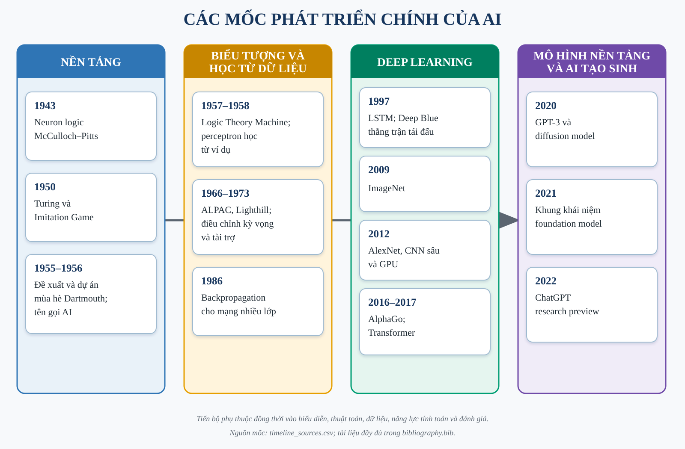

<!-- page_target: approximately 8; style: term_paper/config/style_spec.md -->

# CHƯƠNG 1. LỊCH SỬ PHÁT TRIỂN TRÍ TUỆ NHÂN TẠO

Lịch sử AI thường được kể bằng một chuỗi mốc công nghệ. Cách kể đó hữu ích nhưng chưa đủ: cùng một ý tưởng có thể xuất hiện sớm hơn nhiều so với thời điểm nó trở nên khả thi. Tiến bộ chỉ bền vững khi bốn thành phần gặp nhau: biểu diễn phù hợp, thuật toán học hoặc suy luận, dữ liệu đủ chất lượng và năng lực tính toán đáp ứng quy mô bài toán. Chương này vì vậy không xem lịch sử như cuộc thay thế tuyến tính giữa “AI cũ” và “AI mới”. Nó theo dõi sự thay đổi trọng tâm từ quy tắc được mã hóa bằng tay sang mô hình học từ dữ liệu, đồng thời giữ lại những đóng góp còn giá trị của tìm kiếm, biểu diễn tri thức và đánh giá thực nghiệm.

## 1.1. Tiền đề lý thuyết trước khi AI thành ngành

### 1.1.1. Logic hình thức, tính toán và neuron nhân tạo

Trước khi thuật ngữ “artificial intelligence” xuất hiện, hai câu hỏi nền tảng đã được đặt ra. Thứ nhất, suy luận có thể được biểu diễn bằng ký hiệu và quy tắc hình thức hay không. Thứ hai, một quá trình cơ học có thể thực hiện các quy tắc ấy đến mức nào. Logic toán học cung cấp ngôn ngữ để mô tả mệnh đề và suy diễn; lý thuyết tính toán làm rõ khái niệm thuật toán, trạng thái và giới hạn của phép tính. Các hướng này biến “trí tuệ” từ một khái niệm chỉ thuộc triết học thành đối tượng có thể mô hình hóa từng phần.

Sự chuyển đổi quan trọng nằm ở việc tách chức năng khỏi vật liệu sinh học. Một hệ thống không cần tái tạo toàn bộ bộ não để thực hiện một thao tác được xem là thông minh; nó có thể biểu diễn đầu vào, áp dụng quy tắc và sinh đầu ra. Quan điểm chức năng này mở đường cho hai truyền thống. Truyền thống biểu tượng mô tả tri thức bằng cấu trúc rời rạc và thao tác logic. Truyền thống kết nối mô tả hành vi bằng mạng gồm nhiều đơn vị đơn giản. Hai truyền thống nhiều lần cạnh tranh về nguồn lực và kỳ vọng, nhưng AI hiện đại sử dụng thành phần của cả hai: mạng neuron học biểu diễn, còn hệ thống triển khai vẫn cần quy tắc, tìm kiếm, bộ nhớ và kiểm tra ràng buộc.

### 1.1.2. McCulloch–Pitts và mô hình hóa hoạt động thần kinh

Năm 1943, Warren McCulloch và Walter Pitts công bố một mô hình neuron trừu tượng. Mỗi đơn vị nhận các tín hiệu nhị phân, kết hợp chúng theo một ngưỡng và phát tín hiệu đầu ra. Công trình cho thấy mạng các đơn vị đơn giản có thể biểu diễn những quan hệ logic nhất định [@mcculloch1943logical]. Đóng góp chính không nằm ở độ trung thực sinh học. Mô hình đã tạo một cầu nối giữa hoạt động thần kinh, logic mệnh đề và tính toán.

Neuron McCulloch–Pitts chưa phải mô hình học theo nghĩa hiện nay. Trọng số và cấu trúc không tự điều chỉnh từ dữ liệu; chúng phải được thiết kế để thực hiện hàm mong muốn. Tuy nhiên, ba thành phần của nó—tổng hợp tín hiệu, ngưỡng kích hoạt và kết nối giữa các đơn vị—trở thành ngôn ngữ nền tảng cho perceptron và mạng neuron nhiều lớp. Đây cũng là ví dụ sớm về sự đánh đổi giữa mô hình hóa và hiện thực: lược bỏ nhiều chi tiết sinh học giúp phân tích toán học rõ hơn, nhưng kết quả không cho phép suy ra rằng hệ thống đã tái tạo hoạt động của não người.

## 1.2. Turing và câu hỏi về trí tuệ máy

### 1.2.1. Imitation Game năm 1950

Năm 1950, Alan Turing mở đầu bài báo “Computing Machinery and Intelligence” bằng cách thay câu hỏi “máy có thể suy nghĩ không?” bằng một phép thử hành vi cụ thể hơn. Trong Imitation Game, người đánh giá trao đổi qua kênh văn bản và cố phân biệt người với máy. Turing không đưa ra một danh sách thuộc tính nội tâm cần chứng minh; ông chuyển vấn đề sang khả năng tạo hành vi ngôn ngữ khó phân biệt trong một điều kiện tương tác xác định [@turing1950computing].

Cách đặt vấn đề này có hai giá trị. Thứ nhất, nó tạo một tiêu chí có thể quan sát thay cho tranh luận thuần định nghĩa. Thứ hai, nó thừa nhận rằng nhiều năng lực phải phối hợp trong hội thoại: ngôn ngữ, kiến thức, suy luận, duy trì ngữ cảnh và xử lý câu hỏi bất ngờ. Bài báo cũng xem xét một số phản biện đối với trí tuệ máy và nêu ý tưởng về máy học, thay vì giả định mọi hành vi phải được lập trình trực tiếp.

### 1.2.2. Ý nghĩa và giới hạn của phép thử hành vi

Imitation Game có ảnh hưởng lớn nhưng không phải thước đo đầy đủ cho mọi dạng trí tuệ. Một hệ thống có thể hoàn thành tốt một nhiệm vụ đối thoại mà vẫn không có khả năng tri giác, thao tác vật lý hoặc khái quát ngoài phân phối dữ liệu đã gặp. Ngược lại, một hệ thống dự báo ảnh hoặc điều khiển robot có thể hữu ích dù không hướng đến việc bắt chước hội thoại của con người. Kết quả của phép thử còn phụ thuộc người đánh giá, thời lượng tương tác, chủ đề và tiêu chí chấp nhận.

Giới hạn này dẫn đến một bài học về đánh giá: tiêu chí phải phù hợp với năng lực đang được tuyên bố. Accuracy trên một dataset không đo trực tiếp “trí tuệ”; nó chỉ đo tỷ lệ dự đoán đúng theo nhãn và mẫu của protocol. Tương tự, hội thoại thuyết phục không tự động chứng minh tính đúng đắn. Trong tiểu luận này, mỗi mô hình vì vậy được đánh giá bằng metric gắn với bài toán cụ thể, kèm baseline, phân bố lớp và trường hợp thất bại.

## 1.3. Dartmouth 1955–1956 và sự hình thành tên gọi AI

### 1.3.1. Mục tiêu trong đề xuất Dartmouth

Ngày 31 tháng 8 năm 1955, John McCarthy, Marvin Minsky, Nathaniel Rochester và Claude Shannon đề xuất một dự án nghiên cứu mùa hè tại Dartmouth College. Tài liệu sử dụng cụm từ “artificial intelligence” và dự kiến một nhóm nhỏ làm việc trong mùa hè năm 1956. Giả thuyết trung tâm là các khía cạnh của học tập hoặc trí tuệ có thể được mô tả đủ chính xác để máy mô phỏng [@mccarthy1955dartmouth]. Mốc 1956 thường được xem là thời điểm AI hình thành như một lĩnh vực nghiên cứu có tên gọi và cộng đồng rõ hơn.

Đề xuất nêu nhiều chủ đề vẫn còn hiện diện: sử dụng ngôn ngữ, hình thành trừu tượng, giải quyết vấn đề, tự cải thiện và mô phỏng neuron. Điều này cho thấy AI ngay từ đầu không đồng nhất với mạng neuron hoặc logic biểu tượng. Lĩnh vực được xác lập bởi mục tiêu xây dựng năng lực trí tuệ bằng máy, còn phương pháp có thể thay đổi theo từng giai đoạn.

### 1.3.2. Kỳ vọng ban đầu và những hướng nghiên cứu chính

Kỳ vọng của giai đoạn đầu được thúc đẩy bởi thành công trên các miền có luật rõ. Logic Theory Machine của Newell, Shaw và Simon dùng heuristic để chứng minh một số định lý trong logic mệnh đề, cho thấy tìm kiếm có hướng có thể giảm không gian phương án so với liệt kê mù [@newell1957logic]. Các chương trình chơi trò chơi cũng cung cấp môi trường thuận lợi: trạng thái, hành động hợp lệ và điều kiện thắng có thể định nghĩa chính xác.

Từ đây hình thành ba hướng chính. Hướng thứ nhất là tìm kiếm và giải quyết vấn đề: biểu diễn trạng thái rồi tìm chuỗi hành động dẫn đến mục tiêu. Hướng thứ hai là biểu diễn tri thức và suy luận: mã hóa sự kiện, quan hệ và luật để hệ thống rút ra kết luận. Hướng thứ ba là học từ dữ liệu hoặc kinh nghiệm. Trong nhiều thập niên, hai hướng đầu chiếm ưu thế vì máy tính và dữ liệu còn hạn chế, còn tri thức chuyên gia có thể được chuyển thành luật trong các miền hẹp. Tuy nhiên, thành công trong môi trường đóng cũng tạo kỳ vọng rằng phương pháp sẽ nhanh chóng mở rộng sang thế giới thực. Đây là điểm mà lịch sử sau đó nhiều lần điều chỉnh.

## 1.4. Từ AI biểu tượng đến các chu kỳ hưng thịnh–suy giảm

### 1.4.1. Tìm kiếm, biểu diễn tri thức và hệ chuyên gia

AI biểu tượng xem giải quyết vấn đề như thao tác trên các biểu diễn có ý nghĩa rõ. Trong tìm kiếm, node mô tả trạng thái, cạnh mô tả hành động và heuristic ước lượng hướng đi triển vọng. Trong hệ dựa trên luật, tri thức thường được biểu diễn dưới dạng điều kiện–kết luận. Ưu điểm của cách tiếp cận này là đường suy luận có thể kiểm tra: người phát triển biết quy tắc nào được kích hoạt và vì sao hệ thống đưa ra kết luận.

Hệ chuyên gia mở rộng ý tưởng đó bằng cách thu thập tri thức của chuyên gia cho một miền hẹp. DENDRAL hỗ trợ suy luận cấu trúc phân tử từ dữ liệu hóa học và được mô tả như một trong các hệ tri thức chuyên biệt quy mô lớn đầu tiên [@lindsay1993dendral]. Những hệ như DENDRAL cho thấy hiệu quả không nhất thiết đến từ một cơ chế suy luận hoàn toàn tổng quát; tri thức miền và cách biểu diễn có thể quyết định chất lượng.

Tuy nhiên, tri thức mã hóa thủ công tạo ra nút thắt. Luật khó bao phủ mọi ngoại lệ, tốn công duy trì và có thể xung đột khi hệ thống lớn lên. Các khái niệm hiển nhiên với con người—bối cảnh, quan hệ nhân quả thông thường hoặc nghĩa linh hoạt của ngôn ngữ—khó chuyển thành tập luật đầy đủ. Hệ thống cũng dễ suy giảm khi đầu vào lệch khỏi miền đã thiết kế. Thành công trong miền hẹp vì vậy không đồng nghĩa trí tuệ tổng quát.

### 1.4.2. AI winter: giới hạn dữ liệu, tính toán và kỳ vọng

Thuật ngữ “AI winter” mô tả các giai đoạn đầu tư và quan tâm suy giảm sau khi kỳ vọng không được đáp ứng. Không nên quy lịch sử này cho một sự kiện duy nhất. Trong dịch máy, báo cáo ALPAC năm 1966 đánh giá tiến độ, chi phí và triển vọng của dịch tự động trong bối cảnh cụ thể của Hoa Kỳ; ảnh hưởng của nó gắn trực tiếp với tài trợ cho xử lý ngôn ngữ và dịch máy [@alpac1966language]. Tại Anh, báo cáo Lighthill đầu thập niên 1970 phê phán khả năng mở rộng của nhiều hướng AI đương thời và trở thành một tài liệu quan trọng trong tranh luận về tài trợ [@lighthill1973survey].

Các khó khăn kỹ thuật có tính lặp lại. Không gian tìm kiếm tăng theo cấp số khi số biến hoặc độ sâu kế hoạch tăng. Bộ nhớ và tốc độ máy tính giới hạn độ lớn bài toán. Dữ liệu số hóa còn ít và thiếu chuẩn đánh giá chung. Hệ chuyên gia cần tri thức được thu thập, chuẩn hóa và cập nhật bằng tay. Đối với mạng neuron, việc huấn luyện nhiều lớp chưa có quy trình ổn định ở quy mô lớn. Khi các demo trong miền hẹp được diễn giải thành lời hứa về năng lực tổng quát, khoảng cách giữa kỳ vọng và kết quả càng lớn.

Làn sóng hệ chuyên gia trong thập niên 1980 tạo một chu kỳ thương mại hóa mới, nhưng chi phí xây dựng và bảo trì cơ sở tri thức tiếp tục là vấn đề. AI winter thứ hai thường được gắn với cuối thập niên 1980 và đầu thập niên 1990, khi thị trường và tài trợ điều chỉnh. Cách đọc thận trọng là: hoạt động nghiên cứu không dừng hoàn toàn trong “mùa đông”; nhiều công trình nền tảng về học máy, thị giác và mạng neuron vẫn tiếp tục. Sự suy giảm chủ yếu cho thấy tên gọi và nguồn lực của lĩnh vực nhạy với kỳ vọng hơn là ý tưởng kỹ thuật biến mất.

## 1.5. Sự trỗi dậy của machine learning và deep learning

### 1.5.1. Perceptron, backpropagation và học biểu diễn

Perceptron của Frank Rosenblatt đưa cơ chế học vào mô hình neuron. Với đầu vào \(x\), trọng số \(w\), bias \(b\) và hàm ngưỡng, mô hình tạo dự đoán từ dấu của \(w^Tx+b\); quy tắc cập nhật điều chỉnh trọng số khi phân loại sai. Bài báo năm 1958 mô tả perceptron như một mô hình xác suất cho lưu trữ và tổ chức thông tin [@rosenblatt1958perceptron]. Giá trị thực nghiệm của perceptron nằm ở việc tham số có thể được suy ra từ ví dụ thay vì thiết lập hoàn toàn bằng tay.

Perceptron một lớp chỉ tạo biên quyết định tuyến tính. Các phân tích về perceptron làm rõ những hàm mà cấu trúc này không biểu diễn được [@minsky1969perceptrons]. Giới hạn đó là giới hạn của kiến trúc và thuật toán đang xét, không phải chứng minh rằng mọi mạng neuron đều bất khả thi. Mạng nhiều lớp có thể tạo biên phi tuyến, nhưng cần cách phân bổ sai số từ output về các lớp trước.

Backpropagation giải quyết bài toán này bằng quy tắc dây chuyền. Sai số được truyền ngược qua đồ thị tính toán để thu gradient của loss theo từng tham số, sau đó optimizer cập nhật trọng số. Công trình của Rumelhart, Hinton và Williams năm 1986 cho thấy mạng có thể học các biểu diễn nội bộ hữu ích khi tối ưu bằng lan truyền ngược [@rumelhart1986backprop]. Cơ chế này hiện vẫn là nền tảng của MLP, CNN, RNN và Transformer.

Song song với mạng neuron, statistical machine learning phát triển các mô hình có giả định và biên quyết định khác nhau. k-nearest neighbors dự đoán dựa trên các mẫu gần trong không gian đặc trưng [@cover1967nearest]. Support Vector Machine tối đa hóa biên và có thể dùng kernel để tạo biên phi tuyến [@cortes1995svm]. Random Forest kết hợp nhiều cây để giảm phương sai và tăng độ ổn định [@breiman2001randomforests]. Sự phát triển này chuyển trọng tâm đánh giá sang khả năng khái quát trên dữ liệu chưa thấy, từ đó hình thành quy trình train/validation/test và so sánh bằng benchmark.

### 1.5.2. CNN, ImageNet và bước ngoặt AlexNet

CNN đưa một inductive bias phù hợp với ảnh vào kiến trúc. Thay vì mỗi neuron nối với toàn bộ pixel, convolution dùng kernel cục bộ và chia sẻ trọng số qua các vị trí. Cách tổ chức này giảm số tham số và cho phép phát hiện cùng một mẫu ở nhiều vùng ảnh. Pooling hoặc bước nhảy làm giảm kích thước không gian, còn các lớp sâu dần kết hợp cạnh, texture và cấu trúc thành đặc trưng cấp cao hơn. LeNet và các hệ nhận dạng tài liệu cho thấy học dựa trên gradient có thể hoạt động end-to-end trên ảnh chữ số và ký tự [@lecun1998document].

Deep learning chưa bùng nổ ngay sau các kết quả đó. Mạng sâu khó tối ưu, dữ liệu gán nhãn còn nhỏ và huấn luyện tốn thời gian. Nghiên cứu về tiền huấn luyện các mạng niềm tin sâu năm 2006 là một trong các tín hiệu phục hồi quan tâm đối với kiến trúc nhiều lớp [@hinton2006fast]. Đồng thời, dữ liệu quy mô lớn và phần cứng song song thay đổi điều kiện thực nghiệm. ImageNet cung cấp cơ sở dữ liệu ảnh phân cấp quy mô lớn và một benchmark có tính cạnh tranh, giúp đo tiến bộ trên cùng bài toán [@deng2009imagenet].

Năm 2012, AlexNet đạt kết quả nổi bật trong ImageNet Large Scale Visual Recognition Challenge. Mạng gồm năm lớp convolution cùng các lớp fully connected, được huấn luyện trên khoảng 1,3 triệu ảnh thuộc 1.000 lớp và khai thác GPU để thực hiện tính toán lớn [@krizhevsky2012imagenet]. Bước ngoặt không đến từ một thành phần duy nhất: dữ liệu, GPU, activation, regularization và quy trình huấn luyện cùng tạo hiệu quả. Sau AlexNet, CNN sâu trở thành hướng chủ đạo trong nhiều bài toán thị giác.

Lịch sử CNN cũng cảnh báo về cách hiểu benchmark. Một kiến trúc đạt kết quả cao trên ImageNet không mặc nhiên tối ưu cho ảnh 64×64, dữ liệu y tế dạng bảng hay thiết bị giới hạn. Trong Chương 3, CNN nhỏ được so sánh dưới topology và split đã khóa. Mục tiêu là quan sát phép convolution và sai khác implementation, không tái hiện quy mô AlexNet hoặc tuyên bố state-of-the-art.

### 1.5.3. RNN, LSTM, attention và Transformer

Dữ liệu chuỗi đặt ra yêu cầu khác ảnh. Thứ tự có ý nghĩa và dự đoán tại thời điểm hiện tại có thể phụ thuộc các bước trước. RNN xử lý lần lượt từng phần tử, cập nhật trạng thái ẩn \(h_t=f(x_t,h_{t-1})\), rồi dùng trạng thái này cho output. Elman chỉ ra rằng biểu diễn phân tán trong mạng hồi quy có thể học cấu trúc theo thời gian [@elman1990structure]. Khi unroll mạng qua các bước, Backpropagation Through Time (BPTT) tính gradient trên chuỗi đồ thị lặp.

Vanilla RNN gặp khó khi học phụ thuộc dài. Gradient được nhân lặp qua nhiều Jacobian nên có thể giảm về gần 0 hoặc tăng mất kiểm soát; nghiên cứu thực nghiệm và lý thuyết đã chỉ rõ khó khăn của gradient descent trong bối cảnh này [@bengio1994longterm]. Gradient clipping xử lý trường hợp bùng nổ bằng cách chặn norm, nhưng không tự giải quyết việc thông tin dài hạn bị mất.

Long Short-Term Memory (LSTM) đưa vào đường truyền trạng thái và các cổng điều khiển việc ghi, giữ và đọc thông tin. Kiến trúc được thiết kế để duy trì dòng gradient tốt hơn qua nhiều bước [@hochreiter1997lstm]. LSTM và các biến thể sau đó trở thành lựa chọn phổ biến cho tiếng nói, ngôn ngữ và chuỗi thời gian. Tuy vậy, xử lý tuần tự làm hạn chế mức song song và trạng thái cố định vẫn tạo nút thắt khi chuỗi dài.

Attention cho phép mô hình gán trọng số trực tiếp lên những vị trí liên quan thay vì buộc toàn bộ thông tin đi qua một trạng thái duy nhất. Transformer năm 2017 xây dựng kiến trúc dựa chủ yếu trên self-attention, bỏ recurrence trong khối chính và nhờ đó tăng khả năng song song khi huấn luyện [@vaswani2017attention]. Mỗi token có thể tổng hợp thông tin từ các vị trí khác theo trọng số attention; positional encoding bổ sung thông tin thứ tự mà phép attention tự thân không mang.

Transformer không làm RNN trở nên vô nghĩa. RNN vẫn phù hợp để giảng giải trạng thái, BPTT và suy luận streaming với mô hình nhỏ. Trong Chương 4, Vanilla RNN được chọn để ba implementation có thể đối chiếu đến phương trình và gradient. LSTM, attention và Transformer đóng vai trò mốc mở rộng: chúng cho biết vì sao kiến trúc cơ bản có giới hạn và những cơ chế nào đã được phát triển để xử lý giới hạn đó.

Từ Transformer, tiền huấn luyện trên tập dữ liệu rộng rồi thích nghi cho nhiều nhiệm vụ trở thành một mô hình phát triển quan trọng. GPT-3 cho thấy một mô hình ngôn ngữ tự hồi quy quy mô 175 tỷ tham số có thể thực hiện nhiều nhiệm vụ zero-shot hoặc few-shot thông qua ngữ cảnh mà không cập nhật gradient cho từng nhiệm vụ [@brown2020gpt3]. Khái niệm “foundation model” nhấn mạnh các mô hình được huấn luyện trên dữ liệu rộng, có thể thích nghi cho nhiều tác vụ hạ nguồn, đồng thời lưu ý rằng lỗi và thiên lệch của mô hình nền tảng có thể truyền sang nhiều ứng dụng [@bommasani2021foundation].

AI tạo sinh mở rộng từ sinh văn bản sang ảnh, âm thanh và dữ liệu đa phương thức. Diffusion model học quá trình đảo nhiễu và đạt kết quả sinh ảnh chất lượng cao, tạo một hướng khác với mô hình tự hồi quy và GAN [@ho2020diffusion]. Việc ChatGPT được giới thiệu công khai dưới dạng research preview vào ngày 30 tháng 11 năm 2022 làm giao diện hội thoại của mô hình ngôn ngữ trở nên phổ biến hơn; thông báo ban đầu đồng thời ghi nhận các hạn chế như câu trả lời nghe hợp lý nhưng sai và độ nhạy với cách diễn đạt prompt [@openai2022chatgpt]. Vì vậy, sự phát triển của generative AI tăng cả năng lực lẫn yêu cầu đánh giá: fluency không thay thế kiểm tra factuality, và khả năng đa nhiệm không loại bỏ rủi ro dữ liệu, bias hoặc misuse.

## 1.6. Bài học lịch sử cho thực nghiệm hiện đại

*Nguồn: tác giả tổng hợp từ các tài liệu gốc; ánh xạ từng mốc nằm trong `timeline_sources.csv`.*

### 1.6.1. Dữ liệu, compute, kiến trúc và protocol đánh giá

Timeline ở Hình 1.1 cho thấy các bước tiến không phân bố đều. Mô hình neuron xuất hiện từ năm 1943, nhưng cần thuật toán học, dữ liệu và compute mới phát triển thành deep learning quy mô lớn. CNN đã có ứng dụng thực tế trước AlexNet, nhưng ImageNet và GPU tạo điều kiện so sánh và mở rộng. RNN đặt nền tảng cho mô hình chuỗi, LSTM xử lý một phần phụ thuộc dài, còn attention và Transformer thay đổi đường truyền thông tin và mức song song. Foundation model tiếp tục mở rộng quy mô tiền huấn luyện, nhưng vẫn dựa trên backpropagation và học biểu diễn đã hình thành từ các giai đoạn trước.

Từ đó có thể rút ra bốn điều kiện cho một kết quả thực nghiệm có ý nghĩa. Một là **dữ liệu**: nhãn, phân bố, kích thước và split quyết định câu hỏi mà mô hình thực sự trả lời. Hai là **kiến trúc**: inductive bias phải tương ứng cấu trúc dữ liệu; CNN giả định locality, RNN giả định thứ tự, còn mô hình bảng có thể không hưởng lợi từ các giả định này. Ba là **compute**: giới hạn thiết bị ảnh hưởng batch size, số epoch và khả năng chạy nhiều seed, nên phải được ghi thay vì che giấu. Bốn là **protocol**: nếu preprocessing hoặc tập TEST được dùng để chọn mô hình, metric có thể lạc quan dù code không lỗi.

Các mốc thi đấu giữa máy và người cũng cần được đặt đúng ngữ cảnh. Deep Blue đánh bại Garry Kasparov trong trận tái đấu sáu ván năm 1997 nhờ tìm kiếm, phần cứng song song, hàm đánh giá và cơ sở dữ liệu cờ; đó là thành công lớn trong cờ vua, không phải phép đo mọi dạng trí tuệ [@campbell2002deepblue]. AlphaGo năm 2016 kết hợp policy network, value network và Monte Carlo tree search để xử lý không gian cờ vây [@silver2016alphago]. Hai hệ thống cho thấy học và tìm kiếm có thể bổ sung nhau, đồng thời nhắc rằng kết quả phải gắn với miền nhiệm vụ.

Tiểu luận chuyển các bài học này thành matched protocol. Ba framework trong cùng track dùng đúng sample keys, split, dữ liệu sau preprocessing và topology logic. Validation quyết định checkpoint; TEST không tham gia chọn cấu hình. Metric được tái tính từ prediction artifact. Nếu giới hạn phần cứng buộc dùng subset, cả ba framework dùng cùng subset. Như vậy, so sánh không loại bỏ mọi nguồn biến thiên, nhưng các nguồn chính được kiểm soát và công bố.

### 1.6.2. Tính tái lập, đạo đức và giới hạn suy diễn

Tái lập không chỉ là chạy lại một notebook mà không báo lỗi. Một kết quả có thể chạy lại nhưng vẫn không kiểm chứng được nếu thiếu phiên bản dữ liệu, split indices, model weights hoặc quy tắc tính metric. Báo cáo này dùng provenance theo chuỗi: raw source → preprocessing → split → model → prediction → metric → figure/table. Mỗi mắt xích quan trọng cần có đường dẫn tương đối, cấu hình hoặc hash phù hợp. Duration chỉ mô tả lần chạy trên môi trường ghi nhận, không phải benchmark phổ quát cho Keras, PyTorch hay NumPy.

Đạo đức và giới hạn suy diễn cũng là một phần của chất lượng kỹ thuật. Dataset sức khỏe có thể chứa mất cân bằng và sai lệch đại diện; recall của lớp thiểu số cần được xem cùng precision và false positive. Dữ liệu giá cổ phiếu có autocorrelation và distribution shift; split ngẫu nhiên có thể gây leakage theo thời gian. Foundation model có thể truyền lỗi và bias đến nhiều ứng dụng hạ nguồn [@bommasani2021foundation]. Việc mô hình tạo output thuyết phục không làm mất nhu cầu kiểm tra nguồn, bảo vệ dữ liệu và xác định trách nhiệm của người sử dụng.

Chương 1 cho thấy lịch sử AI là lịch sử của cả ý tưởng lẫn điều kiện kiểm chứng. Chương 2 bắt đầu từ machine learning có giám sát và các thuật toán cơ bản, nơi split, preprocessing và baseline được định nghĩa rõ. Chương 3 đi sâu vào CNN để xem inductive bias không gian hoạt động trên ảnh và trên một phép chuyển đổi Conv1D có giới hạn. Chương 4 khảo sát RNN, BPTT và dữ liệu tuần tự, nơi thứ tự thời gian trở thành ràng buộc của thiết kế thực nghiệm. Ba chương không cố tái hiện toàn bộ lịch sử; chúng chọn các mô hình đủ nền tảng để cài đặt từ scratch, đủ phổ biến để đối chiếu framework và đủ khác nhau để làm rõ quan hệ giữa dữ liệu, kiến trúc và đánh giá.
