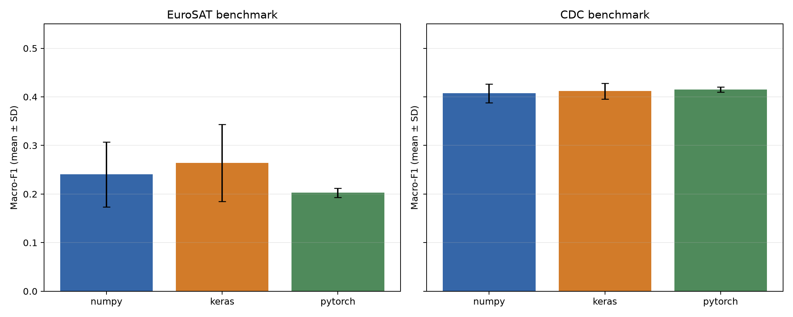
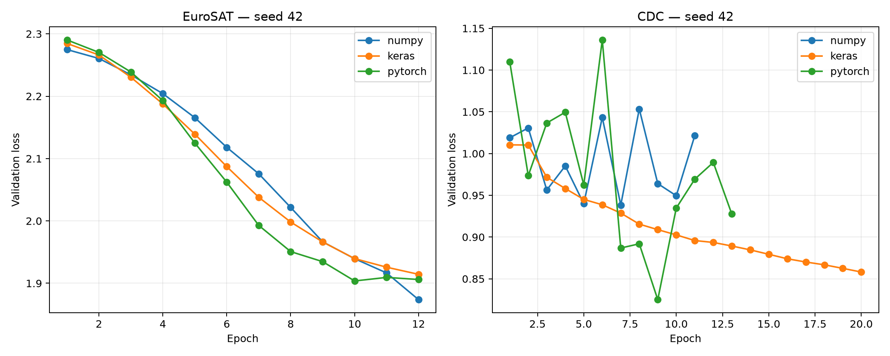

<!-- page_target: 12-14; style: term_paper/config/style_spec.md -->

# CHƯƠNG 3. CONVOLUTIONAL NEURAL NETWORK

Chương này khảo sát Convolutional Neural Network (CNN) ở hai vai trò khác nhau. Vai trò thứ nhất là một bộ trích xuất đặc trưng có cấu trúc cho ảnh RGB EuroSAT, nơi quan hệ lân cận giữa pixel có ý nghĩa không gian tự nhiên. Vai trò thứ hai là một phép thích nghi Conv1D trên 21 chỉ báo sức khỏe của CDC Diabetes, nơi thứ tự cột được giữ cố định nhưng “lân cận” giữa feature chỉ là quy ước của file. Sự đối lập này giúp đánh giá CNN theo cả năng lực và giới hạn của inductive bias.

Thực nghiệm gồm hai track. Track matched triển khai đúng cùng topology bằng NumPy scratch, Keras và PyTorch trên hai benchmark subset cố định: EuroSAT 500/150/150 và CDC 6.000/1.500/1.500 cho TRAIN/VALIDATION/TEST. Ba framework nhận cùng tensor, nhãn, sample key, optimizer family, learning-rate candidates và early-stopping budget. Track ablation tái sử dụng 12 mô hình Keras đã chạy trong A05 trên toàn bộ ba dataset: Basic, AlexNet-inspired, VGG-inspired và ResNet-inspired. Hai track được báo ở bảng riêng vì khác topology, quy mô dữ liệu và mục đích.

Clean run seed 42 của toàn matched track hoàn tất dưới hai phút, thấp hơn ngưỡng 20 phút đã khóa trong hợp đồng. Vì vậy seed 52 và 62 trở thành bắt buộc trước khi xem kết luận cuối. Tổng cộng có 18 run chính, tương ứng 2 dataset × 3 framework × 3 seed. Mỗi run lưu model, lịch sử loss, kết quả search learning rate, probability của từng lớp trên TEST, sample key, hash model, hash preprocessor và hash split.

## 3.1. Động cơ và trực giác CNN

### 3.1.1. Local connectivity và weight sharing

Một Dense layer nối mỗi output với toàn bộ input. Với ảnh 64×64×3, chỉ một Dense layer 128 neuron đã cần hơn 1,57 triệu trọng số, chưa tính bias. Cách nối này bỏ qua cấu trúc ảnh: hai pixel cạnh nhau và hai pixel ở hai góc được xử lý như những cặp tọa độ độc lập. CNN thay giả định đó bằng local connectivity. Mỗi output chỉ quan sát một vùng nhỏ, chẳng hạn cửa sổ 3×3, nên layer tập trung vào cạnh, texture, màu và cấu trúc cục bộ trước khi tổng hợp ngữ cảnh rộng hơn.

Weight sharing là bước giảm tham số quan trọng hơn. Một kernel 3×3×3→8 chỉ có (3\times3\times3\times8=216) trọng số và 8 bias, nhưng cùng kernel được áp dụng tại mọi vị trí. Nếu một filter phản ứng với ranh giới sáng–tối ở góc trái, nó cũng có thể phản ứng với mẫu tương tự ở giữa ảnh. Đây là inductive bias phù hợp với ảnh: một pattern có thể xuất hiện ở nhiều tọa độ mà vẫn giữ ý nghĩa.

Các mô hình LeNet cho nhận dạng chữ viết tay đã cho thấy convolution, pooling và gradient-based learning có thể kết hợp thành hệ thống end-to-end [@lecun1998document]. AlexNet sau đó chứng minh CNN sâu có thể khai thác dữ liệu và compute quy mô lớn cho ImageNet [@krizhevsky2012imagenet]. Chương này không cố tái tạo quy mô của các kiến trúc đó; matched CNN chỉ có 1.562 tham số trên EuroSAT để ba implementation có thể được kiểm tra đến từng phép đạo hàm.

Local connectivity không bảo đảm feature học được sẽ có ích. Kernel vẫn phải được tối ưu từ dữ liệu, và receptive field của mạng quá nông có thể không bao quát vật thể hoặc bố cục cần thiết. EuroSAT gồm các patch vệ tinh nhỏ, nên màu và texture cục bộ chứa tín hiệu đáng kể; Oxford-IIIT Pet lại đòi hỏi phân biệt hình thái giống vật nuôi, pose và chi tiết fine-grained. Cùng một budget ngắn có thể đủ cho dataset thứ nhất nhưng thiếu nghiêm trọng cho dataset thứ hai.

### 3.1.2. Translation equivariance và receptive field

Một phép convolution lý tưởng là translation equivariant: nếu input dịch chuyển, feature map cũng dịch chuyển tương ứng. Tính chất này khác translation invariance. CNN không tự động cho cùng output khi vật thể dịch chuyển; pooling, global aggregation và dữ liệu huấn luyện mới làm prediction bớt nhạy với thay đổi vị trí nhỏ. Stride, padding và boundary còn có thể phá equivariance chính xác.

Receptive field là vùng input có thể ảnh hưởng đến một activation. Với hai convolution 3×3 và một MaxPool 2, activation sau convolution thứ hai nhìn một vùng rộng hơn 3×3 của ảnh ban đầu. Khi layer chồng lên nhau, receptive field tăng mà không cần một kernel rất lớn. VGG khai thác ý tưởng lặp nhiều convolution 3×3 để tăng depth và giữ cấu trúc đồng nhất [@simonyan2014verydeep]. Tuy nhiên, độ sâu chỉ có ích khi optimization và regularization phù hợp; kết quả A05 sẽ cho thấy ba family sâu hơn đã collapse dưới common protocol.

Global Average Pooling (GAP) lấy trung bình mỗi channel trên toàn bộ trục không gian. So với Flatten rồi Dense lớn, GAP giảm mạnh số tham số và buộc mỗi channel đóng vai trò như một summary feature. Matched topology chọn GAP vì hai lý do: parameter count không phụ thuộc kích thước không gian sau convolution, và scratch backward có thể được kiểm tra rõ ràng. Đổi lại, GAP có thể làm mất thông tin vị trí cần cho các lớp khác nhau về bố cục.

## 3.2. Thành phần toán học

### 3.2.1. Convolution/cross-correlation, padding và stride

Các thư viện deep learning thường gọi operation là convolution nhưng thực hiện cross-correlation, tức kernel không bị lật. Với input (X\in\mathbb{R}^{H\times W\times C_{in}}), kernel (K\in\mathbb{R}^{k_h\times k_w\times C_{in}\times C_{out}}), output tại vị trí ((i,j,o)) là:

\[
Z_{i,j,o}=b_o+\sum_{u=0}^{k_h-1}\sum_{v=0}^{k_w-1}\sum_{c=0}^{C_{in}-1}
X_{i+u,j+v,c}K_{u,v,c,o}.
\]

Với stride (s), padding (p) và dilation bằng 1, kích thước một trục output là:

\[
H_{out}=\left\lfloor\frac{H+2p-k}{s}\right\rfloor+1.
\]

Matched CNN dùng kernel 3, stride 1 và `same` padding (p=1), nên convolution giữ nguyên chiều dài/rộng. MaxPool kernel 2, stride 2 giảm kích thước xuống một nửa và bỏ phần tử cuối nếu chiều dài lẻ. EuroSAT có shape 64×64×3, vì vậy luồng shape là 64×64×3 → 64×64×8 → 32×32×8 → 32×32×16 → GAP 16 → logits 10. CDC có shape 21×1, tạo luồng 21×1 → 21×8 → 10×8 → 10×16 → GAP 16 → logits 3.

Parameter count được tính trực tiếp từ tensor. Conv2D đầu có (3\times3\times3\times8+8=224) tham số; Conv2D hai có (3\times3\times8\times16+16=1.168); head có (16\times10+10=170). Tổng EuroSAT là 1.562. Conv1D CDC tương ứng có 32 + 400 + 51 = 483 tham số. Cả ba framework báo đúng hai con số này trên mọi seed.

### 3.2.2. Activation, pooling và classification head

Sau mỗi convolution, ReLU áp dụng (a=\max(0,z)). Hàm đơn giản này giữ gradient bằng 1 ở miền dương và bằng 0 ở miền âm. ReLU giảm vấn đề saturation so với sigmoid trong hidden layer, nhưng neuron có thể “chết” nếu pre-activation liên tục âm. He initialization được dùng để scale phương sai trọng số theo fan-in của kernel.

MaxPool 2 chọn giá trị lớn nhất trong mỗi cửa sổ 2×2 hoặc độ dài 2. Trong backward, gradient được gửi về vị trí đã tạo maximum; nếu có nhiều phần tử bằng nhau, implementation NumPy chia đều gradient cho các vị trí đồng hạng. Quy ước này giúp numerical-gradient test ổn định hơn và tương ứng với một subgradient hợp lệ. Pooling giảm compute cho convolution kế tiếp nhưng có thể xóa tín hiệu yếu, đặc biệt khi input chỉ dài 21 feature như CDC.

Head tạo (C) logits (z), sau đó Softmax biến chúng thành probability:

\[
p_c=\frac{\exp(z_c-z_{max})}{\sum_{j=1}^{C}\exp(z_j-z_{max})}.
\]

Trừ (z_{max}) không đổi phân phối nhưng tránh overflow. Sparse categorical cross-entropy cho nhãn đúng (y) là (-\log p_y). Gradient theo logit có dạng gọn (p-\mathrm{onehot}(y)). CDC dùng class weight nghịch đảo tần suất tính từ benchmark TRAIN: lớp 0 là 0,3957; lớp 1 là 18,1818; lớp 2 là 2,3923. Weight được áp dụng trong loss và gradient TRAIN, không áp dụng cho VALIDATION/TEST metric.

Macro-F1 là metric chính vì tính F1 từng lớp rồi lấy trung bình không trọng số. Mỗi lớp vì vậy có tiếng nói ngang nhau, khác weighted F1 hoặc accuracy dễ bị lớp 0 CDC chi phối. Accuracy vẫn được báo để mô tả tỷ lệ đúng tổng thể, nhưng recall của Prediabetes và Diabetes được xem riêng.

### 3.2.3. Backpropagation qua lớp convolution

Backpropagation qua convolution có ba output: gradient theo input, kernel và bias. Với upstream gradient (G=\partial L/\partial Z), gradient bias là tổng (G) trên batch và các vị trí. Gradient kernel tích lũy tích giữa mỗi input window và upstream gradient tương ứng. Gradient input “rải” upstream gradient qua các vị trí mà kernel đã đọc. Cùng một phần tử input có thể nằm trong nhiều cửa sổ, nên các đóng góp phải cộng dồn.

Implementation NumPy tạo view các cửa sổ bằng `sliding_window_view`, dùng tensor contraction cho forward và gradient kernel, rồi lặp trên chín offset của kernel để tích lũy gradient input. Không dùng TensorFlow, PyTorch autograd hay API convolution. MaxPool, GAP, Dense, Softmax, loss, Adam và early stopping cũng được cài đặt thủ công.

Numerical gradient kiểm tra một phần tử tham số bằng sai phân trung tâm:

\[
g_{num}=\frac{L(\theta+\epsilon)-L(\theta-\epsilon)}{2\epsilon},\quad \epsilon=10^{-5}.
\]

Hai test riêng kiểm tra kernel Conv2D và Conv1D trên tensor nhỏ; giá trị analytic và numerical khớp đến bốn chữ số thập phân. Toy dataset ảnh gồm thanh dọc, thanh ngang và đường chéo; scratch CNN giảm loss và đạt ít nhất 95% accuracy trên TRAIN. Các test này không chứng minh toàn bộ implementation không có lỗi, nhưng bắt được sai orientation kernel, padding, broadcasting và pooling backward thường gặp.

Adam cập nhật toàn bộ tham số bằng moment bậc nhất/bậc hai có bias correction [@kingma2014adam]. NumPy, Keras và PyTorch dùng cùng optimizer family nhưng không được kỳ vọng có trajectory bit-for-bit giống nhau: initialization generator, dtype, convolution kernel implementation, thứ tự mini-batch và phép toán song song khác nhau. Fairness trong chương này có nghĩa cùng bài toán, search space, topology và budget; không phải ép ba runtime sinh cùng trọng số.

## 3.3. Thiết kế thực nghiệm

### 3.3.1. Split, chuẩn hóa ảnh/feature và class weighting

Tất cả benchmark sample được lấy từ split A05 đã khóa trước Phase 4. EuroSAT full split gồm 18.900 TRAIN, 4.050 VALIDATION và 4.050 TEST. CDC full split gồm 177.576/38.052/38.052. Phase 4 không chia lại raw data; nó lấy stratified subset độc lập bên trong từng split bằng subset seed 42. Vì vậy không có sample chuyển vai trò giữa TRAIN, VALIDATION và TEST.

EuroSAT dùng 500 TRAIN, 150 VALIDATION và 150 TEST. Tỷ lệ lớp gần với full split: lớp có 3.000 ảnh đóng góp khoảng 55–56 mẫu TRAIN; Pasture có 37; các lớp 2.500 ảnh có khoảng 46. Ảnh được decode RGB đúng 64×64 và chia 255 về [0,1]. Không augmentation trong matched track. Split hash là `2d793bd92569…`.

CDC dùng 6.000 TRAIN, 1.500 VALIDATION và 1.500 TEST. TRAIN có 5.054 No diabetes, 110 Prediabetes và 836 Diabetes. VALIDATION/TEST đều có 1.264/27/209. StandardScaler chỉ fit trên 6.000 TRAIN rows rồi áp dụng cho hai split còn lại; tensor cuối có shape `(N,21,1)`. Split hash là `c9446f43c942…`. Mean từng feature của TRAIN sau transform gần 0 và standard deviation gần 1 trong tolerance số học.

Mỗi prediction CSV chứa đúng TEST keys theo cùng thứ tự. Verifier so sánh `sample_key` và `y_true` giữa ba framework cho từng dataset/seed, kiểm tra không overlap, hash split, hash preprocessor và hash model. Metric được tái tính từ `y_true`, `y_pred` và các cột `prob_0...prob_C`; không có số trong bảng kết quả được nhập tay. Hình 3.1 và Bảng 3.1 cho thấy quy mô, phân bố và vai trò khác nhau của ba dataset trước khi thu hẹp sang matched track.

*Nguồn: A05 split manifests và raw CDC label column; Oxford chỉ dùng 7.349 sample có annotation chính thức.*

**Bảng 3.1. Quy mô, input và vai trò của ba dataset**

| Dataset | Full samples / lớp | Input | Matched TRAIN / VAL / TEST | Vai trò |
|---|---:|---|---:|---|
| EuroSAT RGB | 27.000 / 10 | 64×64×3, pixel [0,1] | 500 / 150 / 150 | Matched + A05 full-data ablation |
| Oxford-IIIT Pet | 7.349 / 37 | RGB resize 96×96 trong A05 | Không chạy matched | Keras case study A05 |
| CDC Diabetes 012 | 253.680 / 3 | 21×1, StandardScaler | 6.000 / 1.500 / 1.500 | Matched + A05 full-data ablation |

*Nguồn bảng: `term_paper/artifacts/metrics/ch3_dataset_summary.csv`, A05 split manifests và raw CDC label column.*

### 3.3.2. Matched topology, benchmark subset và fairness

Topology cố định là Conv(8,3)–ReLU–MaxPool(2)–Conv(16,3)–ReLU–GAP–Dense(C). NumPy dùng channels-last. Keras dùng `Conv2D/Conv1D` channels-last. PyTorch chuyển cùng tensor sang NCHW/NCL ở biên model rồi dùng `Conv2d/Conv1d`; prediction được chuyển lại NumPy. Việc transpose layout không thay sample hay giá trị feature.

Hai candidate learning rate 0,01 và 0,003 được khai báo trong JSON trước thí nghiệm. Mỗi candidate được fit với Adam; learning rate được chọn theo validation macro-F1, tie-break bằng validation loss rồi learning rate nhỏ hơn. EuroSAT dùng batch 50, tối đa 12 epoch, patience 3. CDC dùng batch 256, tối đa 20 epoch, patience 4. Early stopping phục hồi trọng số có validation loss thấp nhất bên trong candidate.

Parameter count, batch policy và input giống nhau, nhưng selected learning rate có thể khác giữa framework/seed vì tiêu chí validation được áp dụng độc lập. Đây là protocol search công bằng hơn việc ép một learning rate sau khi đã biết một backend thuận lợi. TEST chỉ được suy luận sau khi candidate đã chọn; không có retrain hoặc đổi threshold sau TEST.

Benchmark subset là operational bound, không phải tuyên bố thay thế full dataset. Scratch NumPy cần lưu activation/window cho backward Conv2D và chậm hơn kernel tối ưu của framework. Seed 42 cho một selected NumPy EuroSAT fit mất 45,2 giây, trong khi Keras 1,9 giây và PyTorch 1,4 giây trên cùng máy CPU. Dùng subset cho NumPy nhưng full data cho framework trong cùng bảng sẽ tạo lợi thế dữ liệu; vì vậy cả ba cùng chuyển sang subset. Bảng 3.2 khóa các bất biến của matched track trước khi huấn luyện.

**Bảng 3.2. Hợp đồng matched CNN**

| Thành phần | EuroSAT | CDC Diabetes | Bất biến giữa framework |
|---|---|---|---|
| Operation | Conv2D | Conv1D | 8→16 filters, kernel 3, same padding |
| Pool/head | MaxPool 2 + GAP | MaxPool 2 + GAP | Dense logits + Softmax |
| Parameters | 1.562 | 483 | Bằng nhau tuyệt đối |
| LR candidates | 0,01; 0,003 | 0,01; 0,003 | Chọn bằng VALIDATION macro-F1 |
| Epoch/patience | 12 / 3 | 20 / 4 | Early stopping restore best |
| Seeds | 42, 52, 62 | 42, 52, 62 | Split/subset luôn seed 42 |
| Primary metric | Macro-F1 | Macro-F1 + recall lớp 1/2 | Tái tính từ prediction |

*Nguồn bảng: `term_paper/config/ch3_experiment.json` và processed metadata Chương 3.*

## 3.4. Datasets của Chương 3

### 3.4.1. EuroSAT RGB

EuroSAT RGB có nguồn/link tại [Zenodo record](https://zenodo.org/records/7711097) và công trình mô tả dataset [@helber2019eurosat; @helber2023eurosatdata]. Metadata đã truy xuất không hiện một giá trị license riêng; record dẫn đến điều khoản Copernicus Sentinel nên registry ghi `TERMS_IDENTIFIED`, không tự gán open license. Dataset gồm 27.000 ảnh Sentinel-2 crop 64×64 thuộc 10 lớp land-use/land-cover: AnnualCrop, Forest, HerbaceousVegetation, Highway, Industrial, Pasture, PermanentCrop, Residential, River và SeaLake. Sáu lớp có 3.000 ảnh, ba lớp có 2.500 và Pasture có 2.000. Dataset gần cân bằng nhưng không hoàn toàn, nên macro-F1 vẫn phù hợp hơn chỉ accuracy.

Mẫu input `AnnualCrop/AnnualCrop_1.jpg` là tensor RGB 64×64×3; output là lớp `AnnualCrop`. Ảnh vệ tinh khác ảnh tự nhiên ở góc nhìn từ trên cao và scale cố định. Màu, texture ruộng, mật độ xây dựng, mặt nước và cấu trúc tuyến tính của đường/sông cung cấp tín hiệu. Tuy nhiên các lớp như Highway–River hoặc Industrial–Residential có thể gần nhau trong patch nhỏ.

RGB chỉ dùng ba band trong dữ liệu Sentinel-2, không đại diện toàn bộ thông tin multispectral. Split ngẫu nhiên theo ảnh cũng không bảo đảm tách geographic region; các patch lân cận có thể chia sẻ texture/địa hình. Báo cáo vì vậy mô tả hiệu năng trên split A05, không suy rộng thành độ chính xác bản đồ đất ở khu vực mới.

### 3.4.2. Oxford-IIIT Pet

Oxford-IIIT Pet có nguồn/link tại [trang Oxford VGG chính thức](https://robots.ox.ac.uk/~vgg/data/pets/) và được phát hành theo CC BY-SA 4.0 [@parkhi2012catsdogs]. Dataset có 7.349 ảnh được annotation chính thức, gồm 37 giống, trong đó 12 giống mèo và 25 giống chó. Official trainval có 3.680 ảnh và official TEST có 3.669; A05 tách trainval thành 2.944 TRAIN và 736 VALIDATION. Raw tree có thêm 41 ảnh không xuất hiện trong annotation, nên chúng bị loại khỏi thí nghiệm thay vì được glob tự động.

Phân bố gần cân bằng: đa số lớp có 200 ảnh; minimum 184 và maximum 200. Mẫu `Abyssinian_100.jpg` có output breed `Abyssinian`. Đây là fine-grained classification: màu lông, hình dạng tai/mõm và texture có thể khác tinh tế, trong khi background, pose, crop, lighting và scale biến thiên mạnh. Chance accuracy cho 37 lớp chỉ khoảng 2,7%.

Oxford không vào matched table vì scratch full-resolution/subset mở rộng không cần thiết để đạt acceptance criterion và sẽ làm loãng mục tiêu hai benchmark chính. Chương giữ toàn bộ bốn Keras runs A05 như case study riêng. Quyết định này được đặt theo plan: chỉ đưa Oxford vào bảng matched nếu cả ba framework chạy cùng keys. Không trộn Keras Oxford với EuroSAT/CDC matched subset để tuyên bố framework superiority.

### 3.4.3. CDC Diabetes Health Indicators — 3 lớp

CDC Diabetes Health Indicators ba lớp dùng cùng [trang nguồn Kaggle](https://www.kaggle.com/datasets/alexteboul/diabetes-health-indicators-dataset) [@teboul2019diabetes]; license vẫn ở trạng thái `UNVERIFIED`, không được suy ra từ mirror. Snapshot có 253.680 hàng, 21 predictor và target `Diabetes_012`: 0 No diabetes, 1 Prediabetes, 2 Diabetes. Phân bố full data là 213.703/4.631/35.346, tương ứng 84,24%/1,83%/13,93%. Majority predictor đạt accuracy 84,24% nhưng recall lớp 1 và 2 bằng 0; đây là ví dụ trực tiếp cho việc accuracy không đủ.

Input rút gọn có thể gồm `HighBP=1`, `HighChol=1`, `BMI=40`, `Smoker=1`, `GenHlth=5`, `Age=9`, `Income=3`; output hàng mẫu đầu là lớp 0. Các feature kết hợp indicator nhị phân, số ngày sức khỏe kém, BMI và mã ordinal nhân khẩu học. Không có trục thời gian hoặc không gian tự nhiên.

Conv1D xem feature 0–20 như một chuỗi. Kernel width 3 giả định ba cột kề nhau nên chia sẻ pattern cục bộ. Nhưng adjacency đến từ thứ tự CSV; hoán vị cột sẽ thay nghĩa operation dù thông tin tập hợp không đổi. Do đó thí nghiệm này là controlled architecture adaptation, không chứng minh Conv1D là lựa chọn tốt nhất cho dữ liệu bảng. Một MLP hoặc tree ensemble có inductive bias hợp lý hơn trong nhiều bài toán tabular.

Nhãn và feature dựa trên survey indicators, không phải hệ thống chẩn đoán lâm sàng. Model không được dùng để tự chẩn đoán diabetes. Recall Prediabetes thấp còn cho thấy lớp hiếm nhất chưa được học ổn định dù đã class weighting.

## 3.5. Ba cách cài đặt CNN

### 3.5.1. NumPy scratch CNN có backward/update

`NumpyCNN` lưu sáu tensor tham số `W1,b1,W2,b2,W3,b3`. Forward Conv2D nhận NHWC; Conv1D nhận NLC. Same padding được tạo rõ ràng, các window là view thay vì sao chép từng patch. MaxPool lưu mask và số lượng ties. GAP lưu spatial size để backward chia gradient đều cho mọi vị trí.

Đường backward thực hiện theo thứ tự Dense → GAP → ReLU → Conv2 → MaxPool → ReLU → Conv1. Adam giữ hai state tensor cho mỗi tham số. Sau mỗi epoch, train/validation loss được tính theo mini-batch để tránh giữ toàn bộ EuroSAT convolution windows trong bộ nhớ. Checkpoint tốt nhất là bản sao NumPy của toàn bộ parameter dictionary.

Save format là NPZ gồm metadata JSON và tensor. Load dựng lại kiến trúc từ metadata rồi thay tham số. Test save/load yêu cầu probability khớp với tolerance (10^{-7}). Hai numerical-gradient test, forward shape/range và toy overfit chạy trước thí nghiệm thật. Scratch vì vậy là implementation trainable, không chỉ là đoạn minh họa convolution forward.

### 3.5.2. Keras Conv2D/Conv1D

Keras implementation dùng `Sequential`, `Conv2D` hoặc `Conv1D`, ReLU tích hợp trong convolution layer, `MaxPool`, `GlobalAveragePooling` và Dense logits. Loss là `SparseCategoricalCrossentropy(from_logits=True)`; inference mới áp Softmax. Cách này tránh double-softmax và giữ tính ổn định số của loss API [@keras2026api].

EarlyStopping theo validation loss có `restore_best_weights=True`. Class weight CDC được truyền vào `fit`; EuroSAT không dùng class weight. Model được lưu dạng `.keras` cùng metadata JSON. Test load lại model và so probability với tolerance (10^{-6}).

Keras không dùng data generator/augmentation trong matched track vì input array đã được đóng băng. Các A05 model khác vẫn được giữ nguyên protocol nguồn và đặt ở ablation table. Việc tách wrapper matched khỏi A05 bảo đảm không sửa notebook/checkpoint gốc.

### 3.5.3. PyTorch Conv2d/Conv1d

PyTorch implementation dùng `nn.Sequential`: `Conv`, `ReLU`, `MaxPool`, `Conv`, `ReLU`, `AdaptiveAvgPool`, `Flatten`, `Linear`. Input NHWC/NLC được transpose ở biên thành NCHW/NCL. `CrossEntropyLoss` được tính theo từng hàng; với CDC, row loss nhân class weight và chia tổng weight. Optimization dùng `torch.optim.Adam` [@pytorch2026nn].

Training loop tự shuffle bằng `torch.Generator` theo seed, zero gradient, backward và update từng mini-batch. Cuối epoch, model chuyển sang evaluation mode để tính loss. Best `state_dict` được deep-copy và phục hồi khi dừng. Checkpoint `.pt` chứa config và state dictionary; load test dùng CPU map location. Bảng 3.3 tổng hợp các khác biệt API/layout còn lại và cách chúng được kiểm soát.

**Bảng 3.3. Khác biệt implementation được quản lý**

| Nội dung | NumPy | Keras | PyTorch | Ảnh hưởng kiểm soát |
|---|---|---|---|---|
| Layout nội bộ | NHWC/NLC | NHWC/NLC | NCHW/NCL | Chỉ transpose, cùng giá trị |
| Dtype chính | float64 khi tính scratch | float32 | float32 | Có thể tạo sai khác số nhỏ |
| Gradient | Thủ công | Autodiff | Autograd | Numerical-gradient kiểm tra scratch |
| Kernel backend | NumPy tensor contraction | TensorFlow oneDNN CPU | PyTorch CPU | Timing không suy rộng phổ quát |
| Save | NPZ | `.keras` + JSON | `.pt` | Tất cả có load parity |

*Nguồn bảng: ba implementation CNN và 19 test Phase 4; parameter count được đối chiếu từ model artifact.*

## 3.6. Kết quả matched comparison

### 3.6.1. EuroSAT image classification

Keras có mean macro-F1 cao nhất 0,2641 nhưng standard deviation 0,0794. NumPy đạt 0,2403±0,0666; PyTorch đạt 0,2026±0,0098. Mean accuracy tương ứng là 0,3333, 0,3244 và 0,2933. Khoảng biến động lớn và chỉ ba seed khiến không thể kết luận Keras vượt NumPy một cách tổng quát. Kết luận an toàn hơn là cả ba học tín hiệu cao hơn chance 0,10 nhưng compact GAP topology trên 500 TRAIN ảnh còn hạn chế.

Seed-level result giải thích độ lệch: NumPy đạt macro-F1 0,3157 ở seed 42 nhưng giảm còn 0,1892 ở seed 52; Keras đi từ 0,1787 lên 0,3358; PyTorch ổn định hơn quanh 0,19–0,21 nhưng mean thấp. Selected learning rate cũng thay đổi theo validation. Đây là dấu hiệu optimization variance chứ không phải thay đổi dữ liệu, vì split hash giống nhau trong cả chín run.

NumPy selected fit trung bình 42,51 giây, cao hơn Keras 1,82 và PyTorch 1,20 giây. Timing chỉ mô tả implementation CPU hiện tại: NumPy lưu/contract windows ở Python/NumPy, còn framework dùng kernel tối ưu. Nó không cho phép kết luận Keras/PyTorch luôn nhanh hơn trên GPU, batch khác hoặc model lớn hơn. Parameter count vẫn bằng nhau 1.562. Hình 3.2 và Bảng 3.4 tổng hợp TEST mean ± SD của ba seed trên cả EuroSAT và CDC.

*Thanh là mean của seed 42/52/62; error bar là sample standard deviation.*

**Bảng 3.4. Kết quả matched CNN, mean ± sample SD trên ba seed**

| Dataset | Framework | Accuracy | Macro-F1 | Parameters | Train s | Inference ms/mẫu |
|---|---|---:|---:|---:|---:|---:|
| EuroSAT | NumPy | 0,3244 ± 0,0668 | 0,2403 ± 0,0666 | 1.562 | 42,51 | 1,249 |
| EuroSAT | Keras | 0,3333 ± 0,0643 | 0,2641 ± 0,0794 | 1.562 | 1,82 | 0,360 |
| EuroSAT | PyTorch | 0,2933 ± 0,0240 | 0,2026 ± 0,0098 | 1.562 | 1,20 | 0,028 |
| CDC | NumPy | 0,7196 ± 0,0419 | 0,4075 ± 0,0191 | 483 | 0,89 | 0,004 |
| CDC | Keras | 0,6847 ± 0,0233 | 0,4119 ± 0,0161 | 483 | 2,17 | 0,031 |
| CDC | PyTorch | 0,7293 ± 0,0304 | 0,4153 ± 0,0053 | 483 | 0,44 | 0,001 |

*Nguồn bảng: `term_paper/artifacts/metrics/ch3_framework_summary.csv`, TEST predictions seed 42/52/62 và verifier Phase 4.*

### 3.6.2. CDC Diabetes Conv1D adaptation

CDC tạo kết quả gần nhau hơn: macro-F1 mean 0,4075 NumPy, 0,4119 Keras và 0,4153 PyTorch. Chênh lệch cao nhất–thấp nhất chỉ 0,0079, nhỏ hơn standard deviation của NumPy/Keras. Accuracy PyTorch cao nhất 0,7293; NumPy 0,7196; Keras 0,6847. Vì class weighting chủ động giảm ưu thế lớp 0, accuracy thấp hơn majority baseline 0,8424 không đồng nghĩa model vô dụng.

Recall lớp Diabetes đạt 0,4960 NumPy, 0,5279 Keras và 0,4848 PyTorch. Recall Prediabetes chỉ 0,0370, 0,1235 và 0,0617. Keras tìm được nhiều lớp 1 hơn nhưng vẫn bỏ sót gần 88%. Chỉ 27 Prediabetes trong TEST subset khiến một vài dự đoán thay đổi metric mạnh; kết quả này phải được đọc cùng support, không dùng hai chữ số thập phân như độ chắc chắn lâm sàng.

Confusion matrix gộp ba seed ở Hình 3.3 cho thấy PyTorch nhận đúng khoảng 78% lớp 0, 6% lớp 1 và 48% lớp 2. 60% Prediabetes bị đẩy về No diabetes, 33% sang Diabetes. Pattern này phản ánh lớp 1 vừa hiếm vừa nằm giữa hai trạng thái theo nhãn khái niệm. Class weighting không tạo thêm thông tin phân biệt nếu feature không đủ.

*Matrix gộp ba seed; mỗi hàng chuẩn hóa theo lớp thật. EuroSAT chọn Keras, CDC chọn PyTorch theo mean macro-F1.*

Validation-loss curve seed 42 ở Hình 3.4 không đồng nhất giữa framework dù cùng topology. Điều này phù hợp với khác biệt initialization/dtype/kernel và selected learning rate. Early stopping ngăn tiếp tục tối ưu khi validation không cải thiện, nhưng không bảo đảm ba model dừng cùng epoch.

*Mỗi đường là candidate đã được chọn bằng validation macro-F1; checkpoint bên trong candidate phục hồi theo validation loss.*

### 3.6.3. Oxford-IIIT Pet case study mở rộng

Oxford chỉ dùng kết quả Keras A05. BasicCNN2D đạt accuracy 0,0472 và macro-F1 0,0198; AlexNet-inspired đạt 0,0409/0,0115; VGG-inspired 0,0273/0,0014; ResNet-inspired 0,0433/0,0080. Chance accuracy khoảng 0,0270, nên chỉ Basic/AlexNet/ResNet cao hơn chance accuracy nhỏ, còn macro-F1 của mọi model rất thấp.

Các con số không chứng minh CNN không phù hợp với phân loại giống vật nuôi. A05 dùng 96×96, tối đa 5 epoch, không pretrained weights và CPU-aware common protocol. Fine-grained 37 lớp thường hưởng lợi từ representation sâu, augmentation và transfer learning, nhưng các kỹ thuật đó nằm ngoài scope controlled-from-scratch. Kết quả hợp lệ ở đây là “protocol ngắn không học được classifier tốt”, không phải xếp hạng phổ quát giữa architecture family.

## 3.7. Ablation kiến trúc và phân tích failure

### 3.7.1. Basic, AlexNet-inspired, VGG-inspired, ResNet-inspired

Track A05 giữ cùng protocol trong từng dataset và thay architecture family. Basic có hai convolution stage. AlexNet-inspired tăng depth/capacity nhưng bỏ dense head lịch sử quá lớn. VGG-inspired lặp block kernel nhỏ theo tinh thần VGG [@simonyan2014verydeep]. ResNet-inspired thêm residual connection (y=F(x)+x), dùng projection khi channel thay đổi; residual learning được thiết kế để làm optimization của mạng sâu dễ hơn [@he2015resnet].

Trên EuroSAT full data, BasicCNN2D đạt macro-F1 0,7256 với 24.202 tham số. Ba family sâu hơn có 260.170–324.490 tham số nhưng cùng macro-F1 0,0200 và accuracy 0,1111. Trên CDC full data, bốn CNN gần nhau hơn: Basic 0,4392, AlexNet 0,4075, VGG 0,4261 và ResNet 0,4356. Trên Oxford, tất cả dưới 0,020 macro-F1. Hình 3.5 và Bảng 3.5 giữ nguyên các failure result này thay vì chỉ trình bày cấu hình thuận lợi.

*Nguồn: 12 prediction/metric artifacts A05; đây là common-protocol comparison, không phải matched framework table.*

**Bảng 3.5. A05 architecture ablation theo macro-F1**

| Dataset | Basic | AlexNet-inspired | VGG-inspired | ResNet-inspired | Kết luận trong protocol |
|---|---:|---:|---:|---:|---|
| EuroSAT | 0,7256 | 0,0200 | 0,0200 | 0,0200 | Basic học tốt; ba model sâu collapse |
| Oxford Pets | 0,0198 | 0,0115 | 0,0014 | 0,0080 | Tất cả rất yếu |
| CDC Diabetes | 0,4392 | 0,4075 | 0,4261 | 0,4356 | Chênh lệch nhỏ; Basic cao nhất |

*Nguồn bảng: `term_paper/artifacts/metrics/ch3_a05_architecture_ablation.csv`; 12 run A05 trên TEST của từng dataset.*

Depth không phải biến duy nhất thay đổi về behavior. Model sâu hơn có gradient path dài, nhiều parameter, activation và sensitivity với initialization/learning rate. Common learning rate 0,01 phù hợp Basic EuroSAT nhưng có thể quá lớn cho family sâu. Vì ablation cố giữ common protocol, collapse là kết quả cần báo; nếu mục tiêu là best-achievable từng family, mỗi architecture cần tuning riêng và bảng nghiên cứu khác.

### 3.7.2. Collapse, near-random result và giới hạn protocol

EuroSAT deep-family collapse có dấu hiệu rõ: accuracy 0,1111, macro recall 0,1000 và macro-F1 0,0200. Với 10 lớp, model gần như dự đoán một lớp cho hầu hết sample. Validation loss quanh 2,295 gần (log(10)=2,303), phù hợp với probability gần đều hoặc classifier không tách lớp. Đây không phải sai số ghi bảng vì prediction CSV và confusion matrix xác nhận pattern.

Oxford là near-random nhưng không hoàn toàn cùng dạng. Basic dự đoán một số lớp tốt hơn chance, song 37-class macro-F1 vẫn 0,0198. VGG có accuracy 0,0273 gần chance và macro-F1 0,0014, gợi ý collapse mạnh về rất ít lớp. Số epoch ngắn, resolution 96 và không transfer learning là giới hạn chính của protocol. Background shortcut và fine-grained visual similarity có thể góp phần, nhưng artifact hiện tại không đủ để quy nguyên nhân duy nhất.

Matched EuroSAT không collapse về một lớp, nhưng hiệu năng thấp hơn A05 Basic full-data. So sánh trực tiếp 0,2641 với 0,7256 không phải framework comparison: matched model có 1.562 tham số, GAP head và 500 TRAIN ảnh; A05 Basic có 24.202 tham số, topology khác và 18.900 TRAIN ảnh. Khoảng cách chủ yếu cho biết data/capacity budget quan trọng, không cho biết Keras wrapper matched sai.

CDC có giới hạn cấu trúc sâu hơn. Conv1D weight sharing giả định pattern ba feature có thể tái sử dụng ở vị trí khác, nhưng `HighBP–HighChol–CholCheck` không cùng semantics với `Age–Education–Income`. Nếu đổi thứ tự cột, kernel học pattern khác. Kết quả macro-F1 quanh 0,41 thấp hơn nhiều so với accuracy bề ngoài và recall lớp 1 rất thấp. Đây là lý do không dùng architecture novelty thay cho kiểm tra inductive bias.

Các giới hạn chung gồm: benchmark subset nhỏ; ba seed chỉ cho estimate thô; không confidence interval bootstrap; không calibration metric; không spatial group split EuroSAT; không demographic subgroup audit CDC; timing CPU phụ thuộc backend/thread; Oxford không có matched scratch/PyTorch. License của CDC local snapshot chưa xác minh. Các giới hạn này không invalid phép so sánh đã làm, nhưng giới hạn phạm vi kết luận.

## 3.8. Tiểu kết chương

Chương đã hoàn thành hai mục tiêu. Thứ nhất, CNN matched được cài đặt và chạy thực bằng NumPy scratch, Keras và PyTorch trên EuroSAT Conv2D và CDC Conv1D. Scratch có forward/backward cho convolution, ReLU, max pooling, GAP, Dense, Softmax; có Adam, early stopping, save/load, numerical-gradient và toy-overfit test. Ba framework có parameter count bằng nhau và dùng đúng cùng sample keys/preprocessing.

Thứ hai, kết quả A05 được đặt vào ngữ cảnh thay vì chỉ chọn model tốt. Basic CNN đạt 0,7256 macro-F1 trên EuroSAT full data và 0,4392 trên CDC, nhưng Oxford vẫn rất yếu. AlexNet/VGG/ResNet-inspired collapse trên EuroSAT common protocol dù nhiều tham số hơn. Bằng chứng này nhắc lại bài học của Chương 1: kiến trúc chỉ phát huy khi dữ liệu, optimizer, compute và protocol phù hợp.

Trong matched track, Keras có mean macro-F1 EuroSAT cao nhất 0,2641 nhưng biến động lớn; PyTorch có mean CDC cao nhất 0,4153 nhưng chênh lệch với hai framework nhỏ. Không có bằng chứng rằng một framework luôn tạo model tốt hơn khi logic kiến trúc được giữ. Khác biệt rõ nhất nằm ở engineering/runtime: NumPy minh bạch phép đạo hàm nhưng Conv2D chậm hơn; Keras ngắn gọn; PyTorch cho training loop tường minh và inference nhanh trong cấu hình CPU này.

Chương tiếp theo chuyển từ locality không gian sang phụ thuộc theo thứ tự. Recurrent Neural Network sẽ được đánh giá trên chuỗi hành vi khách hàng và chuỗi giá AAPL, với cùng yêu cầu: scratch có backward thực, Keras/PyTorch dùng protocol matched, metric truy ngược về prediction artifact và mọi failure result được giữ nguyên.
