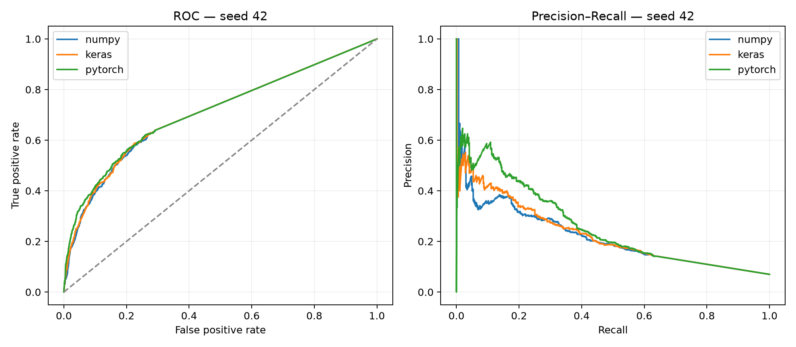
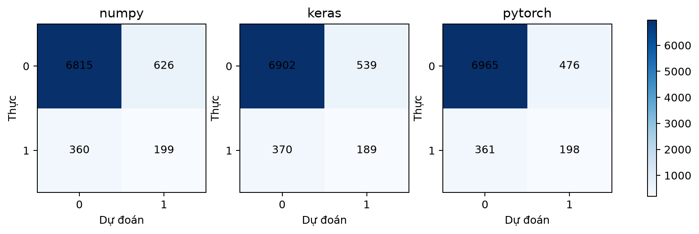
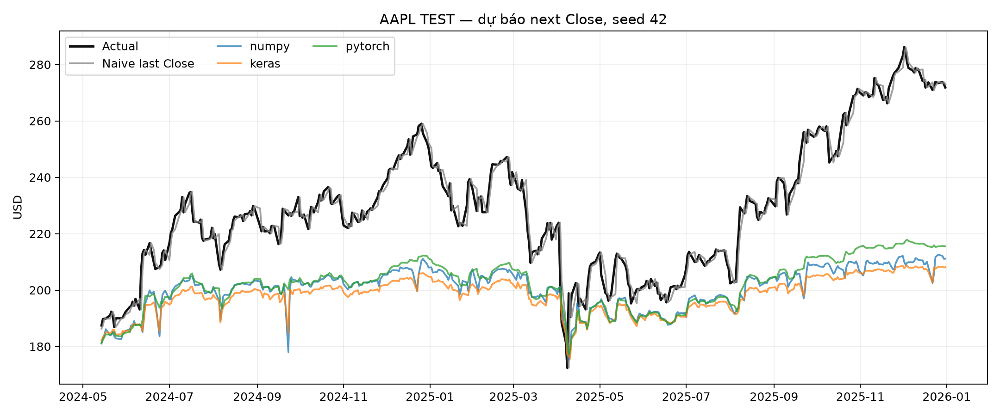

<!-- page_target: 12-14; style: term_paper/config/style_spec.md -->

# CHƯƠNG 4. RECURRENT NEURAL NETWORK

Chương này khảo sát Recurrent Neural Network (RNN) như một mô hình xử lý dữ liệu có thứ tự. Khác với MLP xem mỗi bản ghi là một vector độc lập và CNN ưu tiên quan hệ lân cận, RNN duy trì một trạng thái ẩn được cập nhật khi đọc từng phần tử của chuỗi. Cơ chế đó cho phép cùng một bộ tham số xử lý chuỗi có độ dài nhiều bước và tạo biểu diễn phụ thuộc vào lịch sử đã quan sát. Thực nghiệm tập trung vào Vanilla RNN `tanh`, không nhằm chứng minh đây là kiến trúc tối ưu cho hai bài toán.

Hai dataset được kế thừa từ A06 nhưng được tổ chức lại thành một controlled benchmark có NumPy scratch, Keras và PyTorch. Bài toán thứ nhất dự đoán một khách hàng Online Retail II có mua trong tuần kế tiếp từ tám tuần lịch sử. Bài toán thứ hai dự đoán giá `Close` AAPL của phiên kế tiếp từ 30 phiên gần nhất. Hai bài toán cùng dùng đầu ra many-to-one nhưng khác bản chất: customer là binary classification mất cân bằng, còn AAPL là regression theo thời gian và chịu distribution shift mạnh.

Ba implementation dùng cùng tensor, sample key, split theo thời gian, hidden size 32, Adam, learning-rate search, gradient clipping và early stopping. NumPy scratch thực hiện forward nhiều bước, Backpropagation Through Time (BPTT), update và save/load mà không gọi autograd. Tổng cộng có 18 run, tương ứng 2 dataset × 3 framework × 3 seed. Mỗi run lưu model, lịch sử loss, prediction từng mẫu, threshold nếu có, hash dữ liệu và preprocessor. Cách tổ chức artifact-first giúp mọi metric trong chương được tái tính thay vì chép tay từ màn hình notebook.

## 4.1. Dữ liệu tuần tự và trạng thái ẩn

### 4.1.1. Many-to-one sequence modeling

Một chuỗi đầu vào được ký hiệu (X=(x_1,x_2,ldots,x_T)), trong đó (x_t\in\mathbb{R}^{d}). RNN đọc tuần tự từ (x_1) đến (x_T). Sau mỗi bước, trạng thái ẩn (h_t\in\mathbb{R}^{H}) nén thông tin của input hiện tại và trạng thái trước. Với many-to-one, chỉ (h_T) được đưa vào head để tạo một output. Online Retail dùng (T=8,d=5); AAPL dùng (T=30,d=5); cả hai dùng (H=32).

“Nén lịch sử” không có nghĩa trạng thái ẩn ghi nhớ hoàn hảo mọi bước. (h_t) có kích thước cố định, trong khi lượng thông tin tiềm năng tăng theo chiều dài chuỗi. Mạng phải học giữ tín hiệu hữu ích và bỏ chi tiết ít liên quan. Với Vanilla RNN, quyết định này được thực hiện ngầm qua ma trận recurrent và activation `tanh`; không có cổng quên hay cổng cập nhật. Vì vậy, chương xem RNN là một baseline có trạng thái, không đồng nhất nó với mọi kiến trúc sequence hiện đại.

Trong bài toán customer, mỗi (x_t) mô tả một tuần bằng `total_spent`, `total_quantity`, `order_count`, `unique_products` và `active_flag`. Output là xác suất khách hàng hoạt động ở tuần (t+1). Những tuần không giao dịch được biểu diễn bằng vector 0 trước chuẩn hóa, vì vậy chuỗi chứa cả mức độ giao dịch và pattern hoạt động/không hoạt động. Một output mẫu có dạng `customer-12346__week-2011-09-26 → probability=0.31 → class=0` ở threshold đã khóa. ID chỉ là sample key để audit, không đi vào input.

Trong bài toán AAPL, mỗi bước gồm `Open`, `High`, `Low`, `Close`, `Volume`. Output tuyến tính ước lượng `Close` của phiên kế tiếp. Mẫu sequence đầu tiên chứa 30 phiên kết thúc ngày 2015-02-13, có last Close 31,7700 USD và target ngày 2015-02-17 là 31,9575 USD. Mô hình không nhận tin tức, lãi suất, chỉ số thị trường hoặc sự kiện doanh nghiệp. Do đó output chỉ phản ánh quan hệ trong năm biến lịch sử, không phải ước lượng đầy đủ về thị trường.

Elman RNN cho thấy trạng thái ngữ cảnh có thể học cấu trúc tuần tự bằng cách tái sử dụng activation bước trước [@elman1990structure]. Điểm quan trọng ở controlled experiment là cùng một phương trình được diễn đạt qua ba API khác nhau. Nếu topology, bias, split hoặc preprocessing lệch nhau, chênh lệch metric không còn phản ánh riêng implementation/runtime. Vì vậy, chapter này ưu tiên khả năng đối chiếu hơn độ phức tạp kiến trúc.

### 4.1.2. Quan hệ giữa thứ tự thời gian và split

Dữ liệu tuần tự yêu cầu phân biệt hai loại thứ tự. Thứ nhất là thứ tự bên trong mỗi input window: đảo 8 tuần customer hoặc 30 phiên AAPL sẽ làm thay đổi ý nghĩa. Thứ hai là thứ tự giữa TRAIN, VALIDATION và TEST. Random split có thể đưa target tương lai vào TRAIN trong khi target quá khứ nằm ở TEST, tạo một bài toán dễ hơn nhưng không giống inference theo thời gian.

A06 đã khóa split theo `target_week` và `target_date`. TRAIN luôn đứng trước VALIDATION, VALIDATION đứng trước TEST. Input của một mẫu VALIDATION/TEST được phép chứa lịch sử trước boundary vì đó là thông tin đã biết khi dự đoán. Target không được vượt ngược boundary. Cách này ngăn model trực tiếp học từ target tương lai nhưng vẫn duy trì đủ context cho window đầu tiên sau mốc chia.

Với customer, TRAIN kết thúc tuần 2011-07-11, VALIDATION chạy từ 2011-07-18 đến 2011-09-19, TEST từ 2011-09-26 đến 2011-11-28. Với AAPL, TRAIN kết thúc 2022-09-22, VALIDATION từ 2022-09-23 đến 2024-05-13, TEST từ 2024-05-14 đến 2025-12-31. Các date range được kiểm tra tự động: ngày lớn nhất của split trước phải nhỏ hơn ngày nhỏ nhất của split sau; sample key không được trùng giữa các split.

StandardScaler cho input chỉ được fit trên flattened TRAIN window. Stock target scaler chỉ fit TRAIN (y). Việc dùng một scaler cố định là cần thiết để mô phỏng deployment: hệ thống không được biết mean/variance của giai đoạn TEST. Mặt trái là khi mức giá AAPL tăng ngoài vùng TRAIN, giá trị chuẩn hóa TEST dịch chuyển đáng kể. Đây không phải lỗi scaler mà là bằng chứng distribution shift cần được thể hiện trong kết quả.

## 4.2. Vanilla RNN và Backpropagation Through Time

### 4.2.1. Phương trình forward

Vanilla RNN trong chương sử dụng một recurrent layer và activation `tanh`:

\[
h_t=\tanh(x_tW_{xh}+h_{t-1}W_{hh}+b_h),\qquad h_0=0.
\]

Trong đó (W_{xh}\in\mathbb{R}^{d\times H}), (W_{hh}\in\mathbb{R}^{H\times H}), (b_h\in\mathbb{R}^{H}). Sau bước cuối:

\[
z=h_TW_{hy}+b_y.
\]

Với customer, probability là (p=\sigma(z)) và loss là weighted binary cross-entropy. Với AAPL, (z) là dự đoán target đã chuẩn hóa và loss là mean squared error. Khi báo cáo, stock prediction được inverse-transform về USD. Tách logits và probability tránh double-sigmoid: scratch tự áp dụng sigmoid khi predict; Keras và PyTorch train bằng BCE-from-logits/BCEWithLogits rồi chỉ sigmoid ở inference.

Số trainable parameters của một RNN như trên là:

\[
dH+H^2+H+H+1.
\]

Với (d=5,H=32), tổng là (5\times32+32\times32+32+32+1=1.249). Keras `SimpleRNN` dùng một recurrent bias đúng công thức. `nn.RNN` của PyTorch mặc định tạo hai bias, một cho input-hidden và một cho hidden-hidden; tổng hai bias về toán học có thể gộp thành một. Để matched count, implementation giữ `bias_hh_l0` bằng 0 và đặt `requires_grad=False`. NumPy, Keras và PyTorch vì vậy đều có đúng 1.249 scalar trainable.

`tanh` giới hạn trạng thái trong khoảng ([-1,1]). Điều này giúp activation không tăng vô hạn nhưng không ngăn gradient biến mất. Initialization dùng scale theo fan-in; hidden state khởi tạo zero cho từng sequence. Không state nào được truyền giữa hai customer hoặc giữa hai stock windows. Đây là thiết kế stateless-window: context chỉ dài đúng 8 hoặc 30 bước và mỗi sample được xử lý độc lập trong mini-batch.

### 4.2.2. BPTT, vanishing/exploding gradient và clipping

BPTT “mở cuộn” recurrent cell qua (T) bước rồi áp dụng chain rule từ output về quá khứ. Gradient output được truyền qua head để tạo (partial L/\partial h_T). Ở mỗi bước đi lùi, derivative của `tanh` là (1-h_t^2); gradient tham số được cộng dồn vì cùng (W_{xh},W_{hh},b_h) được dùng tại mọi thời điểm:

\[
\delta_t=\frac{\partial L}{\partial h_t}\odot(1-h_t^2),
\]

\[
\frac{\partial L}{\partial W_{xh}}=\sum_t x_t^T\delta_t,\quad
\frac{\partial L}{\partial W_{hh}}=\sum_t h_{t-1}^T\delta_t.
\]

Gradient truyền về bước trước là (delta_tW_{hh}^T). Phép nhân lặp ma trận recurrent và derivative activation có thể làm norm gradient giảm theo cấp số nhân hoặc tăng mất kiểm soát. Bengio và cộng sự phân tích khó khăn học long-term dependency trong recurrent networks từ góc nhìn này [@bengio1994longterm]. Với sequence 8 và 30 bước, rủi ro nhỏ hơn các chuỗi hàng trăm token nhưng vẫn tồn tại, nhất là khi giá trị `tanh` bão hòa.

Implementation scratch tính toàn bộ hidden states trong forward và lưu cache. Backward đi từ (T-1) về 0, cộng gradient vào năm tensor `Wxh`, `Whh`, `bh`, `Why`, `by`. Trước Adam update, tất cả gradient được clip theo global norm:

\[
g\leftarrow g\cdot\min\left(1,\frac{c}{\lVert g\rVert_2+\epsilon}\right),\qquad c=1,0.
\]

Global clipping giữ hướng của vector gradient tổng nhưng giới hạn độ lớn. Đây là cơ chế ổn định, không chữa vanishing gradient và không bảo đảm model học dependency dài. Keras dùng `clipnorm=1.0` trong optimizer; PyTorch gọi `clip_grad_norm_` trên các tham số trainable. Cả ba dùng Adam [@kingma2014adam], nhưng phép toán floating-point, initialization convention và batching backend vẫn có thể tạo khác biệt.

Kiểm thử không chỉ xác nhận shape. Numerical-gradient test thay đổi một phần tử `Whh[1,2]` bằng (pm10^{-5}), tính sai phân trung tâm và so với BPTT analytic. Toy classification dùng hai nhóm sequence có pattern trái dấu và scratch phải overfit; toy regression yêu cầu MSE giảm dưới 0,15. Test clipping kiểm tra vector gradient ((3,4,12)) có norm 13 được scale về 1 mà không đổi hướng. Save/load parity yêu cầu prediction khớp `atol≤10^{-6}`. Ba wrapper framework còn được kiểm tra cùng công thức parameter count.

## 4.3. Từ Vanilla RNN đến LSTM/GRU và attention

### 4.3.1. Cơ chế cổng và long-term dependency

Long Short-Term Memory (LSTM) bổ sung cell state và các cổng điều khiển luồng thông tin. Cổng quên quyết định phần ký ức cũ được giữ; cổng input điều khiển candidate mới; cổng output quyết định phần cell state được phát ra hidden state. Đường cập nhật cộng của cell state giúp gradient có một lộ trình ít bị nhân lặp hơn so với Vanilla RNN. Kiến trúc LSTM được đề xuất để xử lý chính vấn đề gradient suy giảm và dependency dài [@hochreiter1997lstm].

Gated Recurrent Unit (GRU) gộp cơ chế thành update/reset gates và không tách cell state. GRU thường có ít tham số hơn LSTM nhưng vẫn phức tạp hơn Vanilla RNN. Cả hai không tự động giải quyết leakage, split sai, dữ liệu mất cân bằng hoặc target không dự báo được. Cổng tăng năng lực biểu diễn, đồng thời tăng không gian siêu tham số và thời gian huấn luyện.

Attention thay đổi giả định phải ép toàn bộ lịch sử vào một vector cuối. Output có thể tổng hợp có trọng số từ nhiều representation theo thời điểm. Transformer tiến xa hơn bằng cách dựa chủ yếu trên self-attention thay vì recurrence tuần tự [@vaswani2017attention]. Tuy nhiên, attention không phải lựa chọn mặc định tốt hơn cho mọi dataset nhỏ. Nó cần protocol và baseline riêng; đưa Transformer vào matched table hiện tại sẽ phá vỡ mục tiêu kiểm tra cùng Vanilla RNN cell.

### 4.3.2. Giới hạn phạm vi: thực nghiệm chính dùng Vanilla RNN

Phạm vi Vanilla RNN được khóa trước thực nghiệm vì ba lý do. Thứ nhất, scratch BPTT có thể trình bày và numerical-check đầy đủ trong quy mô tiểu luận. Thứ hai, `SimpleRNN` và `nn.RNN` tạo ánh xạ gần tương đương với NumPy, giúp so sánh implementation rõ ràng. Thứ ba, A06 đã dùng SimpleRNN/RNN, nên kết quả matched hidden-32 có thể đặt cạnh reference hidden-64 mà không đánh đồng hai track.

Việc không train LSTM/GRU không cho phép kết luận chúng cũng thất bại trên AAPL hoặc có cùng trade-off customer. Chương chỉ kết luận về 18 Vanilla RNN runs dưới protocol đã mô tả. Một mở rộng hợp lệ phải giữ nguyên split, tensor, seed, validation search và baseline, sau đó thay cell như một factor có kiểm soát. Nếu chỉ chạy LSTM với budget lớn hơn hoặc preprocessing khác, chênh lệch không thể gán riêng cho cell.

## 4.4. Datasets của Chương 4

### 4.4.1. UCI Online Retail II — customer-week classification

Online Retail II chứa giao dịch của một nhà bán lẻ trực tuyến tại Anh trong hai năm. Nguồn/link là [UCI Machine Learning Repository](https://archive.ics.uci.edu/dataset/502/online+retail+ii), có DOI và giấy phép CC BY 4.0 [@chen2012onlineretailii]. File raw có 1.067.371 transaction lines trong hai sheet. Cleaning A06 loại exact duplicate, dòng thiếu/invalid CustomerID, invoice hủy, quantity không dương và unit price không dương. Sau cleaning còn 779.425 dòng, 36.969 invoice và 5.878 customer.

Từ giao dịch, dữ liệu được gom theo customer-week. Mỗi customer có timeline từ tuần mua đầu đủ điều kiện đến tuần cuối đầy đủ; tuần không hoạt động được điền 0. Window tám tuần tạo 350.864 sequence. Một mẫu TEST đã ẩn CustomerID có `target_week=2011-09-26`, input dạng ma trận 8×5 và output thật `true_label=0`. Positive rate full TRAIN là 6,568%, VALIDATION 4,887%, TEST 6,987%. Một customer có thể tạo nhiều window, nên các sample không độc lập như các cá nhân khác nhau. Split theo thời gian hạn chế future leakage nhưng không biến dữ liệu thành một cohort study độc lập.

Scratch trên toàn bộ 247.458 TRAIN samples với hai learning rates, ba framework và ba seed không cần thiết cho mục tiêu kiểm tra implementation. Vì vậy, theo operational-bound clause, matched track dùng subset phân tầng cố định 30.000 TRAIN, 8.000 VALIDATION, 8.000 TEST, chọn bên trong từng split bằng seed 42/43/44 và giữ thứ tự gốc. Tất cả framework/seed dùng đúng subset này. Reference A06 hidden-64 vẫn dùng full data và được báo riêng, không trộn vào mean của matched track. Bảng 4.1 đặt quy mô subset cạnh toàn bộ chuỗi AAPL được sử dụng.

**Bảng 4.1. Hai dataset và quy mô sử dụng**

| Dataset | Raw/processed quy mô | Biểu diễn | TRAIN/VAL/TEST trong matched track | Output |
|---|---:|---|---:|---|
| Online Retail II | 1.067.371 dòng raw; 350.864 sequence | 8 tuần × 5 feature | 30.000 / 8.000 / 8.000 | mua tuần kế tiếp: 0/1 |
| AAPL 2015–2025 | 2.766 ngày; 2.736 sequence | 30 phiên × 5 feature | 1.915 / 411 / 410 | next Close, USD |

*Nguồn bảng: `term_paper/artifacts/metrics/ch4_dataset_summary.csv` và processed metadata Chương 4.*

Hình 4.1 cho thấy lớp “có mua” ít hơn rõ rệt trong TRAIN benchmark. Class weight được tính chỉ từ nhãn TRAIN subset theo công thức balanced weight; không dùng TEST prevalence. Weighted BCE khiến lỗi positive có đóng góp lớn hơn, nhưng threshold cuối vẫn phải chọn trên VALIDATION. Báo cáo vì thế dùng đồng thời precision, recall, F1, ROC-AUC và PR-AUC. ROC-AUC đo ranking trên mọi threshold; PR-AUC nhạy hơn với tỷ lệ positive thấp và cho thấy trực tiếp precision–recall trade-off.

*Hình 4.1. Phân bố nhãn Online Retail II TRAIN benchmark và actual/naive Close trên AAPL TEST.*

### 4.4.2. AAPL 2015–2025 — next-day Close regression

Snapshot AAPL gồm 2.766 phiên từ 2015-01-02 đến 2025-12-31, tải theo workflow [yfinance](https://github.com/ranaroussi/yfinance) và đối chiếu [trang lịch sử Yahoo Finance](https://finance.yahoo.com/quote/AAPL/history/) [@yfinance2026; @yahoofinanceaapl]. Không xác minh được open dataset redistribution license; Apache-2.0 của `yfinance` chỉ áp dụng cho phần mềm, không cấp quyền cho market data. Schema raw có `Date, Open, High, Low, Close, Adj Close, Volume`; model chỉ dùng năm cột OHLCV, không dùng `Adj Close`. Window 30 phiên tạo 2.736 sequence. Mẫu sequence đầu kết thúc ngày 2015-02-13 với Close 31,7700 USD; output là Close 31,9575 USD ngày 2015-02-17.

Target range thay đổi đáng kể: TRAIN 22,585–182,010 USD, VALIDATION 125,020–198,110 USD, TEST 172,420–286,190 USD. Model học level trên giai đoạn cũ rồi phải dự đoán một regime giá cao hơn. StandardScaler target không “kéo” TEST về distribution TRAIN; nó chỉ ánh xạ theo mean 71,2034 và scale 48,0379 học từ TRAIN. Prediction được inverse-transform trước khi tính MAE/RMSE/R².

Naive baseline dự đoán Close ngày mai bằng Close cuối input. Với daily price level có autocorrelation cao, baseline này mạnh dù không học tham số. Nó có TEST MAE 2,6177 USD, RMSE 3,8789 USD và R² 0,9722. Một RNN không vượt baseline không được xem là hữu ích chỉ vì loss giảm. Hơn nữa, ngay cả khi vượt baseline trên một snapshot, kết quả vẫn chưa đủ cho chiến lược giao dịch vì không tính phí, slippage, adjusted return, risk hoặc validation rolling-window.

Giấy phép dữ liệu market snapshot không được suy ra từ giấy phép Apache-2.0 của thư viện `yfinance`; do đó artifact phục vụ audit nội bộ, không tuyên bố quyền phân phối lại. Mọi diễn giải AAPL trong chương là minh họa phương pháp, không phải khuyến nghị mua/bán hay dự báo tài chính.

## 4.5. Ba cách cài đặt Vanilla RNN

### 4.5.1. NumPy scratch với BPTT và gradient clipping

`NumpyRNN` lưu năm tensor tham số và thực hiện forward theo vòng lặp thời gian. Batch được vector hóa theo trục sample, còn 8/30 bước vẫn lặp tường minh. Cache chứa input và danh sách (h_0,ldots,h_T). `loss_and_gradients` tạo gradient head rồi duyệt ngược cache để cộng gradient recurrent. Không có lời gọi TensorFlow, PyTorch hoặc thư viện autodiff.

Adam được cài đặt với first/second moments, bias correction và epsilon. Mỗi epoch shuffle TRAIN bằng generator gắn model seed; VALIDATION không shuffle và không class weighting. Early stopping theo validation loss, lưu bản sao tham số tốt nhất và restore sau khi dừng. `save` ghi config JSON cùng arrays vào NPZ; `load` khôi phục class và tham số. Prediction chia batch để không giữ toàn bộ hidden cache trong RAM.

Scratch dùng `float64` nội bộ để numerical-gradient ổn định, trong khi input source là `float32`. Khác biệt dtype này có thể ảnh hưởng rounding và thời gian nhưng không thay topology. Một chi tiết phát hiện trong QA là ROC-AUC nhạy với tie: các score bằng nhau trong memory có thể khác cực nhỏ sau CSV encoding. Vì prediction CSV là nguồn sự thật của báo cáo, pipeline đọc lại file đã serialize rồi mới chốt metric. Nhờ vậy notebook tái tính 18 run khớp tuyệt đối với comparison CSV.

### 4.5.2. Keras SimpleRNN

Keras model gồm `Input(shape=(None,5)) → SimpleRNN(32,tanh) → Dense(1)`. Customer compile với `BinaryCrossentropy(from_logits=True)`, stock với MSE. Optimizer là Adam có `clipnorm=1.0`; callback EarlyStopping theo `val_loss`, `restore_best_weights=True`. Keras nhận trực tiếp NumPy arrays và xử lý mini-batch/tracing ở backend TensorFlow. API này ngắn gọn hơn scratch nhưng phương trình matched vẫn giống nhau [@keras2026api].

Model được lưu định dạng `.keras` cùng metadata JSON ghi input size, hidden size, task, seed, learning rate và clip norm. Load-check mở model mới và so tám prediction đầu với output trước save. Keras có thể dùng fused kernel hoặc thứ tự phép toán khác NumPy; matched protocol không đòi weight trajectory giống nhau, chỉ đòi data/topology/budget tương đương và output artifact có thể audit.

### 4.5.3. PyTorch nn.RNN

PyTorch wrapper dùng `nn.RNN(input_size=5, hidden_size=32, nonlinearity='tanh', batch_first=True)` và `nn.Linear(32,1)`. Training loop gọi `zero_grad`, forward, loss, `backward`, global clip và `optimizer.step`. Customer dùng `binary_cross_entropy_with_logits`; stock dùng MSE. Evaluation chuyển model sang `eval()` và đặt trong `torch.no_grad()` [@pytorch2026nn].

Điểm lệch API là hai bias của `nn.RNN`. `bias_hh_l0` được zero và freeze; optimizer chỉ nhận parameter `requires_grad=True`. Do đó parameter count trainable khớp 1.249, trong khi state dict vẫn chứa tensor bias cố định. Đây là phép biến đổi tương đương vì tổng hai recurrent bias của PyTorch được thay bằng một bias học được. Bảng 4.2 đối chiếu topology, loss, clipping, bias và save/load của ba implementation.

**Bảng 4.2. Hợp đồng matched và khác biệt implementation**

| Thành phần | NumPy scratch | Keras | PyTorch |
|---|---|---|---|
| Recurrent cell | vòng lặp + `tanh` thủ công | `SimpleRNN(32)` | `nn.RNN(32)` |
| Head/loss | Dense; BCE/MSE thủ công | Dense; BCE logits/MSE | Linear; BCE logits/MSE |
| BPTT | đạo hàm tường minh | TensorFlow autodiff | PyTorch autograd |
| Clip | global norm 1,0 | Adam `clipnorm=1.0` | `clip_grad_norm_` |
| Bias recurrent | một bias | một bias | bias thứ hai zero/freeze |
| Tham số trainable | 1.249 | 1.249 | 1.249 |
| Save/load | NPZ | `.keras` + JSON | `.pt` state dict |

*Nguồn bảng: `term_paper/config/ch4_experiment.json`, ba implementation RNN và parameter-parity tests Phase 5.*

Learning-rate candidates là 0,003 và 0,001. Customer chọn candidate bằng VALIDATION F1 sau khi threshold được search từ 0,05 đến 0,95 với bước 0,005; tie ưu tiên threshold nhỏ hơn rồi validation loss. Stock chọn validation RMSE sau inverse-transform. Max epoch/patience là 15/3 cho customer và 30/5 cho stock. Clean run seed 42 thấp hơn 20 phút, nên seed 52 và 62 được chạy theo hợp đồng. TEST không tham gia lựa chọn.

## 4.6. Kết quả matched comparison

### 4.6.1. Customer next-week purchase

**Bảng 4.3. Customer TEST, mean ± sample SD qua ba seed**

| Framework | Accuracy | Precision | Recall | F1 | ROC-AUC | PR-AUC |
|---|---:|---:|---:|---:|---:|---:|
| NumPy | 0,8739 ± 0,0382 | 0,2558 ± 0,0761 | 0,3536 ± 0,0609 | 0,2864 ± 0,0273 | 0,7081 ± 0,0058 | 0,2163 ± 0,0251 |
| Keras | 0,8878 ± 0,0210 | 0,2749 ± 0,0492 | 0,3405 ± 0,0555 | 0,2985 ± 0,0070 | 0,7094 ± 0,0005 | 0,2217 ± 0,0139 |
| PyTorch | 0,8969 ± 0,0087 | 0,3026 ± 0,0251 | 0,3572 ± 0,0243 | 0,3265 ± 0,0058 | 0,7133 ± 0,0011 | 0,2466 ± 0,0013 |

*Nguồn bảng: `term_paper/artifacts/metrics/ch4_framework_summary.csv`; cùng 8.000 customer-week TEST, seed 42/52/62.*

Bảng 4.3 cho thấy PyTorch có mean F1 và PR-AUC cao nhất, đồng thời variation qua seed thấp nhất ở hai metric. Chênh lệch F1 so với Keras là 0,0279 và so với NumPy là 0,0400. Tuy nhiên, topology và data giống nhau không khiến optimization trajectory giống hệt: initialization, kernels, dtype và batch operations khác. Ba seed chỉ mô tả độ nhạy nội bộ, không đủ kiểm định thống kê rộng hoặc tuyên bố PyTorch luôn tốt hơn. Hình 4.2 biểu diễn đồng thời F1, ROC-AUC và PR-AUC để tránh đọc một metric tách khỏi hai metric còn lại.

*Hình 4.2. Customer metric mean ± sample SD qua seed 42, 52 và 62.*

Hình 4.3 trình bày ROC và precision–recall cho seed 42. ROC curves khá gần nhau; ROC-AUC 0,7069–0,7137 cho thấy ranking tốt hơn random nhưng còn xa phân tách hoàn hảo. PR-AUC 0,2055–0,2452 cần đặt cạnh positive prevalence TEST benchmark khoảng 7%; model tạo gain so với predictor random theo prevalence, nhưng precision tuyệt đối vẫn thấp.

*Hình 4.3. ROC/PR curves trên cùng 8.000 customer-week TEST của seed 42.*

Threshold validation không cố định ở 0,5: seed 42 chọn 0,655 cho NumPy, 0,665 cho Keras/PyTorch; các seed khác dao động 0,555–0,735. Threshold cao phản ánh output calibration dưới weighted loss, không có nghĩa model “chắc chắn 66%” theo nghĩa xác suất đã hiệu chuẩn. Nếu deployment thay prevalence hoặc chi phí false positive/false negative, threshold phải được revalidate trên dữ liệu mới, không chỉnh trực tiếp bằng TEST hiện tại.

Ở seed 42, NumPy có TN=6.815, FP=626, FN=360, TP=199; Keras 6.902/539/370/189; PyTorch 6.965/476/361/198. PyTorch giảm false positive rõ so với NumPy mà giữ TP gần tương đương, nên precision và F1 cao hơn. Dù vậy, cả ba bỏ sót hơn 64% positive. Hình 4.4 thể hiện đầy đủ bốn ô confusion matrix; nếu output được dùng cho chiến dịch chăm sóc khách hàng, false positive gây chi phí liên hệ còn false negative bỏ lỡ khách có khả năng quay lại. F1 chỉ cân bằng hai phía, không thay thế phân tích chi phí nghiệp vụ.

*Hình 4.4. Confusion matrices trên cùng TEST subset, seed 42 và threshold chọn từ VALIDATION.*

Reference A06 hidden-64/full-data cho F1 0,2491 Keras và 0,2485 PyTorch tại threshold 0,5, ROC-AUC khoảng 0,7005–0,7009. Không thể kết luận matched hidden-32 “tốt hơn” chỉ từ các số này vì reference khác training sample, hidden size, threshold policy và single seed. Giá trị của reference là cho thấy cùng bản chất imbalance và ranking vừa phải trên full TEST 53.052 mẫu.

### 4.6.2. AAPL next-trading-day Close

**Bảng 4.4. AAPL TEST theo USD, mean ± sample SD qua ba seed**

| Model | MAE (USD) | RMSE (USD) | R² |
|---|---:|---:|---:|
| NumPy RNN | 32,0028 ± 4,7039 | 36,9741 ± 4,9221 | -1,5550 ± 0,6923 |
| Keras RNN | 28,1160 ± 5,3329 | 32,7533 ± 6,0509 | -1,0266 ± 0,6972 |
| PyTorch RNN | 23,9837 ± 2,5086 | 27,7904 ± 2,6129 | -0,4349 ± 0,2755 |
| Naive last Close | 2,6177 | 3,8789 | 0,9722 |

*Nguồn bảng: `term_paper/artifacts/metrics/ch4_framework_summary.csv`; cùng 410 AAPL TEST dates, RNN seed 42/52/62 và naive deterministic.*

Bảng 4.4 cho thấy cả chín RNN runs thua naive baseline với khoảng cách lớn. PyTorch có RMSE trung bình thấp nhất trong ba RNN nhưng vẫn lớn gấp khoảng 7,16 lần naive; Keras gấp 8,44 và NumPy gấp 9,53. R² âm nghĩa là prediction tệ hơn một constant baseline dựa trên mean TEST theo định nghĩa R², trong khi naive đạt 0,9722. Do đó không có cơ sở gọi bất kỳ RNN nào hữu ích cho next-Close trong protocol này.

*Hình 4.5. AAPL TEST actual-vs-predicted của seed 42; naive bám sát actual hơn ba RNN.*

Hình 4.5 cho thấy ba RNN phản ứng chậm với price level cao trong TEST và thường dự đoán thấp. Hình 4.6 định lượng khoảng cách RMSE tới naive đồng thời đặt cạnh validation loss. MSE trên training scale vẫn giảm vì VALIDATION còn gần biên TRAIN hơn TEST; checkpoint tốt nhất theo VALIDATION không đảm bảo theo kịp regime 2024–2025. Failure không phải do metric inverse-transform: cùng target scaler A06 được dùng cho mọi framework, prediction CSV lưu USD và notebook tái tính MAE/RMSE/R² trực tiếp.

*Hình 4.6. RMSE mean ± SD so với naive và validation MSE của seed 42.*

Reference A06 hidden-64 cũng có cùng kết luận: PyTorch RMSE 23,5788, Keras 27,8703 và naive 3,8789 USD. Track hidden-32 không tạo failure mới do subset, vì stock matched dùng toàn bộ arrays; nó xác nhận kết quả qua ba seed và thêm scratch. Tăng hidden size từ 32 lên 64 không giải quyết distribution shift trong reference. Đây là ví dụ quan trọng: model phức tạp có thể fit validation nhưng thua một rule một dòng trên TEST.

### 4.6.3. Parameter count, thời gian và sai khác framework

**Bảng 4.5. Chi phí mô tả của matched track**

| Dataset | Framework | Tham số | Training/selected fit (s), mean ± SD | Inference (ms/mẫu), mean ± SD |
|---|---|---:|---:|---:|
| Customer | NumPy | 1.249 | 3,97 ± 2,69 | 0,0184 ± 0,0123 |
| Customer | Keras | 1.249 | 6,26 ± 3,63 | 0,0332 ± 0,0223 |
| Customer | PyTorch | 1.249 | 7,43 ± 6,56 | 0,0040 ± 0,0023 |
| AAPL | NumPy | 1.249 | 7,10 ± 7,10 | 0,2659 ± 0,3565 |
| AAPL | Keras | 1.249 | 15,81 ± 3,42 | 1,1735 ± 1,3207 |
| AAPL | PyTorch | 1.249 | 14,25 ± 17,28 | 0,0178 ± 0,0186 |

*Nguồn bảng: `term_paper/artifacts/metrics/ch4_framework_comparison.csv`; selected-fit và warmed TEST inference của seed 42/52/62.*

Bảng 4.5 cho thấy thời gian có variation lớn vì early stopping chạy số epoch khác và CPU framework có warm-up/tracing khác. Cột training chỉ là selected candidate fit, trong khi search thực tế còn candidate không được chọn; comparison CSV lưu thêm `search_seconds`. Inference đã warm-up một lượt nhưng TEST stock chỉ có 410 mẫu, nên overhead chiếm tỷ trọng lớn và SD cao. Không nên dùng bảng này để kết luận backend nào nhanh hơn phổ quát.

Điểm có thể kết luận chắc là parameter count bằng nhau và sample-key parity đạt. Với mỗi dataset/seed, ba prediction files có cùng thứ tự `sample_key,y_true`; customer mỗi file 8.000 hàng, stock 410 hàng. Model save/load được kiểm tra 18/18. Split/preprocessor hashes giống nhau trong cùng dataset. Những kiểm tra này không làm metric bằng nhau, nhưng loại các nguyên nhân so sánh sai phổ biến như lệch mẫu, lệch target hoặc quên inverse-transform.

## 4.7. Phân tích giới hạn

### 4.7.1. Imbalance và trade-off precision–recall

Customer sequence có positive rate thấp và thay đổi theo thời gian. Class weighting tăng ảnh hưởng của positive trong loss, nhưng cũng có thể làm probability kém calibrated. Threshold search tối đa F1 trên VALIDATION, vì vậy kết quả phụ thuộc mục tiêu coi precision và recall quan trọng tương đương. Một bài toán retention có thể ưu tiên recall; một chiến dịch khuyến mại đắt tiền có thể ưu tiên precision. Khi đó cần xác định cost matrix trước, không chọn threshold sau khi xem TEST.

Subset phân tầng giữ tỷ lệ lớp và dùng cùng samples cho ba framework, nhưng 8.000 TEST chỉ là một phần của 53.052 A06 TEST. Nó phù hợp controlled benchmark scratch, không thay thế full-data external validation. Customer windows từ cùng người còn tương quan; model có thể học pattern khách hàng lặp lại dù ID không phải input. Một đánh giá khác có thể split theo cả thời gian và cohort customer mới, nhưng đó là câu hỏi nghiên cứu khác.

ROC-AUC khoảng 0,71 có thể trông tốt hơn F1 khoảng 0,29–0,33 vì ROC tính false-positive rate trên lớp negative rất lớn. PR-AUC trực tiếp phạt precision thấp và vì vậy chỉ khoảng 0,22–0,25. Báo cả hai ngăn việc chọn một metric thuận lợi để che giới hạn. Accuracy khoảng 0,87–0,90 cũng phải đặt cạnh majority prevalence; accuracy cao không đồng nghĩa nhận diện phần lớn khách mua lại.

### 4.7.2. Distribution shift và naive last-Close baseline

AAPL minh họa ba giới hạn. Thứ nhất là target price level không stationary: model phải extrapolate ra ngoài range đã học. Thứ hai, overlapping windows tạo nhiều sample nhưng không tạo nhiều regime độc lập. Thứ ba, một ticker và một split không đại diện thị trường. Mean ± SD qua seed đo randomness optimization, không đo uncertainty do giai đoạn lịch sử.

Naive last-Close mạnh vì price hôm sau thường gần hôm nay. Dự đoán level cho phép baseline tận dụng persistence; một hướng khác là dự đoán return/difference rồi tái dựng price, nhưng phải định nghĩa lại target và baseline trước khi chạy. Rolling-origin evaluation cũng phù hợp hơn một TEST block duy nhất. Những mở rộng này không được thử trong Phase 5 nên chỉ là hướng nghiên cứu, không phải lời giải thích hậu nghiệm đã được kiểm chứng.

R² âm của RNN và khoảng cách RMSE không nên bị bỏ khỏi báo cáo. Failure result cho thấy validation loss, recurrent architecture và nhiều framework không thay thế baseline đúng. Nó cũng nhắc rằng “deep learning” không mặc nhiên tốt hơn quy tắc đơn giản. Không model nào trong chương được dùng để khuyến nghị đầu tư; deployment Phase 6 phải hiển thị naive output cạnh RNN và cảnh báo tài chính rõ ràng.

Các giới hạn chung khác gồm: chỉ hai learning rates, hidden size cố định 32, một recurrent layer, không dropout, không tune sequence length và không có LSTM/GRU. Search nhỏ được chọn để bảo đảm fairness/khả năng audit. Một search rộng có thể cải thiện một model nhưng sẽ tăng multiple-comparison risk và compute; mọi cải tiến phải dùng VALIDATION mới hoặc nested/rolling evaluation thay vì tối ưu tiếp trên TEST hiện tại.

## 4.8. Tiểu kết chương

Chương đã hoàn thành một matched Vanilla RNN benchmark có thể tái lập. NumPy scratch thực sự huấn luyện bằng BPTT, global gradient clipping và Adam; numerical-gradient, toy-overfit, save/load và shape đều được kiểm thử. Keras và PyTorch biểu diễn cùng many-to-one topology, còn sai khác bias PyTorch được kiểm soát để cả ba có 1.249 trainable parameters.

Hai dataset đáp ứng hai loại bài toán tuần tự. Online Retail II dùng customer-week sequence thực tế, có cleaning/provenance, split thời gian và imbalance rõ. AAPL dùng 30-day OHLCV windows, target inverse-transform về USD và naive last-Close bắt buộc. Benchmark customer dùng subset cố định trong giới hạn vận hành; stock dùng toàn bộ processed arrays A06. Ba framework dùng cùng TEST keys/dates/labels trên mọi seed.

Kết quả customer cho thấy PyTorch có mean F1 0,3265 và PR-AUC 0,2466, cao nhất trong các implementation được đánh giá, nhưng recall chỉ khoảng 0,3572 và precision 0,3026. Kết quả không hỗ trợ tuyên bố framework phổ quát. Với AAPL, PyTorch là RNN có RMSE thấp nhất 27,7904 USD, nhưng naive chỉ 3,8789 USD; cả chín RNN runs đều thất bại trước baseline. Đây là kết luận chính, không phải ngoại lệ cần loại.

Toàn bộ 18 prediction files tái tạo metric, 18 model load-check đạt, sáu hình được sinh từ artifact và notebook đã execute không lỗi. Những bằng chứng này tạo nền cho Phase 6: deployment phải nạp model cùng preprocessor/hash, validate đúng shape sequence, trả threshold/baseline và trình bày cảnh báo sử dụng. Riêng endpoint AAPL phải nói rõ kết quả mang tính học thuật, không phải khuyến nghị đầu tư.
